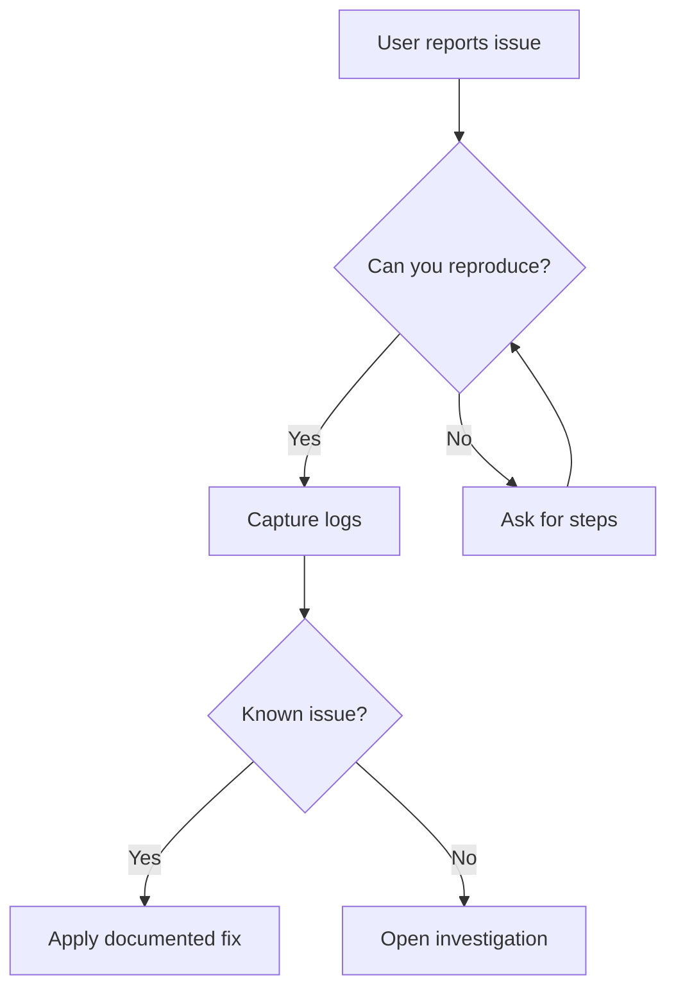
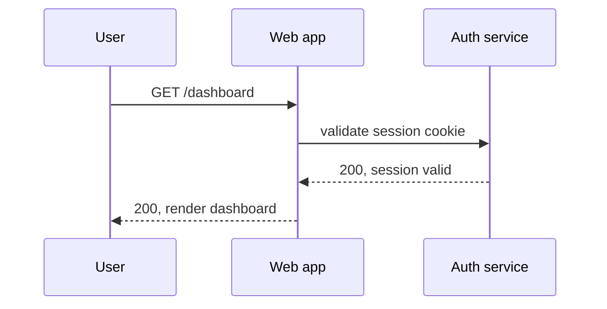
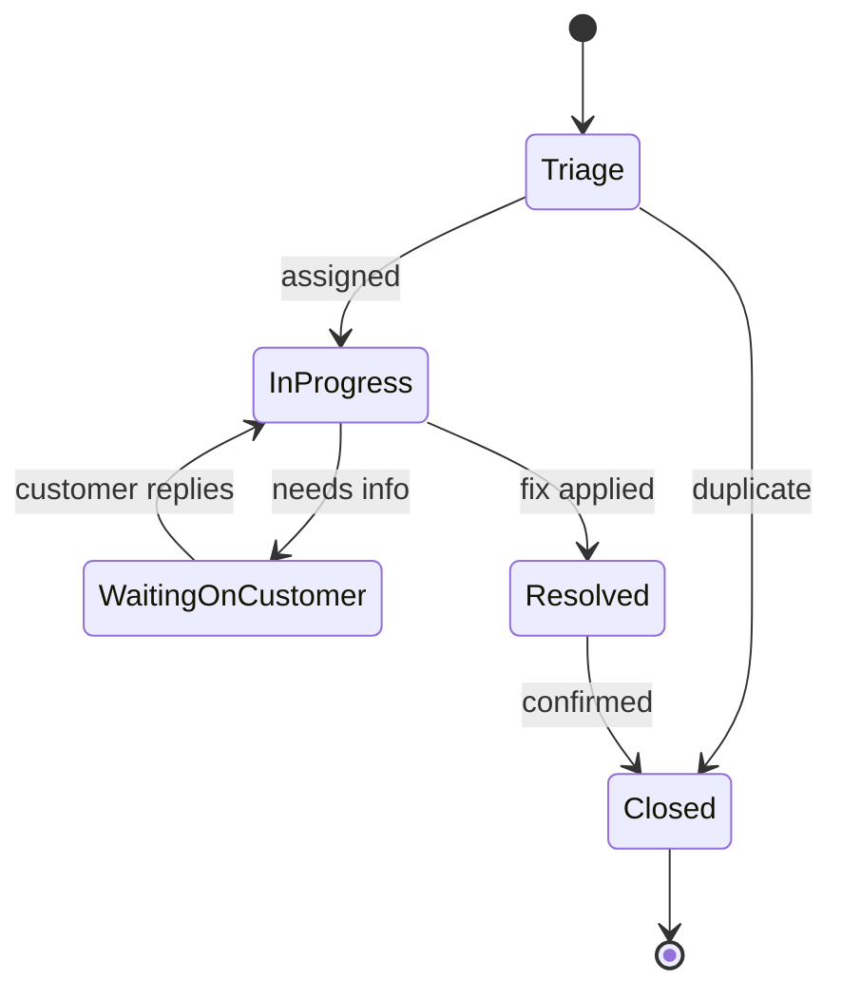

The MermaidLoader picks up any fenced `mermaid` block on the page, renders it client-side, and re-renders on theme toggle. Click any diagram to enlarge it in a lightbox.

## Flowchart

## Sequence diagram

The first colon in a message label is the parser's separator. Anything after a second colon will trip it. The line below uses prose instead of `Header-Name: value` to avoid the trap.

## State diagram

## Health checks

Each diagram should render an SVG (not literal mermaid source). The lightbox should open on click and dismiss with Escape. Toggling the theme should re-render the SVG with the new colour palette.
