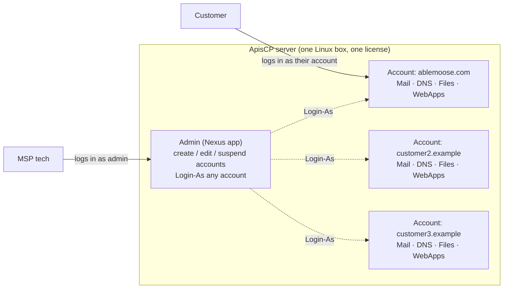

When a ticket lands and the customer says "I can't log in to my hosting", the operative word for an MSP that uses ApisCP is **hosting**. The MSP is the hosting provider. The platform that does the hosting is ApisCP, installed on the MSP's own servers. The customer doesn't see ApisCP branding most of the time. They see an end-user panel where they log in to manage their website, their mailboxes, their DNS, their databases.

## The problem this product solves

Customers want a single place to manage their website and their email. They want to add a mailbox, change a DNS record, install WordPress, restore a database to last Tuesday, see how much storage they're using. They don't want to learn Linux, they don't want a console, they don't want to file a ticket for every change. The MSP wants to deliver that to fifty customers on a server it already owns, without paying a per-account fee, without trusting a SaaS provider with customer data, and without writing the panel itself.

ApisCP is that panel. It installs on a stock Linux server the MSP rents or owns. Each customer gets an isolated **account** on the server with a per-account login at the same URL. Inside their account they get web hosting, mail, DNS, databases, file management, and 1-click installs of web apps like WordPress. The MSP gets a separate admin app that lists every customer account, lets the MSP create / suspend / edit / delete accounts, and lets the MSP log in as any customer to fix something without asking for the customer's password.

It is a hosting control panel in the same family as cPanel/WHM, Plesk, and DirectAdmin. The MSP buys a one-time license per server and runs the platform end-to-end.

## How it compares to cPanel

For an MSP coming from cPanel, the day-to-day shape of the work feels familiar. Both products front a multi-tenant Linux server, both isolate accounts, both offer 1-click web apps, both have an admin app and an end-user app. The differences that bite first:

| | cPanel / WHM | ApisCP |
|---|---|---|
| **Operational model** | GUI-first; WHM exposes most config | GUI for accounts and customer-facing surfaces; **platform config is command-line** (`cpcmd`, Scopes, the Ansible Bootstrapper) |
| **Licensing** | Per-account tiered subscription | One-time per-server license |
| **Privilege isolation** | Suexec / CageFS layered on | **Fortification** is the native isolation framework; PHP runs as a separate `apache` user from the account |
| **Self-maintenance** | Admin runs upgrades, security patches | Bootstrapper is idempotent: re-running the installer repairs drift; **scopes** describe desired state |
| **Brute-force protection** | cphulkd; admin-tunable | **Anvil** rate-limits panel and API logins; **Rampart** wraps fail2ban jails for service brute-force (mail, FTP, SSH, DB); **Shield** is the DOS handler |
| **Community size** | Very large; tutorials abound | Smaller; primary docs at `docs.apiscp.com` and `kb.apiscp.com` |

What this means in practice: a tech who only knows the cPanel GUI will find the customer-facing side of ApisCP easy to read. The admin side will feel sparse until you learn that the real lever is `cpcmd` and the Ansible-driven Bootstrapper, not the Nexus app's screens. The Intermediate and Advanced courses cover that side.

## The three pieces, one diagram

Three things to hold:

1. **One ApisCP server hosts many customer accounts.** Each account is a separate filesystem space, separate Unix user, separate mailbox set, separate database set. The accounts can't see each other.
2. **Admin and customer log in at the same URL** (`https://server-name:2083`). The username decides who you are. The admin sees Nexus; the customer sees their own account dashboard.
3. **The admin can Login-As any customer** to fix something on their behalf, then Revert back to admin. The customer's password is never exposed.

The rest of the Beginner course teaches: where things live in Nexus, how to Login-As, what the customer sees on their side, how to walk a customer through a typical task, and how to triage when something breaks.

## Where Able Moose Accounting fits

For the worked examples in this course, the MSP hosts a 15-person bookkeeping firm called **Able Moose Accounting**. Able Moose has a website at `ablemoose.example` and a handful of mailboxes (`admin@`, `bookkeeping@`, `helen@`, plus shared addresses). Their account on the ApisCP server is named `ablemoose-au` (the admin username; the primary domain is `ablemoose.example`). Whenever the lesson talks about "the customer's account", picture Able Moose's account on the server.

<Callout type="info" title="ApisCP is sometimes called apnscp">
The product was renamed from apnscp to ApisCP. CLI binaries and config paths still carry the old name (`/usr/local/apnscp`, `apnscp-bootstrapper.log`). Both names refer to the same product; treat them as interchangeable when reading docs.
</Callout>

## What ApisCP is NOT

- **Not a cloud platform.** It runs on whatever Linux server you point it at. Scaling means adding more ApisCP servers, not auto-spinning more containers.
- **Not a reseller portal in the SaaS sense.** ApisCP itself does not include a customer-facing billing / signup flow. Resellers and customer self-signup live in the billing software the MSP wires alongside (Blesta, WHMCS, HostBill).
- **Not a Windows hosting panel.** ApisCP runs only on RHEL-family Linux (CentOS Stream, Rocky, AlmaLinux). Containers (Docker, OpenVZ, LXC) are unsupported.
- **Not a managed service.** The MSP runs the platform. There is no Apis Networks help desk taking customer tickets.

Next lesson: a tour of Nexus, the admin's view of every customer account on the server.
