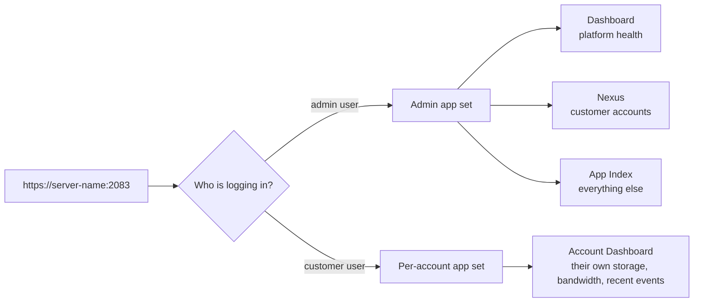

The customer's login and the admin's login go through the same URL: `https://server-name:2083`. The server reads who you are from the username and decides what app set to render. As admin you see three things the customer doesn't: a platform-wide **Dashboard**, an **App Index** of every available app, and **Nexus** for account management.

## What the admin sees first

## Nexus, the account list

When a ticket says "Able Moose can't send mail", Nexus is where you go to find Able Moose's account.

<AnnotatedScreenshot
  src="/img/apiscp/nexus-sidebar.png"
  alt="ApisCP web panel with the Nexus app open. The sidebar menu has Nexus highlighted. The main section shows analytics-style widgets including storage usage at 88%."
  caption="Nexus is the account management app. Sidebar highlighted means you're inside it; the main pane lists accounts and their summary stats."
>
  <Hotspot client:load x={22} y={45} label="1" title="Nexus in sidebar" purpose="Launches into the account management section.">
    The Nexus holds customer accounts. If you need to create, suspend, delete, edit, or log in to a customer account, then the nexus is the right spot.
  </Hotspot>
</AnnotatedScreenshot>

<Callout type="info" title="Two account counts catch new techs out">
The Nexus list shows one row per **primary domain** account. An account can host multiple **addon domains** under the same login. So a Nexus list of 50 rows can mean 50 customers, or it can mean 50 customers and another 30 addon domains those customers manage themselves. The addon domains live inside the account row; they aren't a separate Nexus entry.
</Callout>

## Common admin actions, in Nexus

For each customer row in Nexus, the actions are roughly:

- **Click the row** to see the account's detail page (services enabled, plan, contact email, storage breakdown).
- **Edit** to change services (toggle mail, change quota, switch plan).
- **Suspend** to disable everything except panel access (you can still Login-As).
- **Delete** to remove the account. Destructive; use the dry-run flow in the Intermediate course before deleting anything.
- **Login-As** to enter the account as the customer's admin user. Covered in the next lesson.

## What Nexus is NOT

- **Not a billing system.** Nexus tracks account state, not invoices. The MSP wires billing software (Blesta, WHMCS, HostBill) alongside ApisCP. The `billing,invoice` field on an account is just a string; what it means is the billing software's problem.
- **Not the customer's view.** The customer never sees Nexus. They see their own account dashboard, with no awareness of other accounts on the server.
- **Not the only way to add an account.** The `AddDomain` CLI does the same thing and is what scripts and billing integrations use. Nexus is the GUI front-end for `AddDomain`.

<Checkpoint slug="apiscp-fundamentals-checkpoint-nexus" client:visible />

Next lesson: the Login-As move, how an admin enters a customer's account without their password and how to come back safely.
