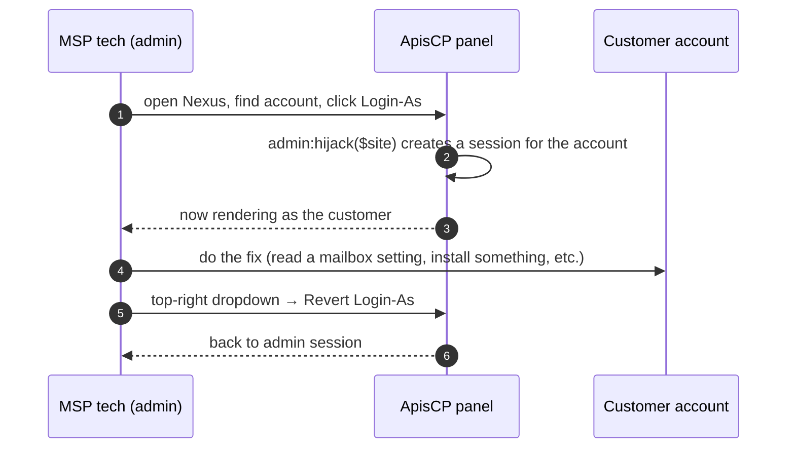

When a ticket says "I can't see my mailbox", the fastest fix is to see what the customer sees. ApisCP gives the admin a button that creates an authenticated session as the customer with no password handoff. The control panel calls it **Login-As**; the underlying API call is `admin:hijack`. The action is audited and reversible.

## How it works, in one diagram

The customer doesn't have to be online. The customer doesn't get a notification by default. The admin's session is a real session against the account; everything the admin does in that session is attributed to the account's admin user, with the same permissions the customer would have.

## The dropdown that gives it away

When you're logged in *as a customer* (whether by Login-As or by their own login), the top-right user dropdown shows a **Revert Login-As** item. If you see it, you're not in your admin session; you're in someone else's.

<AnnotatedScreenshot
  src="/img/apiscp/login-as-dropdown.png"
  alt="ApisCP web panel top-right dropdown menu. Items shown: Settings, Help Center, App Index, Revert Login-As, Logout. The current user is 'test-admin' on test-domain.example."
  caption="The 'Revert Login-As' item is the tell. If you see it in the dropdown, the session in your browser is impersonating an account; clicking it returns you to your admin session."
>
  <Hotspot client:load x={62} y={9} label="1" title="Account name shown" purpose="Confirms which account you've impersonated.">
    The username shown is the customer's admin user (here: `test-admin`), not your own admin login. Read it before doing anything destructive.
  </Hotspot>
  <Hotspot client:load x={30} y={75} label="2" title="Revert Login-As" purpose="The reverse of the action that got you here." tone="success">
    One click drops the impersonated session and reloads as your admin user. If this item is missing, you're not impersonating, you're just logged in normally.
  </Hotspot>
</AnnotatedScreenshot>

## When to use Login-As

Three common reasons, in order of how often they come up at the helpdesk:

1. **The customer says "X doesn't work" and you can't reproduce from the admin side.** Login-As, click the same thing they did, see the same screen. Most "doesn't work" tickets are resolved by seeing what the customer is actually looking at.
2. **You need to change something inside the account that the admin app doesn't expose.** Some surfaces (e.g. mailbox passwords, web app FTP credentials) are scoped to the account user, not the admin. Login-As, change it, Revert.
3. **You need to test before you tell the customer to do it themselves.** Walk through the steps yourself first; *then* write the ticket reply.

## When NOT to use Login-As

- **Don't Login-As to send mail from a customer's mailbox.** The mailbox owner is the customer. Sending mail under their account is impersonation in a way that matters legally, not just technically.
- **Don't Login-As to delete files at the customer's request without confirming the request in the ticket.** Verbal or out-of-band requests are not enough; the ticket needs the customer's written ask before destructive actions.
- **Don't Login-As as a workaround for missing admin tooling.** If you need to do something repeatedly via Login-As, that's a request for an admin-side feature or a `cpcmd` invocation. Note it and surface it to the team.

## The procedure

<StepThrough client:load>
  <Step title="Find the account in Nexus">
    Sidebar → Nexus → search by domain name. The Able Moose row shows the admin username, primary domain, and a row of actions on the right.
  </Step>
  <Step title="Click Login-As">
    The row's action set includes a Login-As button (icon: arrow-into-person). One click; no password prompt.
  </Step>
  <Step title="Confirm in the top-right dropdown">
    The username shown should be the customer's admin user. If it's still your admin username, the Login-As didn't fire; try again or check that the account is active (a suspended account allows panel login but warns on entry).
  </Step>
  <Step title="Do the fix">
    Resolve the ticket. Take screenshots if the customer will need them in the reply.
  </Step>
  <Step title="Revert">
    Top-right dropdown → Revert Login-As. Confirm the username is back to your admin login before opening the next ticket. Forgetting to Revert and then editing another customer's account from the wrong session is the most common gotcha.
  </Step>
</StepThrough>

<Callout type="warn" title="The 'wrong session' gotcha">
If you Login-As Customer A, finish the ticket, and immediately open Customer B's account from the *impersonated* session, you're acting as Customer A inside Customer B's surface. Customer A doesn't have permission to do that, so most actions will fail; some will succeed in surprising ways. Always Revert before moving to the next account.
</Callout>

## What gets logged

Login-As writes an audit entry that records:

- The admin user who initiated the impersonation.
- The site (account) impersonated.
- The timestamp.

Whatever you do *inside* the impersonated session is attributed to the customer's admin user, not to you, in account-level logs. The audit trail that ties an admin to the impersonation is separate, on the platform side. If a customer disputes a change made during a Login-As session, the platform log is the source of truth for *who really did it*.

## What this is NOT

- **Not the same as `su` to root.** Login-As only ever puts you in an account context; you never gain server-root privilege from Login-As.
- **Not visible to the customer.** They will not see "your MSP is logged in as you right now" anywhere in their UI. Communicate via the ticket.
- **Not bypassable.** You cannot Login-As a deleted account, an account that's been fully removed (not just suspended), or an account that hasn't finished being created.

Next lesson: the end-user panel itself. Once you've Login-As'd, what are you actually looking at?
