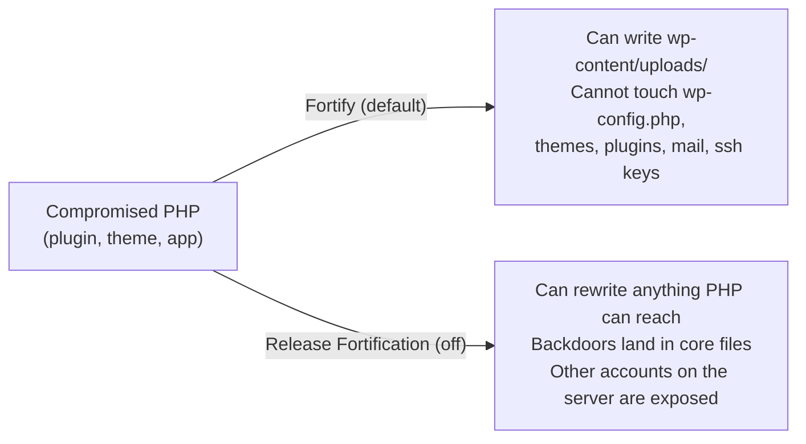

Fortification is ApisCP's blast-radius limiter. The customer's PHP web app runs as a system user called `apache`. The customer's files belong to a different system user, the account's admin user. A compromised plugin gets `apache`'s permissions, which means it can write to a small allow-list of paths (uploads, cache directories) and nothing else. The same trick is what causes the most common WordPress ticket to land on the helpdesk.

## Two users, one account

A typical ApisCP account has at least two real Unix users behind the scenes. The **account user** owns the customer's files and is the SFTP / SSH login target. The **`apache` user** runs PHP-FPM for every web app on the account. Filesystem ACLs (`setfacl`) decide which paths `apache` can write into. By default, the answer is "the small handful of paths the app needs to function" and nothing else.

The diagram is the mental model. With Fortify on, a plugin RCE writes a webshell into uploads and that's it. Without Fortify, the same RCE rewrites `wp-config.php`, plants a backdoor in the active theme, reads the customer's mail, and (on a server where the account user is the same across customers, as on many cPanel installs) reaches into the next customer's home directory. ApisCP's competitor model is the "without" column; ApisCP's default is the "with" column.

<Callout type="info" title="What this stops, plain English">
A popped plugin can still scribble cat GIFs into the uploads folder. It cannot install a persistent backdoor in PHP code, cannot read the customer's `~/.ssh/id_rsa`, and cannot pivot into another customer's account on the same server. That is the whole point.
</Callout>

## The four levels you'll see in the panel

The Web Apps surface exposes Fortification as four named states. Two of them are everyday; two are short-lived tools.

| Mode | What apache can write | When to use it |
|---|---|---|
| **Fortify** | Only the paths the app needs (uploads, cache). Default for known apps. | Always, unless one of the others applies. |
| **Web App Write Mode** | Everything in the document root, for a short timed window (default around 10 minutes). | Customer or tech is doing an in-place plugin install or core update through the WP admin UI right now. Fortify snaps back automatically when the timer expires. |
| **Release Fortification** | Everything in the document root, no timer. | Almost never. A stuck migration. A genuinely broken-by-design app. Document the reason in the ticket; do not leave it Released. |
| **Learning Mode** | Everything in the document root for a 30-minute window, then ApisCP builds a profile from whatever changed. | The app isn't WordPress / Drupal / Joomla / Magento; ApisCP doesn't ship a profile for it. Run Learning Mode once on first install. |

Fortify itself has two sub-levels (MIN and MAX) that the Intermediate course tunes. For triage, treat Fortify as one state and reach for Write Mode when the customer needs to install something through the WP admin UI.

## "I can't install a plugin"

This is the single most common Fortification ticket. The story:

1. Customer (or you, mid-Login-As) clicks **Plugins > Add New** in the WordPress admin.
2. WordPress tries to write the plugin's files into `wp-content/plugins/`.
3. PHP is running as `apache`. Fortify says `apache` can't write into `wp-content/plugins/`. The write fails.
4. WordPress prompts the user for FTP credentials.

The FTP dialog is the visible symptom. It is not a misconfiguration. WordPress is asking for a *second* set of credentials so it can perform the install as the **account user** (who can write into `plugins/`), rather than as `apache` (who can't). That's also why the account user's password is the right answer in the dialog, with `localhost` as the host.

That's not always the right move for the helpdesk, though. There are three plausible responses, and the choice depends on what the customer actually wants.

<DecisionTree client:load
  startId="root"
  nodes={[
    { type: "question", id: "root", prompt: "What does the customer actually want?", choices: [
      { label: "Install one plugin once, right now", next: "once" },
      { label: "Be able to install plugins from the WP admin whenever they want", next: "always" },
      { label: "Have ApisCP keep plugins updated automatically", next: "auto" },
    ]},
    { type: "outcome", id: "once", label: "Web App Write Mode for one window", tone: "success",
      body: <>From <strong>Web &gt; Web Apps</strong>, on the WordPress card, switch the mode to <strong>Web App Write Mode</strong>. The timer starts. The customer installs the plugin through WP admin without an FTP dialog. The mode reverts to Fortify automatically when the timer ends. This is the right answer for almost every ticket.</> },
    { type: "outcome", id: "always", label: "Hand them their FTP credentials", tone: "info",
      body: <>WordPress's FTP dialog is the supported path for self-service plugin installs while staying Fortified. Give the customer their account-user FTP credentials (host <code>localhost</code>, username = account user, password = account password) and a one-page explainer on what the dialog wants. They install plugins normally; the platform stays protected.</> },
    { type: "outcome", id: "auto", label: "Lean on ApisCP's update facility", tone: "success",
      body: <>From the same Web Apps card, make sure auto-updates are on. ApisCP runs <code>webapp:update-all</code> twice a week against every enrolled site. The customer never sees the FTP dialog because the updates happen outside WordPress, as the account user, with a snapshot taken first. New plugin <em>installations</em> still need Write Mode or the FTP dialog; updates of plugins they already have do not.</> },
    { type: "outcome", id: "release", label: "Release Fortification (last resort)", tone: "warn",
      body: <>Turning Fortification off entirely is the wrong answer for almost every ticket. It removes the protection that makes the platform safe for multi-tenant hosting. If the only fix is Release, write the reason in the ticket and put a reminder on the account to re-Fortify within the day.</> }
  ]}
/>

## Fortification is per-site, not per-account

Two WordPress installs in the same account can run at two different Fortification levels. The customer's primary domain might be MAX (locked down, in production, only ApisCP updates it). A staging subdomain might be MIN (looser, the customer experiments here). The same account, two settings. Tickets that talk about "my site" don't always mean the primary; ask which install the customer means before changing modes.

## What this is NOT

- **Not antivirus.** ApisCP's malware scrubbing is a separate subsystem that scans uploads against signatures. Fortification doesn't scan anything; it limits what an attacker can do after a successful exploit.
- **Not a substitute for keeping the app updated.** Fortify reduces the blast radius of a popped plugin. It doesn't stop the plugin from being popped. Patches and good plugin hygiene still apply.
- **Not something to turn off because the customer keeps hitting the FTP dialog.** The FTP dialog is the design working as intended. Write Mode is the answer, not Release.

Next lesson: the Web Apps screen itself, button by button, including snapshots, auto-updates, and the WordPress SSO link that saves you a password handoff.
