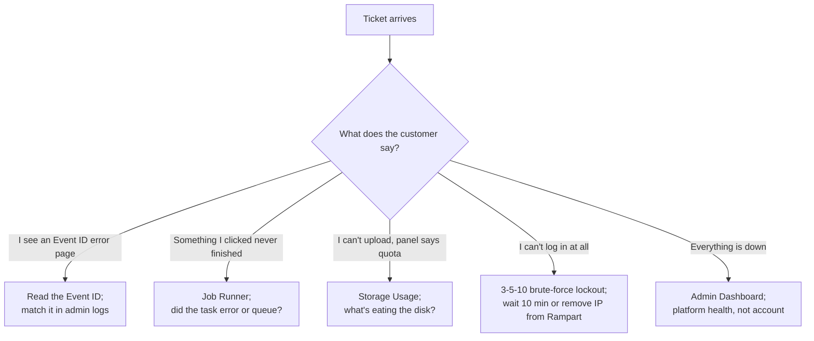

When a ticket says "the panel isn't working", the first job is figuring out which thing isn't working. ApisCP rarely returns a vague error; it returns an **Event ID**, a queue state, a storage breakdown, or a brute-force lockout. Each of those points at a different part of the platform.

## The triage map

## Signal 1: the Event ID

ApisCP returns a per-error Event ID on the error screen, like `0c515558-38a2-59be-82c6-1d810b1195e2`. The ID is the lookup key in the admin's logs. Without it, you're hunting through Apache and panel logs by timestamp; with it, you grep one line.

<AnnotatedScreenshot
  src="/img/apiscp/error-event-id.png"
  alt="ApisCP Internal Server Error page with a rocket-ship icon and an Event ID string below."
  caption="The Event ID under the error message is the lookup key. Always copy it into the ticket before retrying anything."
>
  <Hotspot client:load x={50} y={62} label="1" title="Event ID" purpose="The unique identifier for this specific error.">
    Format is a UUID. Same UUID lands in the admin-side panel log; grep for it to find the full stack trace.
  </Hotspot>
</AnnotatedScreenshot>

The procedure when a customer reports a 500-style error:

<StepThrough client:load>
  <Step title="Ask for the Event ID">
    A screenshot of the error page is enough. The UUID is the only thing you need.
  </Step>
  <Step title="Grep the panel log">
    On the server, `grep <event-id> /usr/local/apnscp/storage/logs/error.log` returns the surrounding stack trace.
  </Step>
  <Step title="Read the trace and act">
    Most production Event IDs point at a misconfigured site, a missing dependency, or a recently changed Scope. Fix the root cause, then ask the customer to retry.
  </Step>
</StepThrough>

## Signal 2: the Job Runner

ApisCP runs slow operations as background jobs: web app installs, web app updates, mass account edits, backups. The Job Runner sidebar entry shows the queue and what each job did.

When the customer says "I clicked Install WordPress and it just sat there", the job didn't fail loudly; it landed in the queue. Open Job Runner, find the install task, read its state:

- **Pending**: queued but not started. Usually means the worker is busy with something else.
- **Running**: in progress. The job's progress section updates live; leave it alone.
- **Completed**: done. The result is in the job's output.
- **Failed**: an exception fired. The output panel has the message; this is the next-step lookup.

Customers don't see Job Runner. *Tell* them when something is queued behind another job, otherwise they think nothing is happening.

## Signal 3: storage usage

Quota tickets are the second-most-common ticket family after mailbox tickets. ApisCP exposes a Storage Usage page that breaks down the account by directory.

<AnnotatedScreenshot
  src="/img/apiscp/storage-usage.png"
  alt="ApisCP Storage Usage dashboard. A pie chart shows the share of total space used by users vs system. Below it a table lists directories like /var/log and /var/www with their respective storage percentages."
  caption="The Storage Usage page is the first place to look when a customer hits a quota wall. The pie chart is a glance; the table tells you which directory to clean up."
>
  <Hotspot client:load x={85} y={30} label="1" title="Pie chart" purpose="At-a-glance split of storage by category.">
    Users vs system vs apache. A bulging `apache` slice means a web app (usually WordPress media uploads) is the culprit.
  </Hotspot>
</AnnotatedScreenshot>

A handful of paths come up so often they're worth memorising:

- `/var/lib/mysql` and `/var/lib/pgsql` are **never** touched directly. Database file deletion corrupts the DB; drop the database from MySQL Manager or PostgreSQL Manager instead.
- `/var/log/httpd` is the access-log audit trail. Five days minimum retention; deletion is a support-ticket conversation.
- `apache` user storage is the PHP-process owner, not the customer. Files uploaded by a CMS (WordPress media library) are credited here.

## Signal 4: the 3-5-10 brute-force lockout

Every ApisCP server runs a default brute-force deterrent on every login surface: **three** wrong passwords in a **five**-minute window blocks the IP for **ten** minutes. This applies to panel, FTP, terminal, mail, every authenticating service. Often the cause when a customer says "the server is down for me but my colleague can use it."

<StepThrough client:load>
  <Step title="Confirm the symptom">
    Customer says "I can't log in" but a different IP works. Likely a Rampart block, not an outage.
  </Step>
  <Step title="Ask for their IP">
    The customer can Google "what's my IP" or you can pull it from the ticket headers if your PSA captures it.
  </Step>
  <Step title="Wait or unban">
    Wait 10 minutes and the block expires automatically. Or, from admin, `cpcmd rampart:unban <ip> '*'` removes the block from every jail immediately.
  </Step>
  <Step title="Send the right password">
    The trigger was wrong passwords. Send the right one via your normal credential-handoff process, not as plain text in the ticket reply.
  </Step>
</StepThrough>

The Advanced course covers Rampart's tuneables (the 3-5-10 numbers are defaults, not laws) and the Shield DOS handler that complements Rampart for web-side abuse.

## Signal 5 (the meta-signal): the admin Dashboard

When two customers report the same problem within minutes, stop. Open the admin Dashboard. If services are red there, you have a platform issue. Customer-facing fixes don't apply; the work is platform-side.

<Callout type="warn" title="Don't escalate to Login-As until you've checked these four">
Login-As is fast, so it's tempting to skip the signal-reading and just Login-As to "see what's going on". But Login-As doesn't reveal Event IDs you didn't ask the customer for, Job Runner state from a different session, or platform-side log lines. Read the signals first; Login-As is the second move, not the first.
</Callout>

## What this is NOT

- **Not a guarantee.** The signals above cover the common cases. Production has edge cases; when none of these fit, the Intermediate course (Web Apps lifecycle) and the Advanced course (Scopes, security stack) cover deeper diagnostics.
- **Not a substitute for asking the customer good questions.** The fastest triage is sometimes a clarifying question, not a log dive.

That's the end of the Beginner course. The Intermediate course teaches what an admin actually does next: creating accounts, plans, SSL automation, web apps with Fortification, and the suspend / activate / edit / delete lifecycle.
