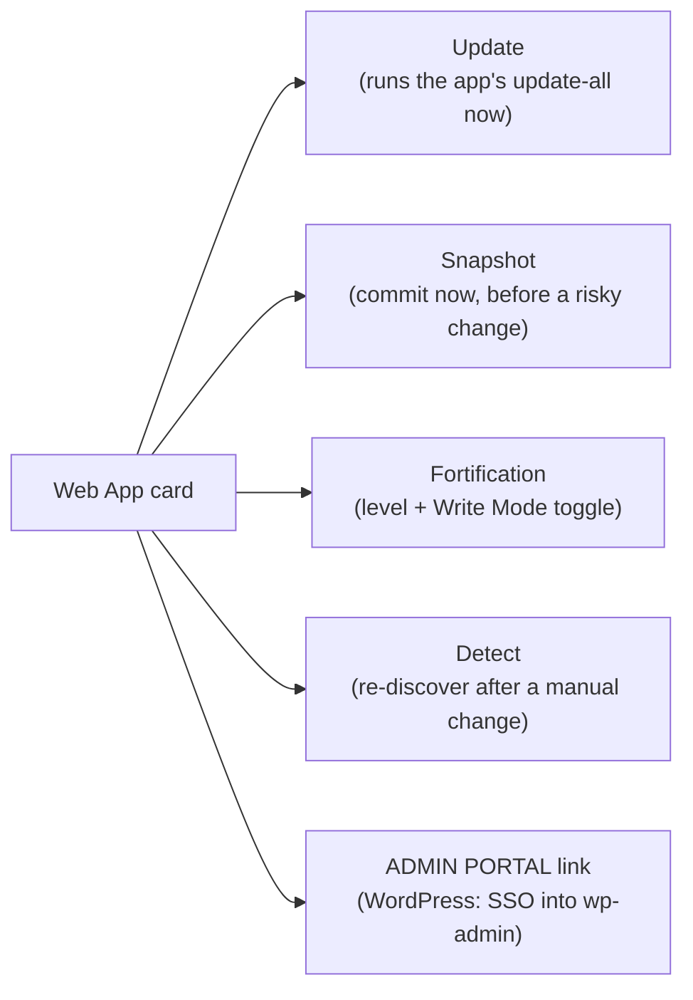

After Login-As, the path is **Web > Web Apps**. Every web app on the account, primary domain or subdomain, gets one card on this page. The card is the control surface: snapshots, updates, Fortification, app-specific actions, admin login. Once you know what each button does, a "WordPress is broken" ticket is two or three clicks long instead of an SSH session.

## What a Web App card shows

Each card has the app's name, version, document root, current Fortification mode, snapshot status, last-update timestamp, and a row of action buttons. The actions vary slightly per app (WordPress has the most), but the load-bearing five appear on every card.

Anything else on the card (manifest editor for ad-hoc apps, plugin/theme list for WordPress, app-specific debug toggles) sits behind those five.

## Snapshots, and what they cost

Snapshots are git-backed. Each Web App with snapshots enabled gets a git repository attached to its document root; a snapshot is a commit. Enable them from the card's **Enable Snapshots** option, or pass `'[git:1]'` at install time.

They are the safety net that makes platform-wide updates safe. They are also the line item on the customer's storage bill that surprises people. The repo holds prior versions of every file the app's ever had, so a 500 MB WordPress site with snapshots on can easily reach 1 GB on disk over a few months. Storage doubles as a rule of thumb. For a customer on a tight quota, that is the conversation to have before flipping the toggle.

When you'd want snapshots on:

- Production sites with content the customer cares about. The platform's twice-weekly update job triggers a snapshot before every update; rollback is automatic on failure.
- Sites the customer edits aggressively (frequent plugin/theme changes, content reorgs). Manual snapshot before a known-risky change is cheap insurance.

When you'd skip them:

- Static or near-static sites that the customer rarely touches.
- Accounts pinned to small plans where the disk cost matters more than the rollback safety.

<Callout type="info" title="Snapshots are on-server, not off-server">
The git repo lives in the same account on the same server. A whole-server failure takes the snapshots with it. They are an update-safety mechanism, not a backup product. Off-server backups (Bacula, Duplicity) are a separate concern, covered in the Advanced course.
</Callout>

## Auto-updates: what ApisCP does by default

Sites installed via Web Apps enroll in ApisCP's automatic update facility by default. Twice a week (Wednesday and Sunday, during the maintenance window) the platform runs `webapp:update-all` for every enrolled site. With snapshots on, each update is wrapped in a pre-snapshot and a post-update health check; on failure, the platform rolls back to the snapshot and notifies the account contact.

The card exposes one toggle for this. Turn it off when the customer has a custom plugin that breaks on every minor update and they've asked you to pin the version. Turn it back on once they've sorted it out, because a WordPress install with auto-updates off is a vulnerability stack waiting to ripen.

## The WordPress-specific actions

WordPress cards expose three actions you'll reach for often:

- **Update.** Same `webapp:update-all` the platform runs on schedule, but on demand. Use when the customer says "the email said an update failed, can you retry it" or when you've just installed a Fortification change and want to confirm updates still work.
- **Reset failed update.** WordPress occasionally lands in a "core update is in progress" state and refuses to do anything else until the lock is cleared. The card has a button to clear it. Way faster than SSH-ing in and deleting `.maintenance` by hand.
- **Plugin enable / disable.** Toggle individual plugins from the panel without logging into wp-admin. The classic use case is "the site is showing a fatal error after the customer installed a plugin"; disable the suspect plugin from here, ask the customer to test, and either re-enable or leave it off.

These are all WordPress's own facilities, surfaced via the bundled WP-CLI; the card is the friendlier door.

## The ADMIN PORTAL link, your WordPress SSO

The card has a link labelled **ADMIN PORTAL**. Click it, and ApisCP generates a one-time WP-CLI login token (via the `wp-cli-login` server plugin that ApisCP installs inside every WordPress site by default) and drops you into wp-admin as the first administrator on the site. No password handoff. No "what was that customer's WordPress password again" detour.

A worked ticket where this matters:

> *Sarah at Able Moose Accounting: "Our website is showing a white page. The contact form was working yesterday. Can you have a look?"*

<StepThrough client:load>
  <Step title="Login-As into the account">
    From Nexus, find ablemoose.example, click Login-As. You're now inside their ApisCP panel.
  </Step>
  <Step title="Open Web > Web Apps">
    The WordPress card shows the version, document root, and Fortification mode. Last-update timestamp says yesterday afternoon, which matches the customer's "was working yesterday" timeline.
  </Step>
  <Step title="Disable the most-recently-changed plugin">
    On the WordPress card, open the plugin list. The one updated yesterday is the suspect. Click Disable on it. Ask the customer to refresh.
  </Step>
  <Step title="If the site is back, log into wp-admin via ADMIN PORTAL">
    Click the ADMIN PORTAL link. You land in wp-admin as the first admin user. Roll the plugin back to the previous version from inside WordPress, or leave it disabled and tell the customer to contact the plugin vendor.
  </Step>
  <Step title="If the site is not back, snapshot rollback">
    Back on the Web Apps card, if snapshots were enabled, the platform's pre-update snapshot from yesterday is in the git history. Roll the site back to it. Investigate the broken state on a staging copy, not the production site.
  </Step>
</StepThrough>

The whole flow is under a minute when the buttons line up. The same triage without these affordances is a `wp-cli` session over SSH.

<Callout type="warn" title="The ADMIN PORTAL link is admin-level access">
The token logs you in as the first administrator on the site, which is full ownership of the WordPress install. Use it for support work. Don't share the URL; the token is one-time but the dialog above it isn't. The audit trail captures that the platform admin clicked it, but anything you do inside wp-admin is logged inside WordPress, not in ApisCP.
</Callout>

## Ad-hoc apps and manifests, briefly

Sites that aren't WordPress / Drupal / Joomla / Magento / Ghost / Laravel / Discourse / Nextcloud appear on the Web Apps page as "Ad hoc." The card is thinner: snapshots and Fortification still apply, but the Update / Reset / Plugin actions don't. To get them, a `.webapp.yml` manifest in the document root tells ApisCP what the app is and how to handle it. The Intermediate course covers the manifest format; for triage, knowing the card exists for non-1-click apps is enough.

## What this is NOT

- **Not a WordPress dashboard.** The card surfaces a handful of common actions. Anything beyond that (configuring plugins, editing content, managing users) belongs in wp-admin, reached via the ADMIN PORTAL link.
- **Not an off-server backup.** Snapshots live with the site on the same server. The Advanced course covers Bacula / Duplicity for off-server retention.
- **Not where you'd manage Fortification policy.** The card toggles between Fortify and Write Mode and Release. Tuning what Fortify allows per-app is profile-level work covered in the Intermediate and Advanced courses.

Next lesson: triage moves. When something does break, four signals tell you where to look before reaching for Login-As.
