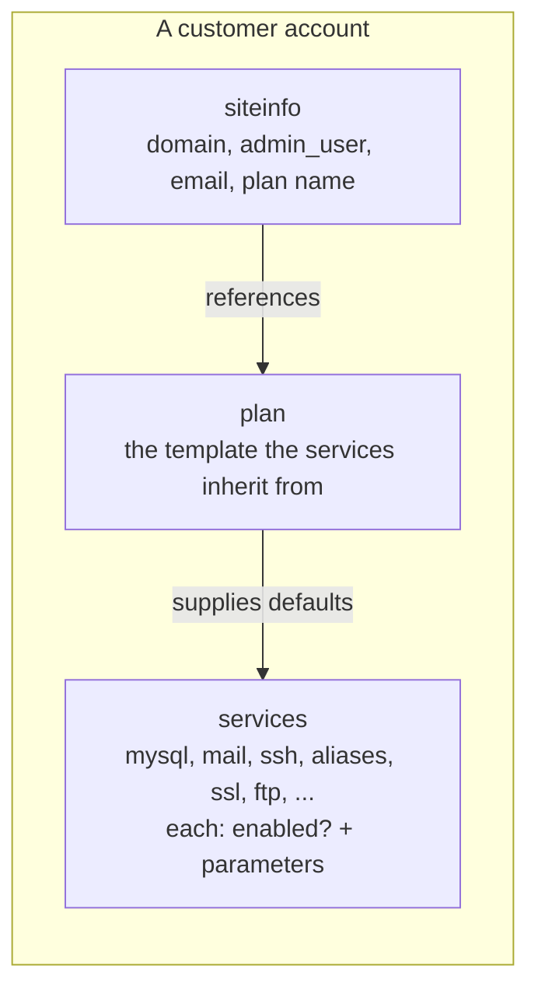

The Beginner course covered the account as a container the customer logs into. From here on you're building accounts, not just visiting them. The shape underneath is three things: a **siteinfo**, a set of **services**, and a **plan**. Every Add / Edit / Nexus operation manipulates this triad.

## The triad



- **siteinfo** is the account's identity card. Primary domain, admin username, contact email, the plan it's assigned to. One per account.
- **Services** are switches and parameters. Each one says "is this feature enabled, and at what setting?". A short list of the ones you'll touch most:

| Service | What it controls | Common parameter |
|---|---|---|
| `siteinfo` | Identity | `domain`, `admin_user`, `email`, `plan` |
| `mysql` | MySQL on this account | `enabled`, max databases |
| `pgsql` | PostgreSQL | `enabled` |
| `mail` | Inbound and outbound mail | `enabled` |
| `ssh` | Terminal access | `enabled` |
| `users` | Secondary user count | `enabled`, `max` |
| `aliases` | Addon domains | `enabled`, `aliases[]` |
| `ssl` | Per-account SSL | `enabled` |
| `letsencrypt` | LE certificate automation | `enabled`, scheduled renewal |
| `diskquota` | Storage quota | `enabled`, `quota` |
| `bandwidth` | Bandwidth cap | `enabled`, `limit` |
| `auth` | Auth knobs | `passwd`, `tpasswd`, `cpasswd` |
| `billing` | Billing identifier | `invoice`, `parent_invoice` |

- **Plan** is the template. When an account is created with `-p plan-name`, every unset service value falls through to the plan's value. Override a single value (`-c mysql,enabled=0`) and the rest still inherit.

This is the entire mental model. Every screen and every command is some manipulation of this triad.

## The triad in motion

Watch what happens to the triad as you add a secondary user and then take a service away. Each step shows what `cpcmd admin:collect` reads back for the account afterwards.

<StepThrough client:load>
  <Step title="Starting state: mail on, ssh off, users.max=1">
    Able Moose's account has mail enabled, terminal access disabled, and a `users` service set to one slot (just the admin user). The `admin:collect` for the relevant fields:

    ```bash
    cpcmd admin:collect '[siteinfo.domain,mail.enabled,ssh.enabled,users.max]' \
      '[siteinfo.domain:ablemoose.example]'
    # {"site42":{"siteinfo":{"domain":"ablemoose.example"},
    #   "mail":{"enabled":1},"ssh":{"enabled":0},"users":{"max":1}}}
    ```
  </Step>
  <Step title="Add a secondary user (Helen)">
    Bookkeeper Helen needs her own mailbox login. Bump `users.max` to 3 to leave room, then add the user:

    ```bash
    EditDomain -c users,max=3 ablemoose.example
    cpcmd -d ablemoose.example user:add helen 'GeneratedPassword!'
    ```

    `user:add` creates a real Unix user inside the account; she now counts against `users.max`. `admin:collect` shows the change:

    ```bash
    cpcmd admin:collect '[users.max]' '[siteinfo.domain:ablemoose.example]'
    # {"site42":{"users":{"max":3}}}
    ```

    Helen is a secondary user. She can authenticate to mail (and, if granted, SFTP). The panel is the admin user's surface; secondary users have a reduced view.
  </Step>
  <Step title="Disable mail and see what breaks">
    Suppose the customer moves their mailboxes to Microsoft 365 and asks the MSP to turn off mail on the ApisCP account. One flag:

    ```bash
    EditDomain -c mail,enabled=0 ablemoose.example
    ```

    What breaks: inbound mail to `ablemoose.example` stops (Dovecot stops accepting for the domain), the catch-all is gone, IMAP/SMTP submission for Helen's mailbox stops authenticating. What doesn't: the panel, the website, DNS records, databases. The triad's services are independent switches; flipping one doesn't cascade past the service it owns.
  </Step>
</StepThrough>

## The -c flag

`AddDomain` and `EditDomain` use the same flag pattern everywhere: `-c <service>,<parameter>=<value>`. Read it as "configure service `mysql`'s `enabled` parameter to `0`":

```bash
EditDomain -c mysql,enabled=0 ablemoose.example
```

Multiple `-c` flags compose; each one is an independent setting:

```bash
AddDomain \
  -c siteinfo,domain=ablemoose.example \
  -c siteinfo,admin_user=ablemoose-au \
  -c siteinfo,email=admin@ablemoose.example \
  -c siteinfo,plan=basic \
  -c diskquota,quota=10000 \
  -c users,max=20
```

The Nexus UI generates these same `-c` flags under the hood. The difference is auditability: a CLI invocation reads back to you exactly; a UI click does too, but the receipt is in the action log rather than the command itself.

## Plans, the inheritance shortcut

A "basic" plan ships with ApisCP. Most MSPs start there, then build their own plans for tiers ("starter", "growth", "agency"). Plans live as service-value INI files at `resources/templates/plans/<plan-name>/`. They're inheritable: a thin "starter" plan can override only what differs from "basic" and inherit the rest.

A real custom plan (named `agency`) might be three lines:

```ini
# resources/templates/plans/agency/diskquota
[DEFAULT]
quota = 50000

# resources/templates/plans/agency/users
[DEFAULT]
max = 50
```

Everything else falls through to the base plan. The Plans lesson (lesson 3) covers creating and managing these.

<Callout type="info" title="Plans are not billing tiers">
A plan is a *technical* template. It decides what an account *can* do. Whether the customer pays $5 or $50 a month, what's on the invoice, and how the renewal happens are all the billing software's problem. Wire `siteinfo,plan` and `billing,invoice` independently; one names the capability, the other names the money.
</Callout>

## A worked Able Moose onboarding

Able Moose Accounting has just signed on with the MSP. The MSP standard plan is `agency`, the primary domain is `ablemoose.example`, the admin contact is `admin@ablemoose.example`, and the desired admin username is `ablemoose-au`.

The single command:

```bash
AddDomain -p agency \
  -c siteinfo,domain=ablemoose.example \
  -c siteinfo,admin_user=ablemoose-au \
  -c siteinfo,email=admin@ablemoose.example \
  --notify \
  --bootstrap
```

What that produces:

- A new account named after the primary domain. Internal site identifier is something like `site42`.
- Every service in the `agency` plan applied at its plan-default values: 50 GB quota, 50 users max, MySQL enabled, mail enabled, etc.
- A welcome email sent to `admin@ablemoose.example` with the panel URL and the auto-generated password.
- A Let's Encrypt SSL certificate issued automatically because `--bootstrap` triggered the LE bootstrap hook.

That's the entire onboarding. Everything else (DNS, mailboxes, WordPress) is on the customer side, or the next set of `EditDomain` calls.

## The two account identifiers

Read carefully, because this catches new techs out: an account has **two** identifiers and most commands accept *either*:

- **The primary domain** (`ablemoose.example`). What humans use; what shows up in URLs; what `EditDomain <domain>` accepts.
- **The site identifier** (`site42`). What the filesystem uses internally; what `cpcmd -d <site>` accepts.

You can also pass an **admin username** (`ablemoose-au`) or a **billing invoice** (`apiscp-XYZ123`) to most commands. The `get_site_id` helper resolves any of these to the `siteXX` form.

```bash
get_site_id ablemoose.example    # → site42
get_site_id ablemoose-au        # → site42
cpcmd -d site42 common:get_load # uses the site identifier
```

## What this is NOT

- **Not a per-user permission model.** Plans assign service settings to an *account*. Per-user permissions (e.g. a secondary user that can manage mailboxes but not files) live in the `users` service's parameters; not in plans.
- **Not change-tracked by ApisCP itself.** ApisCP doesn't keep a diff log of "who changed `diskquota,quota` from 5000 to 10000 last Thursday". If you need that, log via your own audit hook in `cpcmd` wrappers or the billing integration.
- **Not safe to overwrite in bulk by accident.** `EditDomain --all -c <flag>` applies the change to *every* account on the server. Use it with `--dry-run` first.

Next lesson: creating an account from end-to-end, both Nexus UI and `AddDomain` CLI.
