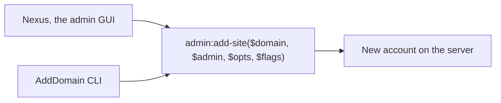

`AddDomain` is the one command in ApisCP that maps an entire customer onboarding to a single line. Nexus is the GUI front-end for the same call. The two are equivalent on output; the choice between them is operational, not technical.

## The two surfaces



The CLI is for scripts, billing integrations, repeatable onboarding flows, and any change you want a clear receipt of. The GUI is for one-off provisioning when an admin is already in the panel and needs to see the form fields prompt them through the choices.

## The CLI, full shape

```bash
AddDomain \
  -p <plan> \
  -c siteinfo,domain=<primary-domain> \
  -c siteinfo,admin_user=<admin-username> \
  -c siteinfo,email=<contact-email> \
  -c billing,invoice=<billing-id> \
  --bootstrap \
  --notify
```

The flags that change behaviour:

- **`-p <plan>`**: applies the named plan's service defaults. Without it, the server's `default_plan` (set via `cp.config opcenter default_plan`) is used.
- **`-c siteinfo,*`**: the three required identity fields. Domain, admin user, email. The admin user must be unique server-wide.
- **`-c <service>,<param>=<value>`**: any service tweak you want. Each one is independent; the plan supplies defaults for whatever you don't override.
- **`-c auth,passwd=1`**: prompts for a password interactively (and confirms it). Without this, a random password is generated and emailed to the contact address.
- **`--bootstrap`**: tries to issue a Let's Encrypt certificate at creation. If `letsencrypt.auto_bootstrap` is true (a Scope), this is implied. Pass `--bootstrap=false` (or `-c ssl,enabled=0`) to skip.
- **`--notify`**: sends a welcome email to the contact address. The template is at `resources/views/email/opcenter/account-created.blade.php`; the Customizing lesson in the Advanced course covers overriding it.
- **`--force`**: hook failures don't abort the addition. Use sparingly; failure of an onboarding hook usually means something to fix, not ignore.

## A worked CLI onboarding, with reasoning

> *MSP onboards Able Moose Accounting. Standard plan is `agency`. They've registered their billing in the invoicing system as `am-2026-014`.*

```bash
AddDomain -p agency \
  -c siteinfo,domain=ablemoose.example \
  -c siteinfo,admin_user=ablemoose-au \
  -c siteinfo,email=admin@ablemoose.example \
  -c billing,invoice=am-2026-014 \
  --bootstrap \
  --notify
```

What each line does:

- `-p agency` sets the plan baseline. Quota, user count, services-enabled all come from the plan.
- `siteinfo,domain` is the primary domain. The URL the customer will use for their site and the basis of their default mail domain.
- `siteinfo,admin_user` is the panel login. Must be unique server-wide. Convention: domain-as-slug, often `<domain>-<tld>`.
- `siteinfo,email` is the contact address. Welcome email lands here; future password resets and Let's Encrypt notifications land here too.
- `billing,invoice` ties the account to a billing identifier. Lets you `EditDomain` or `SuspendDomain` against the invoice rather than the domain when the billing system needs to act on the account in bulk.
- `--bootstrap` issues SSL on creation.
- `--notify` sends the welcome.

After the command returns, Nexus shows a new row for `ablemoose.example`. The customer can log in immediately with the credentials from the welcome email.

## The Nexus equivalent

In Nexus the same onboarding is a form. The required fields are the same three `siteinfo,*` values; everything else is a checkbox or a dropdown. Once submitted, Nexus calls `admin:add-site` under the hood, the equivalent of `AddDomain`. The Job Runner shows the call's status while it runs.

When to prefer Nexus: a one-off onboarding where the admin wants the form to prompt them through plan selection and any custom service overrides.

When to prefer CLI: anything you want to repeat (a standard small-business onboarding shape), anything driven by billing integration (Blesta / WHMCS), anything in a script, and anything you want a clean line of audit for.

## EditDomain, the same shape

`EditDomain` mirrors `AddDomain`. Same `-c flag` system, against an existing account:

```bash
# Increase a customer's disk quota
EditDomain -c diskquota,quota=20000 ablemoose.example

# Change the contact email
EditDomain -c siteinfo,email=billing@ablemoose.example ablemoose.example

# Switch to a different plan
EditDomain -c siteinfo,plan=enterprise ablemoose.example
```

`--all` applies an edit to every account; `--filter` constrains it. Both belong wrapped in `--dry-run` before the real run:

```bash
# Show what would change, don't apply
EditDomain --dry-run -c diskquota,quota=20000 --all
```

<Callout type="warn" title="--all and --force are loaded weapons">
`EditDomain --all` touches every account on the server. `AddDomain --force` ignores hook failures. Both have uses; both have done damage in haste. `--dry-run` is the antidote; use it.
</Callout>

## When AddDomain fails

The common shapes of failure:

| Failure | Cause | Fix |
|---|---|---|
| `Domain already exists` | The primary domain is taken on this server | Use a different primary; or `DeleteDomain` the existing if it's a stale onboarding |
| `Admin user already exists` | The admin username is taken (server-wide) | Pick a different `admin_user`; convention is domain-derived |
| `Plan not found` | Typo or the plan isn't on the server | `./artisan opcenter:plan --list` to confirm; create the plan if missing |
| Hook failure | An onboarding script the MSP added has a bug | Read the hook output; `--force` only after understanding the cause |

The Beginner course's triage signals (Event ID, Job Runner, log lookups) apply here too: `AddDomain` failures land in the same panel log and grepping the Event ID surfaces the trace.

## DeleteDomain, with a brake

Deleting a customer is destructive. The first move is *always* `--dry-run`:

```bash
DeleteDomain --dry-run ablemoose.example
```

`--dry-run` reports what would be removed without removing it. Confirm the right account, then run the real delete:

```bash
DeleteDomain ablemoose.example
```

Bulk-delete by billing invoice or by suspension reason needs the same brake on it (see lesson 6 of this course for the lifecycle in full).

<Checkpoint slug="apiscp-account-provisioning-checkpoint-services" client:visible />

## What this is NOT

- **Not the moment to design plans.** Use the plan that already exists. The Plans lesson covers creating and editing plans before they become the default.
- **Not the same as registering a domain.** ApisCP creates an *account* for a domain. The domain itself still needs to be registered (at a registrar) and have nameservers pointed at the MSP's DNS infrastructure.
- **Not idempotent with `--force`.** Re-running `AddDomain` for a domain that already exists fails; `--force` does *not* turn this into an upsert.

Next lesson: plans in full. Built-in basic, creating custom plans with `artisan`, and the inheritance pattern.
