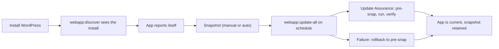
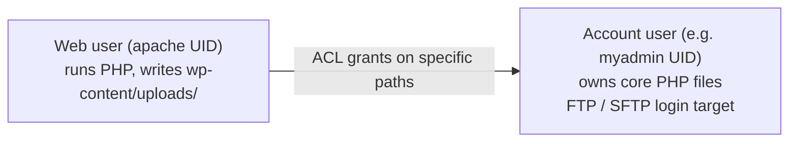

ApisCP's 1-click web app installer is the surface customers see most after mail. Under the hood it's the `webapp` module: agnostic, snapshot-aware, and Fortification-protected. The Beginner course covered clicking Install WordPress; this lesson covers what's actually happening and the operational levers you'll pull.

## The Web Apps lifecycle



A 1-click WordPress install does this end-to-end:

1. Creates a database (with `webapp:create-database` or its module-specific equivalent).
2. Downloads the latest WordPress.
3. Writes the document root, configures `wp-config.php`, sets the database credentials.
4. Runs the install wizard non-interactively, sending the admin credentials to the contact email.
5. Marks the document root as belonging to a Web App, so `webapp:discover` finds it later.
6. Enables Update Assurance (snapshot before each update) if Fortification is on.

## The agnostic webapp module

The `webapp` module is the same call regardless of the app. `webapp:update-all('ablemoose.example')` updates whatever lives in the document root, whether that's WordPress, Drupal, Ghost, Joomla, or Laravel. The module dispatches to the right per-app code automatically:

```bash
# Update everything ApisCP knows about for this domain
cpcmd -d ablemoose.example webapp:update-all

# Detect what's there (force re-detection)
cpcmd -d ablemoose.example webapp:discover blog.ablemoose.example

# Take a manual snapshot
cpcmd -d ablemoose.example webapp:snapshot blog.ablemoose.example
```

The 1-click catalogue varies by ApisCP release; current builds cover WordPress, Drupal, Ghost, Joomla, Laravel, Magento, Discourse, and Nextcloud. Anything else can run as an **ad-hoc app** via a manifest.

## Ad-hoc apps and manifests

A `.webapp.yml` file in the document root tells ApisCP an unknown app exists and how to handle it. From the docs, the minimum useful manifest:

```yaml
# .webapp.yml in the document root
base: wordpress              # optional: inherit a known app's behaviour
depth: 0                     # 0 means approot == docroot
database:
  type: mysql
  user: ablemoose_app
  password: <stored elsewhere>
  db: ablemoose_app
  host: localhost
  prefix: ''
fortification:
  max:
    - file1
    - dir/subdir/
  min:
    - file1
    - dir/
```

After writing the manifest, sign it (`webapp:manifest-sign $hostname $path`) so ApisCP trusts it. Resigning is required after any edit; the signature is the integrity check that stops an attacker from modifying the manifest to escalate.

## Fortification, the operational view

Fortification is ApisCP's privilege-separation framework. Every web app runs under a user named `apache` that's different from the account's admin user. Files an attacker would target (`wp-config.php`, theme PHP, plugin PHP) are owned by the account user; files an attacker would write (`wp-content/uploads/`) are owned by `apache`. PHP can read its own configuration but can't overwrite it, can't overwrite the theme, can't escalate to the account user.



The boundary is the point. Mechanism (ACL specifics, the per-app profile, the unfortify escape hatch) is Advanced-course material; for now, treat the two boxes as separate Unix users that share a filesystem via narrowly-granted ACLs.

Two operational settings the admin app exposes per Web App:

- **`MIN` (default for most apps)** — Apache can write only to specified paths (uploads, cache directories). Application core files are read-only.
- **`MAX`** — even more restrictive; some paths the app expects to write to are read-only. WordPress install/update via the GUI fails under MAX; the admin has to issue updates via `webapp:update-all`. Useful for static-after-publish workflows.

Switching Fortification levels:

```bash
cpcmd -d ablemoose.example webapp:fortify blog.ablemoose.example max
# or in the GUI: Web > Web Apps > Fortification > Fortify (MAX)
```

The Advanced course covers Fortification's internals (the ACL model, the per-app profile in `webapp:fortify-profile`, the unfortify escape hatch). For Intermediate, MIN is right for most accounts; MAX is the post-launch lockdown.

<Callout type="info" title="Why end-user FTP updates exist alongside Fortification">
WordPress can update itself via FTP, prompting the user for FTP credentials at upgrade time. With Fortification on, the WP admin can't directly write to PHP files (apache user can't, by design). FTP gives WP a separate user context (the account's admin user) to perform the write. The trade-off is that the FTP password lives in WordPress's session during the update; if the WP admin is compromised, the FTP password is too.
</Callout>

## Snapshots and Update Assurance

Snapshots are **git-backed**. Each Web App with snapshots enabled gets a git repository attached to its document root; a snapshot is a commit. Enable snapshots from Web > Web Apps in the panel, or at install time via the `'[git:1]'` install flag.

- **Manual**: `cpcmd webapp:snapshot $hostname $path` or the Snapshot button in the GUI.
- **Auto via Update Assurance**: when an update is initiated through `webapp:update-all`, ApisCP records the app's HTTP status code and content length before the update, takes a snapshot, runs the update, and re-evaluates the same probes afterward. If the post-update response is non-2XX, or the content length drifts past the `[webapps] => assurance_drift` tuneable, ApisCP rolls back to the snapshot automatically.

This is the load-bearing safety mechanism for unattended updates. Without it, an MSP can't trust the platform-wide nightly `webapp:update-all` job not to break customer sites. With it, the rollback is automatic and the customer's site stays up.

Tune the drift sensitivity via `cp.config`:

```bash
# Read the current drift tolerance (decimal fraction; 0.3 means 30% content-length swing)
cpcmd scope:get cp.config webapps assurance_drift

# Loosen for an app whose homepage legitimately changes a lot
cpcmd scope:set cp.config webapps assurance_drift 0.5
```

## The customer-side updates dance

In the customer's panel (Web > Web Apps), each app exposes:

- **Update** — runs `webapp:update-all` for this domain.
- **Snapshot** — takes a snapshot now.
- **Detect** — re-runs `webapp:discover` if ApisCP's metadata about the app has drifted.
- **Fortification** — toggles MIN/MAX, or temporarily lifts Fortification (called "Write Mode") for an install/maintenance window.

The customer rarely uses these directly. The MSP either runs platform-wide updates (recommended; Update Assurance guards every site) or hands the buttons to a power-user customer with a written process.

## A worked update flow

> *The platform runs a weekly cron at 03:00 Sunday: `cpcmd admin:update-webapps '[]'`. This updates every Web App across every account.*

Behind the scenes:

1. ApisCP enumerates accounts with Web Apps.
2. For each app: record HTTP status + content length → snapshot (a git commit on the app's repo) → run update → re-probe.
3. If the response is 2XX and content length is within `assurance_drift`: the commit stays in the app's git history; the app is on the new version.
4. If the response is non-2XX or drifts past tolerance: rollback to the prior commit, mark the app for admin attention, notify the account contact and (if `crm.copy_admin` is set) the MSP.

Monday morning, the admin reviews the night's events on the Dashboard. Failed updates are an explicit list to act on; everything else proceeded without intervention.

<Checkpoint slug="apiscp-account-provisioning-checkpoint-fortification" client:visible />

## What this is NOT

- **Not a CMS-specific build system.** ApisCP doesn't manage WordPress plugins, themes, or content. It manages WP at the level of "core + the plugins WP itself reports". Plugin curation is the customer's job.
- **Not a substitute for off-server backups.** Snapshots live on the same server as the account. A whole-server failure takes them with it. The Backups lesson in the Advanced course covers Bacula and Duplicity for off-server protection.
- **Not a feature gate.** Fortification is on by default. Turning it off (`webapp:unfortify`) is a one-shot escape hatch for a stuck migration, not a per-customer choice.

Next lesson: the lifecycle. Suspend, activate, edit, delete; the brakes and bulk operations that keep multi-account ops sane.
