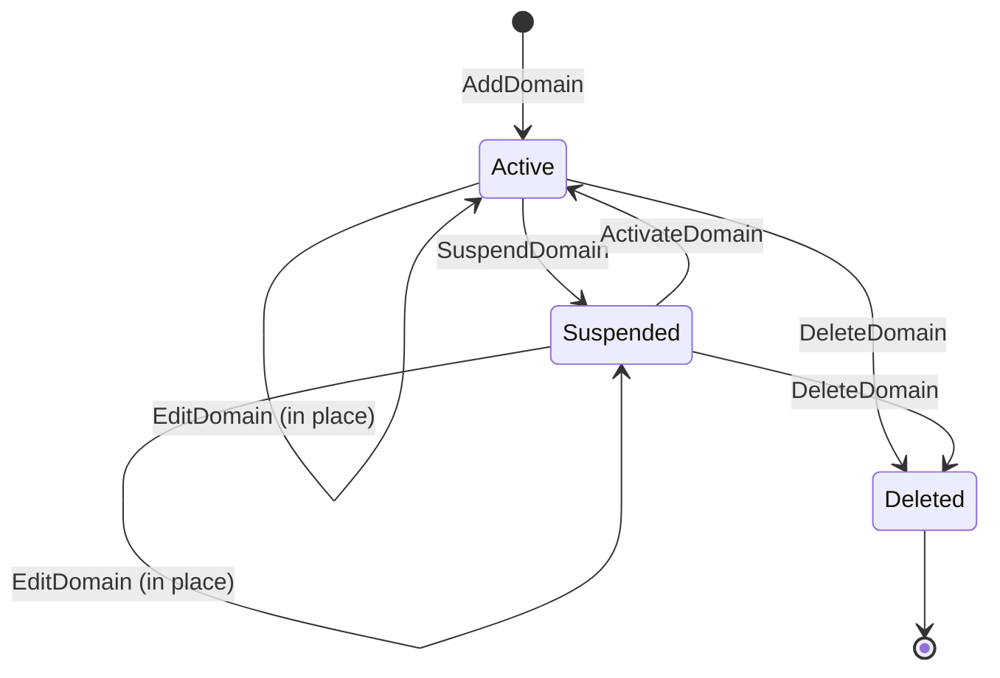

Every account beyond its first day is somewhere in a four-state lifecycle: active, suspended, edited, deleted. The four commands (`ActivateDomain`, `SuspendDomain`, `EditDomain`, `DeleteDomain`) cover this. Lesson 2 covered Add and Edit for the onboarding path; this lesson covers the rest of the lifecycle and the bulk-operation patterns built on top.

## The lifecycle, one diagram



Active is the default. Suspended is a soft-disable; the account exists but can't serve traffic, deliver mail, or accept logins for non-panel surfaces. Deleted is gone (filesystem, mail, databases all removed) and not recoverable from inside ApisCP — only from an off-server backup.

## SuspendDomain

```bash
SuspendDomain ablemoose.example
```

Effect: account immediately stops serving web, mail, FTP, terminal. The customer's panel login still works by default (so they can read the suspension reason), but every other service rejects them. The account's data, files, mail, databases are all preserved untouched.

Useful flags:

- **`--reason="$reason"`**: explanation shown to the customer on panel login. Without a reason, login shows "Your account has been suspended" with no detail.
- **`--template=NAME`**: render the reason via a Blade template under `resources/templates/opcenter/suspension/`. Use this for a consistent "your invoice is overdue, please pay" message vs a quieter "platform migration in progress" one.

```bash
SuspendDomain --reason="Invoice am-2026-014 unpaid" --template=overdue ablemoose.example
```

A suspended account's panel-login behaviour can be tightened further: set `[auth] suspended_login = false` in `config.ini` (via the Advanced course's Scope) to deny panel login as well.

## ActivateDomain

The reverse of `SuspendDomain`. Reactivates services without touching account data:

```bash
ActivateDomain ablemoose.example
```

Idempotent: running against an already-active account is a no-op.

## EditDomain on a suspended account

You can edit a suspended account. Quotas, plan, email contact, any service value. The edit applies; when activated, the new settings take effect immediately. Useful for "fix the cause of the suspension before reactivating":

```bash
# Customer hit quota and was suspended; raise quota then reactivate
EditDomain -c diskquota,quota=20000 ablemoose.example
ActivateDomain ablemoose.example
```

## DeleteDomain, with safety

```bash
DeleteDomain --dry-run ablemoose.example
```

`--dry-run` reports what *would* be removed without removing anything. Always the first move. Confirm the right account, then:

```bash
DeleteDomain ablemoose.example
```

Bulk-delete patterns:

```bash
# Delete every account suspended over 30 days ago, with reason matching XYZ
DeleteDomain --since="last month" --match="XYZ" --dry-run

# Confirm the list looks right, then run without --dry-run
DeleteDomain --since="last month" --match="XYZ"
```

`--since` accepts strtotime-compatible strings: `"now"`, `"last month"`, `"3 weeks ago"`, unix timestamps. `--match` matches a regex against the suspension reason. Combined, they let you sweep stale accounts.

<Callout type="danger" title="DeleteDomain is destructive and not undoable from inside ApisCP">
Files, mail, databases, snapshots, the account's filesystem space; all gone. The only recovery path is an off-server backup. Always `--dry-run` first. If a customer cancels and might come back, prefer SuspendDomain with a long retention policy.
</Callout>

## Billing invoice grouping

The `billing,invoice` service value is a string that ties an account to a billing identifier. Subordinate accounts can be parented to a master via `billing,parent_invoice`. This is the lever the lifecycle commands use to act on groups:

```bash
# Three accounts under one master invoice
AddDomain -c siteinfo,domain=ablemoose.example \
  -c siteinfo,admin_user=ablemoose-au \
  -c billing,invoice=am-master

AddDomain -c siteinfo,domain=able-au.example \
  -c siteinfo,admin_user=able-au \
  -c billing,parent_invoice=am-master

AddDomain -c siteinfo,domain=able-nz.example \
  -c siteinfo,admin_user=able-nz \
  -c billing,parent_invoice=am-master
```

Now `SuspendDomain am-master` suspends *all three* sites. `ActivateDomain am-master` reactivates them. `DeleteDomain am-master --dry-run` shows what a bulk-delete of the group would remove.

This is the same shape the Advanced course uses for reseller hierarchies and parent/child SSO. For now it's enough to know that `billing,invoice` lets one command act on many accounts.

## EditDomain at scale

Quota bumps and plan migrations are the two common bulk edits. The pattern, with safety:

```bash
# Show what would change without changing it
EditDomain --dry-run -c diskquota,quota=20000 --filter "billing,parent_invoice=am-master"

# Apply for real, after reading the dry-run output
EditDomain -c diskquota,quota=20000 --filter "billing,parent_invoice=am-master"
```

`--all` is the every-account flag; `--filter <criteria>` constrains it. The criteria language matches account metadata: `billing,parent_invoice=...`, `siteinfo,plan=...`, etc.

Bulk plan changes:

```bash
# Move every starter-plan account to agency-plan
EditDomain --filter "siteinfo,plan=starter" -c siteinfo,plan=agency --dry-run
```

Pair with `admin:collect` (covered in the Advanced course) for more sophisticated targeting.

## A worked offboarding

> *Able Moose has notified the MSP they're moving hosts. The MSP needs to suspend the account, hold it for 60 days in case they come back, then delete it cleanly.*

Day 0 — Customer notifies, MSP suspends:

```bash
SuspendDomain --reason="Customer-initiated offboarding, hold until $(date -d '+60 days' +%Y-%m-%d)" ablemoose.example
```

Day 1 — Confirm customer has migrated DNS and mail to the new host:

```bash
# Verify the customer is no longer relying on this account's DNS
dig +short ablemoose.example
# Confirm new host's IP, not the MSP's IP
```

Day 60 — Reminder fires from the MSP's PSA. Confirm with the customer; if they're sticking with the new host, delete:

```bash
DeleteDomain --dry-run ablemoose.example
# Read the output, confirm it matches expectations
DeleteDomain ablemoose.example
```

The customer can no longer come back via ApisCP after step 3. Any restore would be from the MSP's off-server backup, not from ApisCP itself.

## What this is NOT

- **Not a versioned undo.** ApisCP doesn't keep a "previous account state" you can roll back to. Edits are immediate and replace prior values.
- **Not a billing engine.** `billing,invoice` is a string ApisCP uses for grouping; the billing system itself (Blesta / WHMCS / HostBill) tracks money against that string.
- **Not asynchronous.** Suspend/Activate/Edit/Delete are synchronous. The command returns when the change is applied. There's no "scheduled for tomorrow" mode at this layer; cron-driven scripts handle scheduling externally.

That's the Intermediate course. The Advanced course covers what the MSP runs the *platform* on top of: cpcmd / the API, Scopes, the security stack, Fortification's internals, resource enforcement, backups, and reseller integration.
