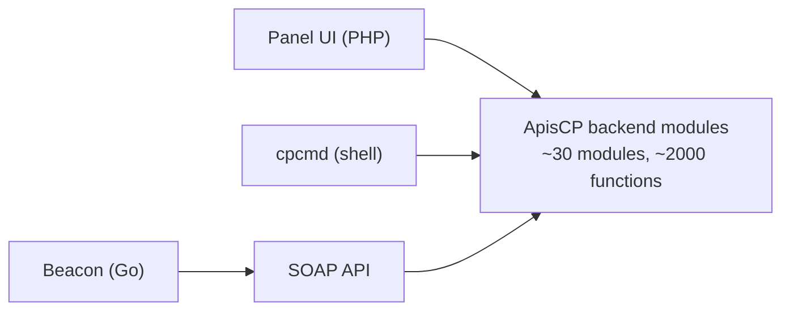

The Intermediate course used `AddDomain`, `EditDomain`, `cpcmd scope:set` without explaining how they all relate. They're three sides of the same API. ApisCP exposes ~2,000 functions across ~30 modules; `cpcmd`, the panel UI, and the SOAP API are three rendering surfaces over the same backing calls. Once you can read one, you can read the others.

## The shape



Every panel action is a call against a backend module. Every `cpcmd` invocation is the same call. Every SOAP request is the same call. The function name (`admin:add-site`, `email:add-mailbox`, `webapp:update-all`) is the unit of work.

## The cpcmd shape

```bash
cpcmd [-d SITE] [-u USER] MODULE:FUNCTION [args...] [flags]
```

- **`-d SITE`** runs the call in the context of `SITE` (the account). Without it, the call runs in admin context.
- **`-u USER`** runs as a specific user inside that site (defaults to the site's admin user).
- **`MODULE:FUNCTION`** the call. Two notations are equivalent: `email:add-mailbox` (kebab/colon, panel docs style) and `email_add_mailbox` (underscore, programmatic style).

Examples that show the shape:

```bash
# Admin: get the system load
cpcmd common:get-load

# Admin: list every command in the email module
cpcmd misc:list-commands "email:*"

# As Able Moose: read their bandwidth usage
cpcmd -d ablemoose.example common:get-bandwidth

# As Able Moose's secondary user 'helen': set a vacation auto-responder
cpcmd -d ablemoose.example -u helen email:set-vacation "Out until Monday"
```

## The output format flag

`--format=json` swaps the human-readable print for JSON, which is what scripts want:

```bash
cpcmd --format=json common:get-load
# {"1":"0.52","5":"0.82","15":"0.94"}

cpcmd --format=json admin:collect '[siteinfo.domain,diskquota.quota]'
# {"site42":{"siteinfo":{"domain":"ablemoose.example"},"diskquota":{"quota":10000}}}
```

`--format=bash` produces shell-array output, useful when wrapping `cpcmd` from a bash script.

## admin:collect, the bulk reader

`admin:collect` is the single most useful call when working across many accounts. Two args: the fields to read, and an optional filter.

```bash
# Read every account's primary domain, disk quota, and ssh-enabled flag
cpcmd admin:collect '[siteinfo.domain,diskquota.quota,ssh.enabled]'

# Same but filtered to one billing group
cpcmd admin:collect \
  '[siteinfo.domain,diskquota.quota,ssh.enabled]' \
  '[billing.parent_invoice:am-master]'
```

Pipe through `jq` for shell-friendly chaining. A common pattern: collect, filter, then iterate `EditDomain` per match. The full Plans lesson in the Intermediate course showed an example.

## The admin: module, the lever Nexus pulls

When Nexus suspends an account, it calls `admin:deactivate-site(string $site, array $flags = [])`. When Nexus adds an account, it calls `admin:add-site(string $domain, string $admin, array $opts = [], array $flags = [])`. When Login-As fires, it calls `admin:hijack(string $site, string $user = null, string $gate = null)`.

The same functions are reachable from `cpcmd`:

```bash
# Equivalent to SuspendDomain
cpcmd admin:deactivate-site ablemoose.example

# Equivalent to AddDomain (but more verbose; just use AddDomain in practice)
cpcmd admin:add-site ablemoose.example ablemoose-au \
  '<options-array, see API.md>'
```

The convenience binaries (`AddDomain`, `EditDomain`, `SuspendDomain`, etc.) wrap these for ergonomics. The underlying call is always an `admin:*` invocation.

## The hijack call, in detail

`admin:hijack` is Login-As. It takes a site, optionally a user inside that site, and optionally a gate (the auth surface; "SOAP" for API consumers, defaulting to the gate the request arrived on).

```bash
# Hijack admin context to Able Moose's admin user via the standard gate
cpcmd admin:hijack ablemoose.example

# As a SOAP API consumer hijacking to a specific user
# (returns a session ID you then use on subsequent SOAP calls)
cpcmd admin:hijack ablemoose.example helen SOAP
```

For API-driven workflows (a billing system calling ApisCP to set a customer's vacation message), the pattern is: API authenticates as admin, calls `admin:hijack`, gets a session, then runs the customer-context call against that session. The audit trail records the admin who hijacked; the inner action is attributed to the customer's user.

<Callout type="info" title="Why hijack is the right name">
"Login-As" is the customer-friendly label. The API name reflects what's actually happening: the request *takes over* the destination user's authentication context. The naming is precise even if it sounds aggressive.
</Callout>

## Beacon, scripting from off the server

Beacon is a small Go client that calls ApisCP's SOAP API from a remote machine. Useful when scripting from a workstation, a CI runner, or another server.

```bash
# Set the API key (one-time per Beacon install)
beacon exec --key=AAAA-BBBB-CCCC-DDDD common_get_web_server_name

# Same call going forward
beacon exec common_get_load

# As a specific site
beacon exec -d ablemoose.example common_get_bandwidth
```

The function names use underscore notation (`common_get_load`, not `common:get-load`) but otherwise behave like `cpcmd`. Beacon creates an API key under **Dev > API Keys** inside any account; the key has the same auth scope as the account it was created under.

A clean pattern for an MSP's PSA or RMM: each customer-side automation has its own Beacon key under that customer's account, so the audit log shows which integration made the call.

## Reading the full call inventory

Two reflexes:

```bash
# List every command in a module
cpcmd misc:list-commands "admin:*"
cpcmd misc:list-commands "webapp:*"

# Search across modules by keyword
cpcmd misc:list-commands "*backup*"
cpcmd misc:list-commands "*pass*"
```

Pair with the API reference at `https://api.apiscp.com/`. The reference is generated from the same module code; signatures and parameter types are the source of truth there.

## A worked admin-side audit

> *The MSP wants to know, across every account, which ones have SSH enabled and a disk quota under 5 GB. Goal: confirm that small accounts don't have terminal access (security policy).*

```bash
cpcmd --format=json admin:collect \
  '[siteinfo.domain,diskquota.quota,ssh.enabled]' \
  '[ssh.enabled:true]' \
| jq -r 'to_entries[]
  | select(.value.diskquota.quota < 5000)
  | "\(.value.siteinfo.domain): quota=\(.value.diskquota.quota), ssh=on"'
```

Reads every account where `ssh.enabled` is true, filters in `jq` to those with quota below 5000, prints a one-line-per-violation report. The same shape works for any combination of fields.

## What this is NOT

- **Not a curl-against-the-panel pattern.** ApisCP exposes SOAP, not REST. Beacon and the SOAP API are the off-server interfaces. Curl works against the SOAP endpoint, but it's a SOAP request, not a JSON one.
- **Not a substitute for the convenience binaries.** `AddDomain` / `EditDomain` / `SuspendDomain` exist because they're easier to read and easier to type than the underlying `admin:*` calls. Use them in shell scripts; reach for `cpcmd admin:*` only when you want a specific arg the wrapper doesn't expose.
- **Not asynchronous by default.** Most `cpcmd` calls are synchronous and return on completion. A handful (web app installs, mass operations) queue into the Job Runner; their `cpcmd` return is a job ID you can poll.

Next lesson: Scopes and Tuneables, the config governance layer that decides what defaults apply to every account and what knobs are platform-wide vs per-account.
