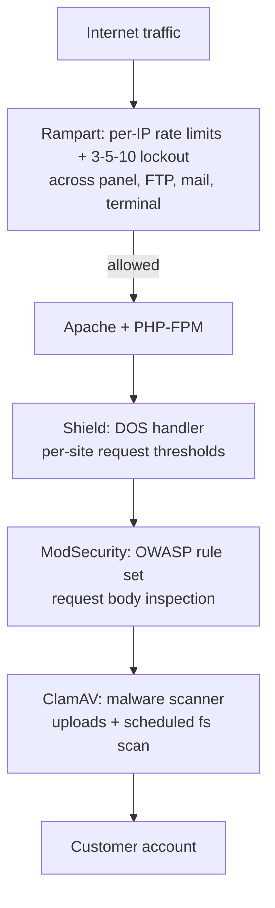

A default ApisCP install ships with four security subsystems running and configured: **Rampart** for brute-force protection across every auth-bearing service, **Shield** as the DOS handler for the web tier, **ModSecurity** for application-layer attack rules, and **ClamAV** as the malware scanner. Each catches a different attack class. The defaults are sensible; the operational work is reading their state and intervening cleanly when needed.

## The stack, one diagram



Each layer rejects what shouldn't reach the next. The defaults: Rampart's 3-5-10, Shield's DOS thresholds, ModSec's CRS3 default rule set, ClamAV on every upload and a nightly full-fs scan.

## Rampart, the brute-force deterrent

Rampart is jail-based, conceptually similar to Fail2Ban. Each auth-bearing service has a **jail**: `apnscp` (the panel), `dovecot` (mail), `postfix-sasl` (mail submission), `proftpd` (FTP), `sshd` (terminal). A jail accumulates failures per source IP; when a threshold trips, the IP is added to a deny list for a fixed window.

The default jail config is **three failures in five minutes = ten-minute block**. Same numbers apply to every jail. The 3-5-10 lockout the Beginner course mentioned isn't a single rule; it's the default of every Rampart jail.

The cpcmd surface:

```bash
# Is this IP banned anywhere?
cpcmd rampart:is-banned 203.0.113.42 '*'
# returns boolean

# Which jails has it tripped?
cpcmd rampart:list-bans
# returns map of jail -> banned IPs

# Unban from a specific jail
cpcmd rampart:unban 203.0.113.42 apnscp

# Unban from every jail (the common move when a customer is locked out)
cpcmd rampart:unban 203.0.113.42 '*'

# Add a permanent whitelist for an MSP office IP
cpcmd rampart:whitelist 198.51.100.5
```

Per-jail tuning is platform-level: change the failure count, the window, or the block duration via Scope. The defaults are right for nearly every MSP; tighten if you have a high-value tenant making noise, loosen if customers complain about being locked out for typos.

<Callout type="warn" title="Whitelisting an MSP office IP is the standard move">
Helpdesk techs typo their own credentials. The MSP's office IPs end up Rampart-banned regularly until they're whitelisted. Add the office IPs (and any RMM/PSA outbound IPs) to the whitelist on first setup; one less ticket per week.
</Callout>

## Shield, the DOS handler

Shield runs at the Apache layer. It tracks per-site request rates and rejects requests when a site is hit hard enough to threaten the server's response time for other sites.

The Shield Scope settings:

- **DOS site count**: how many request-rate counters to maintain per site.
- **Interval**: the sliding window.
- **Status penalty**: how aggressively to demote a site that crosses the threshold.
- **Page deadline**: the per-request time budget; requests exceeding it get a 503 from Shield rather than tying up a PHP-FPM worker.

The Shield handler's admin page (under platform settings) shows live cache stats: how many request-rate entries are tracked, average TTL on the oldest entries, hits and misses. A normal multi-tenant server has busy Shield stats; a quiet Shield is unusual.

```bash
# Read Shield's current status
cpcmd shield:status

# Look at which IPs are currently in Shield's penalty list
cpcmd shield:list-bans

# Release a specific IP
cpcmd shield:unban 203.0.113.42
```

Shield and Rampart both ban IPs but they catch different shapes: Rampart on auth attempts (slow trickle of bad passwords), Shield on request volume (sudden flood of bot traffic). An IP can be in both, neither, or one.

## ModSecurity, the application-layer rules

ModSecurity reads each request body and runs the OWASP Core Rule Set against it. SQL injection patterns, path traversal, XSS payloads, file-upload extension violations; all of them produce a ModSec block.

ApisCP ships CRS3 enabled by default. Logs land in `/var/log/httpd/modsec_audit.log` (per-server) and per-account.

When a customer reports "my legitimate request was rejected as malicious":

```bash
# Read the most recent ModSec event for this account
grep -A 30 "<request-id>" /var/log/httpd/modsec_audit.log

# Whitelist a specific rule for one account
cpcmd -d ablemoose.example modsec:whitelist <rule-id>

# Or, for one URL pattern
cpcmd -d ablemoose.example modsec:whitelist-pattern '/api/upload'
```

Surgical whitelists are the right move; turning ModSec off for an account is the wrong move. The OWASP rules catch real attacks daily.

## ClamAV, the malware scanner

ClamAV scans every uploaded file (via Dovecot for mail attachments, via mod_security for HTTP uploads, via the platform's scheduled job for the full filesystem). The scan against the EICAR test file is the smoke test:

```bash
# The signature ClamAV detects
echo X5O!P%@AP[4\PZX54(P^)7CC)7}\$EICAR-STANDARD-ANTIVIRUS-TEST-FILE!\$H+H* > /tmp/eicar

# Force a scan
clamscan /tmp/eicar
# /tmp/eicar: Win.Test.EICAR_HDB-1 FOUND
```

If a customer's site is hosting a malicious file (often via a WordPress plugin compromise), ClamAV finds it on the next scheduled pass. The notification lands in the admin's queue; the customer gets an email. The cleanup is a manual investigation (Fortification's audit trail helps here; the file's owner tells you whether the upload came from PHP or from FTP).

## Reading account-side events

For per-account security events (Rampart bans for the customer's mailbox auth, ModSec hits against their site, ClamAV finds on their files):

```bash
cpcmd -d ablemoose.example security:list-events
```

This is the "what happened on this customer today" view, useful when triaging a customer ticket that smells like it might be security-related.

## A worked scenario: customer locked out across services

> *Sarah at Able Moose calls: "I can't access anything. Email is rejecting me, FTP says invalid credentials, even the panel won't let me in."*

Procedure:

1. Get Sarah's source IP.
2. `cpcmd rampart:list-bans` to check if her IP is in a jail. Highly likely.
3. `cpcmd rampart:unban <ip> '*'` to remove the block.
4. Confirm Sarah can log in.
5. Investigate the *cause* of the lockout. Three failures over five minutes across panel + mail + FTP means a misconfigured client somewhere. Most often a mail client (Outlook, Apple Mail) that was reconfigured with a wrong password and is retrying every 60 seconds.
6. Walk Sarah through finding the offending client; have her update the password there before unbanning, otherwise she'll be banned again in two minutes.

The unban without fixing the cause is a temporary fix. Both halves matter.

## What this is NOT

- **Not a substitute for customer-side discipline.** The MSP can ban an attacker IP for ten minutes; the customer's mailbox password is still the load-bearing secret. Bad passwords across the board are an account-policy conversation.
- **Not a static configuration.** ModSec rules update; OWASP CRS releases regularly. The Bootstrapper pulls the latest CRS on each run.
- **Not the only layer.** Production MSPs also run network-level rate limits at the edge (Cloudflare, the upstream firewall). The four ApisCP layers cover what hits the box; what doesn't reach the box is a layer outside ApisCP's view.

Next lesson: Fortification's internals. The privilege-separation model that backs every Web App.
