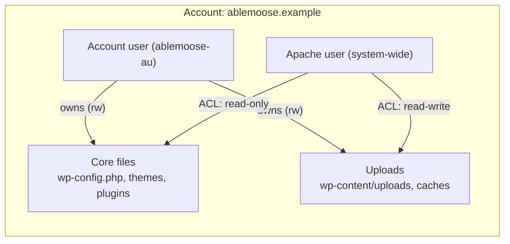

Fortification is the answer to a question no other hosting panel asks cleanly: "if a web app on this account is compromised, what stops the attacker from taking over the rest of the account?" The Intermediate course covered the operational buttons. This lesson covers the model: who owns what, what the apache user can and can't do, how the ACL system enforces it, and how to read or override it when needed.

## The user model

Every ApisCP account has at least two Unix users:

- **The account user** (e.g. `ablemoose-au`). Owns the account's files. Logs in to the panel. Reads and writes anything inside the account's home directory through FTP, SFTP, or the panel's file manager.
- **The apache user** (a single system-wide user named `apache`). Runs every PHP process for every account. Owns the *uploaded* files (anything written by PHP runtime, e.g. WordPress media uploads, cached files, log files PHP writes).

These two users have different permissions inside the same account home. ACLs decide which files apache can read, which it can write, which it can't touch.



A compromised PHP process runs as apache. It can read `wp-config.php` (it has to, to know the DB credentials), but it can't *modify* `wp-config.php`. It can write into `wp-content/uploads`, but it can't write into theme PHP. The attack surface is bounded.

## How the ACLs work

The mechanism is POSIX extended attributes (xattrs) plus filesystem ACLs (setfacl). The Bootstrapper writes the ACLs on every account creation and every fortification level change; the kernel enforces them on every syscall.

A typical Fortification MIN configuration for a WordPress install at `/var/www/wp/`:

```
/var/www/wp/                     # owner: ablemoose-au, ACL: apache=r-x
/var/www/wp/wp-config.php        # owner: ablemoose-au, ACL: apache=r--
/var/www/wp/wp-content/          # owner: ablemoose-au, ACL: apache=rwx
/var/www/wp/wp-content/uploads/  # owner: ablemoose-au, ACL: apache=rwx
/var/www/wp/wp-content/themes/   # owner: ablemoose-au, ACL: apache=r-x
/var/www/wp/wp-content/plugins/  # owner: ablemoose-au, ACL: apache=r-x
```

Themes and plugins are read-only for apache: the WordPress admin UI can't install or upgrade them from inside the WP admin under MIN. Uploads are read-write: media library uploads work. Core files are read-only: a plugin RCE can't drop a backdoor into `wp-load.php`.

## MIN vs MAX, what changes

**MIN** is "the safe defaults": uploads writable, core read-only. WordPress media works, WP admin updates don't.

**MAX** tightens: even `wp-content/uploads` becomes read-only for some sub-paths (e.g. anything outside a known upload subdirectory). The intent is a static-after-publish workflow: the customer (or the platform) updates the site through `webapp:update-all`, which temporarily lifts MAX, runs the update, then re-applies MAX.

Switching:

```bash
cpcmd -d ablemoose.example webapp:fortify blog.ablemoose.example max
cpcmd -d ablemoose.example webapp:fortify blog.ablemoose.example min
```

## Fortify profiles

Each Web App type has a *fortify profile*: a YAML description of which paths get which ACLs at which level. ApisCP ships profiles for the 1-click catalogue (WordPress, Drupal, etc.).

```bash
# Read the active profile for an app
cpcmd -d ablemoose.example webapp:fortify-profile blog.ablemoose.example
```

For ad-hoc apps with a `.webapp.yml` manifest, the manifest's `fortification:` block defines the profile:

```yaml
fortification:
  min:
    - config/
    - vendor/
  max:
    - config/
    - vendor/
    - public/
```

`min:` lists paths that get the stricter ACL even under MIN. `max:` lists paths that get the stricter ACL under MAX. The lesson 5 of the Intermediate course covered manifest creation; the fortify block is what makes the manifest security-aware.

## The unfortify escape hatch

Sometimes a migration or a one-off task requires Fortification temporarily off:

```bash
cpcmd -d ablemoose.example webapp:unfortify blog.ablemoose.example
# Now apache has rwx everywhere; the attack surface is the same as a normal hosting panel
# Do the work...
cpcmd -d ablemoose.example webapp:fortify blog.ablemoose.example min
```

Unfortify is a one-shot. It's not a per-customer choice and shouldn't be left on long-term. Audit the unfortify state with:

```bash
cpcmd -d ablemoose.example webapp:is-fortified blog.ablemoose.example
# returns the level or false if currently unfortified
```

<Callout type="danger" title="Don't leave accounts unfortified">
An unfortified site is a "normal hosting panel" site, with the attack surface that implies. Run the platform-wide audit periodically to find accounts left unfortified during maintenance and not re-fortified. `cpcmd admin:collect '[siteinfo.domain,webapp.fortified]'` collects the state across accounts.
</Callout>

## Auditing Fortification across the platform

A common admin check:

```bash
# Every account, every web app, what's its fortify level?
cpcmd --format=json admin:collect-webapp-fortify | jq
```

The output is structured: site → app → level. Filter in jq for anomalies: unfortified apps, MAX apps that shouldn't be MAX (customer wants to manage their own updates), MIN apps the MSP would prefer at MAX (post-launch static sites).

## When Fortification gets in the way

Two regular failure shapes:

- **Customer reports "I can't update WordPress from the WP admin UI."** Likely on MIN (default) and trying to use WP's in-UI plugin install. The right fix is `webapp:update-all` from the platform (works under MIN), or temporary unfortify if they insist on the UI path.
- **A plugin needs to write outside its expected directory.** The plugin is making assumptions Fortification doesn't grant. Either whitelist the path in the manifest's `fortification:` block, or accept that the plugin won't work under Fortification and either unfortify (bad) or move the customer to a plan that uses a different platform (worse).

The platform's defaults are designed around the well-behaved subset of CMS plugins. Plugins that need root-level filesystem writes are not a fit for a Fortification-protected hosting environment, period.

## Reading audit trails

When a security event happens (a known-bad file appears in an upload directory, a ClamAV detection fires), the Fortification audit answers "who put it there?":

```bash
cpcmd -d ablemoose.example audit:file-events '/var/www/wp/wp-content/uploads/suspicious.php'
# Returns the file's history: created by apache at TIMESTAMP, modified by apache at TIMESTAMP, ...
```

Apache as the writer means the upload came through PHP (likely a plugin compromise). The account user as the writer means an FTP or panel-file-manager upload (the customer or their FTP credentials being abused). The two routes need different remediation.

## What this is NOT

- **Not a sandbox in the container sense.** Fortification is file-permission ACLs, not process isolation. A PHP process can still consume CPU/memory; that's the resource enforcement layer (next lesson).
- **Not a perfect defence.** A zero-day in WordPress core that allows the attacker to chain into a process injection can bypass Fortification's read-only ACLs by writing through a vulnerable code path before the ACL applies. Fortification raises the cost; it doesn't eliminate it.
- **Not the same as Linux capabilities.** Some hosting panels use Linux capabilities to drop root privileges from web processes. ApisCP layers ACLs on top of normal user-process separation; capabilities are an OS-level concern handled by the underlying RHEL distribution.

Next lesson: resource enforcement. cgroups, quotas, watchdogs, and the cgroup:freeze move when a customer's site is misbehaving.
