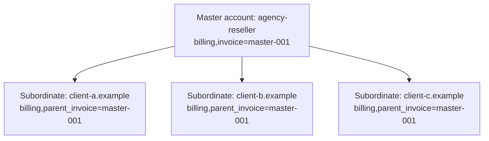

Three things sit alongside ApisCP rather than inside it: off-server backups, billing software, and reseller-like sub-account grouping. Each has the same shape: ApisCP exposes the data and the hooks; an external system (or the billing integration) uses them. This lesson covers the contracts so you can pick the right tool and wire it cleanly.

## Backups, the contract

ApisCP doesn't include a backup product; it integrates with two: **Bacula** and **Duplicity**. Both speak Linux file backups well. They take extended attributes (which carry Fortification's ACLs), they support encryption in flight, and they can write to off-server destinations.

Which to pick:

- **Bacula** supports full + differential + incremental. Differential is the operational win: you can skip incremental backups inside a window when restoring, because the most recent differential covers them. Bigger servers (millions of inodes) want differential.
- **Duplicity** supports full + incremental only. Restoring from an incremental means replaying every incremental since the last full. Small servers tolerate this; large servers don't.

Most MSPs choose Bacula. The Duplicity option is simpler to wire and is fine for small servers.

## The paths a backup must cover

For an account to be fully restorable, the backup must include:

| Path | What it is |
|---|---|
| `/home/virtual/site*/shadow` | Account data: files the customer uploaded, mail spools, databases logical-export folders |
| `/home/virtual/site*/info` | Account metadata: siteinfo, services, plan reference |
| `/var/log/mailer_table*` | Mailbox-to-account mapping |
| `/var/lib/mysql/mysql-grants*` | MySQL grants |
| `/var/lib/pgsql/*/backups` | PostgreSQL grants |

Note: the database files themselves (`/var/lib/mysql`, `/var/lib/pgsql`) are *not* on this list. Direct file backups of live databases produce inconsistent snapshots. ApisCP ships a logical-export job (`/usr/local/apnscp/bin/scripts/backup_dbs.php`) that writes dump files into each account's shadow tree; the anacron schedule for it is controlled by the `backups.automatic-database-exports` Scope. The shadow paths above (`/home/virtual/site*/shadow`) include those exports; the backup tool picks them up as part of the account data.

```bash
# Disable the anacron job (if your backup tool runs its own logical export)
cpcmd scope:set backups.automatic-database-exports false

# Manually run the export
/usr/local/apnscp/bin/scripts/backup_dbs.php
```

## A worked Bacula setup

The full Bacula setup is a multi-page topic; the ApisCP-specific parts:

1. Install Bacula File Daemon (`bacula-fd`) on the ApisCP server.
2. Configure the FileSet to include the paths above (plus any MSP-specific paths like custom plans under `/usr/local/apnscp/resources/templates/plans/`).
3. Configure encryption (PKI keys for FileSet).
4. Configure the Storage Daemon to write to your off-server target (another server, S3 via the right plugin, tape, etc.).
5. Schedule full/differential/incremental on a sensible rotation (e.g. monthly full, weekly differential, nightly incremental).
6. Test restores. *Test restores.* A backup you've never restored is not a backup.

## Restoring an account

ApisCP doesn't have a "restore from off-server backup" button. The restore is operationally:

1. Bacula (or Duplicity) restores the relevant filesystem paths.
2. ApisCP's account-detection scan picks up the restored account on the next Bootstrapper run, or `cpcmd admin:rediscover` forces it.
3. Logical database exports restore via `mysql < dump.sql` and `pg_restore`. The panel can also run these via the account's database manager once the dump file is back inside the account's shadow tree.
4. Confirm the account is functional via Login-As before declaring the restore done.

Pre-stage this in a runbook. The middle of a customer outage is not the time to figure out the path.

<Callout type="warn" title="A backup-tool's backup is not enough">
The MSP that backs up its ApisCP server but not the *configuration* (plans, custom Scopes, Bootstrapper parameters, billing integration tokens) has restored the customer data but not the ability to operate. Back up `/usr/local/apnscp/config/`, `/usr/local/apnscp/resources/templates/plans/`, and any custom scope under `/usr/local/apnscp/config/custom/` alongside the customer data.
</Callout>

## Billing integration, the contract

ApisCP doesn't ship a billing system. It ships hooks. Four billing platforms have integration modules:

| Platform | Module status |
|---|---|
| **Blesta** | Native integration as of Blesta 4.8.0 |
| **WHMCS** | Community module via `LithiumHosting/apnscp-whmcs` |
| **HostBill** | Native integration as of 2021-06-28 |
| **Clientexec** | Native via `clientexec/apiscp-server` (6.3.0+) |
| **WISECP** | Native as of 2.3 |

The integration's job:

1. When a customer signs up (and pays) in the billing system, the billing system calls ApisCP's API to create the account: `admin:add-site($domain, $admin, $opts, $flags)`. The `billing,invoice` field is set to the billing system's invoice ID.
2. When the customer pays for an upgrade, the billing system calls `admin:edit-site` to change the plan.
3. When the customer is overdue, the billing system calls `admin:deactivate-site`.
4. When the customer comes back, the billing system calls `admin:activate-site`.
5. When the customer cancels permanently, the billing system can call `admin:delete-site`.

The billing system handles money. ApisCP handles the account. The `billing,invoice` field is the join key.

## Building a custom integration

A custom integration (your MSP has a homegrown billing system) implements a class extending `Billing_Module` and overrides as many of `get_customer_since`, `get_invoice_status`, etc. as it wants to.

The surface is documented in `docs/admin/Billing integration.md`. The minimum useful surrogate from the docs:

```php
<?php declare(strict_types=1);

class Billing_Module_Surrogate extends Billing_Module {
  public function get_customer_since() {
    return strtotime('last year');
  }
}
```

Register the surrogate, restart apnscpd, and ApisCP starts using your customer-since logic for Dashboard widgets and reporting.

For the API-driven side (billing system pushing into ApisCP), you write the calls in the billing system's plugin language. The pattern is: authenticate as admin via the SOAP API, call `admin:add-site` (or whatever's needed), check the return value. The Beacon client from the cpcmd lesson is one way to script this from outside the server.

## Sub-account grouping via billing-invoice

ApisCP has no native reseller feature. Apis Networks' stated design: "There is no intention to provide reseller support directly in apnscp. This is the domain of billing software." What the platform *does* expose are the primitives a billing system uses to model reseller-shaped groups:

- **Master account**: an account with `billing,invoice=<master-id>`.
- **Subordinate accounts**: accounts with `billing,parent_invoice=<master-id>`.
- **One-way SSO**: a master's admin user can `admin:hijack` (Login-As) into any subordinate they own. Lateral SSO between subordinates and child-to-parent SSO are not allowed.



The agency-reseller account is a grouping handle, not a hosting account in its own right. The billing system invoices the master; the master's owner (a sub-MSP, an agency) invoices their downstream clients out-of-band. ApisCP supplies the grouping and the SSO; the billing system tracks the money and presents the reseller-portal UX (if one exists at all).

This is the pattern an MSP uses to run a white-label sub-reseller program. Another MSP signs up for an "agency" master; their customers' sites become subordinate accounts under the master.

## Bulk operations across the sub-account group

The billing-invoice grouping is what makes the master a handle for bulk operations. The convenience binaries `EditDomain`, `SuspendDomain`, and `DeleteDomain` accept the invoice as an argument and act on every account that carries it:

```bash
# Suspend the entire group if the reseller goes overdue
SuspendDomain master-001

# Apply a quota bump across every subordinate of a master
EditDomain --filter "billing,parent_invoice=master-001" -c diskquota,quota=20000

# Audit storage across the master's clients
cpcmd admin:collect '[siteinfo.domain,diskquota.quota,diskquota.used]' \
  '[billing,parent_invoice:master-001]'
```

The single string `master-001` becomes the handle for every operation that targets the master's full set of accounts.

## What this is NOT

- **Not a one-platform answer.** Backups need off-server storage (a different server, S3, tape). Billing needs a separate product. Reseller-style white-labeling needs branding work in the billing system, because ApisCP itself provides only the grouping primitives. ApisCP is the hosting platform; these three are alongside.
- **Not a SaaS billing engine.** None of the integrations turn ApisCP into a self-serve signup-and-pay product. The billing system handles signup-and-pay; ApisCP handles the provisioned outcome.
- **Not free of operational discipline.** A backup runbook, a restore runbook, and a "what if the billing system loses sync with ApisCP" runbook are MSP-side work. ApisCP exposes the surfaces; the MSP writes the procedures.

That's the end of the Advanced course. Together with Beginner (panel fundamentals) and Intermediate (account provisioning), you have the surface area to run an ApisCP platform end-to-end.
