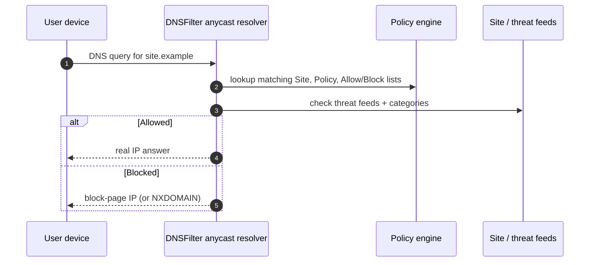

DNSFilter is a cloud-delivered, AI-driven DNS resolver that filters every DNS query against threat feeds and your account's policy before answering. The block decision happens at the resolver, not in the browser, not at the firewall, so the user's machine never opens a TCP connection to a flagged domain.

## The DNS path, one diagram

DNSFilter publishes anycast IPs that you point your network's DNS at, or that the Roaming Client uses on a single device:

| Use | IPv4 addresses | Notes |
|---|---|---|
| Standard DNS queries (incl. DNS-over-TLS) | `103.247.36.36`, `103.247.37.37` | UDP/TCP 53, UDP/TCP 5353, TCP 853 (DoT), TCP 443 (DoH) |
| DNS queries with DNSSEC validation | `103.247.36.9`, `103.247.37.9` | UDP/TCP 53, UDP/TCP 5353 |
| IPv6 standard DNS queries | `2402:5c40:5c40::3636`, `2402:5c40:5c41::3737` | Same port set as the IPv4 standard pair |

Anycast means the same IP is announced from many points of presence, so a roaming user automatically reaches the closest one without any reconfiguration.

DNSFilter is a **closed resolver**: it only answers for networks and devices it recognises. If a Site or Roaming Client isn't registered against your organisation, the resolver won't respond. There is no public 8.8.8.8-style fallback.

<Callout type="info" title="Why a frontline tech cares">
The block happens before the browser opens a connection. That's why the user usually sees a vendor-hosted block page instead of a normal TLS error, and why your triage starts at the query log, not at the user's browser.
</Callout>

## What DNSFilter blocks

A Filtering Policy controls two kinds of decisions:

- **Threats**: Malware, Phishing, Botnets, Cryptomining, plus circumvention tools like TOR, anonymisers, and many VPNs/proxies.
- **Content categories**: Adult Content, P2P & Illegal, Social Networking, Drugs, Terrorism & Hate, and many more.

Both are evaluated for every query, alongside the organisation's Allow and Block lists.

## A worked ticket: Able Moose Accounting

Sarah at Able Moose Accounting (15-person bookkeeping firm, one office, one tenant) opens a ticket: *"I tried to open a quoted estimate from a supplier and got a 'blocked by your administrator' page."*

<StepThrough client:load>
<Step
  title="Confirm it's DNSFilter"
  image="https://help.dnsfilter.com/hc/article_attachments/28076297901459"
  imageAlt="DNSFilter-hosted block page showing the message that 'blocked.dnsfilter.com' is blocked by 'Block Test', with the user's IP and timestamp at the bottom."
>
The block page is hosted by DNSFilter and shows the customer's organisation name. That tells you the block came from the DNS layer, not from the browser, the firewall, or the M365 tenant.
</Step>
<Step
  title="Find the query in the dashboard"
  image="https://help.dnsfilter.com/hc/article_attachments/32082118423315"
  imageAlt="DNS Query Log interface with Filters, Columns, Density, Export, Save View, and Refresh controls; entries show timestamps, the queried FQDN, and the verdict (Allowed / category)."
>
Open the DNS Query Log, filter by Sarah's Site or device, and locate the query for the supplier domain. The log shows what category or threat feed flagged it.
</Step>
<Step title="Decide if it's a real positive">
If the verdict is Phishing or Malware, the user stays blocked and you investigate. If it's Newly Registered Domain or a category like Cloud Storage that the customer needs, you'll move on to an allowlist entry (covered in lesson 4).
</Step>
</StepThrough>

## What this is NOT

- **Not a web filter.** DNSFilter sees domain names, not URLs. It can't block one path on a site while allowing another. `https://example.com/badthing` and `https://example.com/safething` look identical to it.
- **Not a replacement for endpoint protection.** A user who downloads malware via a domain DNSFilter doesn't recognise as malicious is still a malware incident. DNSFilter raises the floor; it doesn't lower the ceiling on what else you need.

<Callout type="info" title="Sources">
This lesson is grounded in DNSFilter's public help center. Key articles: [Introduction to DNSFilter](https://help.dnsfilter.com/hc/en-us/articles/1500008104522-Introduction-to-DNSFilter), [Configure DNS Forwarding on a Network](https://help.dnsfilter.com/hc/en-us/articles/1500008110261-Configure-DNS-Forwarding-on-a-Network), [Filtering Policy content categories](https://help.dnsfilter.com/hc/en-us/articles/29593839153171-Filtering-Policy-content-categories), [Block cyber threats with Filtering Policies](https://help.dnsfilter.com/hc/en-us/articles/29593876264467-Block-cyber-threats-with-Filtering-Policies).
</Callout>
