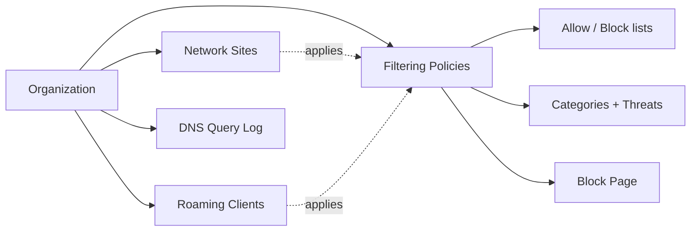

DNSFilter's admin console lives at `app.dnsfilter.com` (or, for an MSP using whitelabel, at a custom subdomain like `filtering.yourdomain.com`). The Overview tab is the default landing, a 7-day, organisation-wide activity dashboard, treat it as a glance, not a real-time signal. The Query Log is what's live. On the frontline, your day-to-day work touches five areas.

## The five core concepts

| Area | What it is | Why a frontline tech opens it |
|---|---|---|
| **Organization** | The tenant. For an MSP, each customer is their own Organization (sub-org). | Most frontline mistakes are tenant-switcher mistakes, make sure you're in the right org. |
| **Network Sites** | A physical location or network identified by a static IP, IP subnet, or Dynamic DNS hostname. | Tells DNSFilter which IPs are allowed to query, and which Policy applies. |
| **Roaming Clients** | The Windows / macOS / mobile agent that protects a device off the office network. | Most "DNSFilter isn't blocking on my laptop at home" tickets start here. |
| **Filtering Policies** | The rules, categories, threats, Allow/Block lists, Block Page assignment. | You'll read a policy to explain *why* something was blocked; you won't usually edit it from the frontline. |
| **DNS Query Log** | The forensic log of every query. Default view is the last 15 minutes. | Your first stop for any "site is blocked" ticket. |

<Callout type="info" title="Where these live in the navigation">
Sites and Roaming Clients both sit under **Deployments** in the left nav, not as top-level items. Filtering Policies has its own top-level entry. The diagram above lays them out as siblings of the Organization for the conceptual picture; in the console, Deployments is the doorway to the first two.
</Callout>

## The tenant-switcher discipline

For MSP staff, the most expensive mistake is editing the wrong customer's policy because you didn't switch organisation first. Establish the habit:

1. Land on the dashboard.
2. **Confirm the organisation name in the header** before anything else.
3. If you're escalating a ticket via screenshot, include that header so the next tech can see which tenant you were in.

<Callout type="warn" title="Read-only first">
If your role is Read Only or Policies Only, large parts of the dashboard are simply hidden. Integrations, the Data Export tab under Tools, and similar will be missing entirely. That's working as designed, not a broken account. If you genuinely need a panel that's hidden, ask the customer's account Owner or a Super Admin for the right role; don't try to work around it.
</Callout>

## A walkthrough: Sarah's ticket from lesson 1

<StepThrough client:load>
  <Step
    title="Switch to Able Moose Accounting"
    image="https://help.dnsfilter.com/hc/article_attachments/31372828280211"
    imageAlt="DNSFilter Overview dashboard showing aggregate request counts and a 'Find organization' search bar in the header that opens the tenant switcher."
  >
    From the MSP organisation drop-down, select Able Moose Accounting. Verify the org name appears in the header before continuing.
  </Step>
  <Step
    title="Open DNS Query Log"
    image="https://help.dnsfilter.com/hc/article_attachments/32082118423315"
    imageAlt="DNS Query Log interface with Filters, Columns, Density, Export, Save View, and Refresh controls; entries show timestamps, FQDN, and verdict columns."
  >
    Default view is the last 15 minutes, usually enough for a fresh "blocked just now" ticket. If it isn't, widen the time range.
  </Step>
  <Step title="Filter by Site or Roaming Client">
    Add a filter for Sarah's Network Site (office) or her Roaming Client (laptop). The filter chip appears at the top of the log.
  </Step>
  <Step title="Read the verdict for the supplier domain">
    The matching row shows the category, threat feed match, or list entry that produced the block. That's what you'll cite in the ticket update.
  </Step>
</StepThrough>

<Checkpoint slug="dnsfilter-helpdesk-fundamentals-checkpoint-console" client:load />

<Callout type="info" title="Sources">
[Navigating the DNSFilter dashboard](https://help.dnsfilter.com/hc/en-us/articles/1500008111161-Navigating-the-DNSFilter-dashboard), [Monitor organization activity from the Overview dashboard](https://help.dnsfilter.com/hc/en-us/articles/1500008108482-Monitor-organization-activity-from-the-Overview-dashboard), [Manage DNSFilter account user permissions](https://help.dnsfilter.com/hc/en-us/articles/1500008108462-Manage-DNSFilter-account-user-permissions), [Network Sites dashboard navigation](https://help.dnsfilter.com/hc/en-us/articles/42219476783507-Network-Sites-dashboard-navigation).
</Callout>
