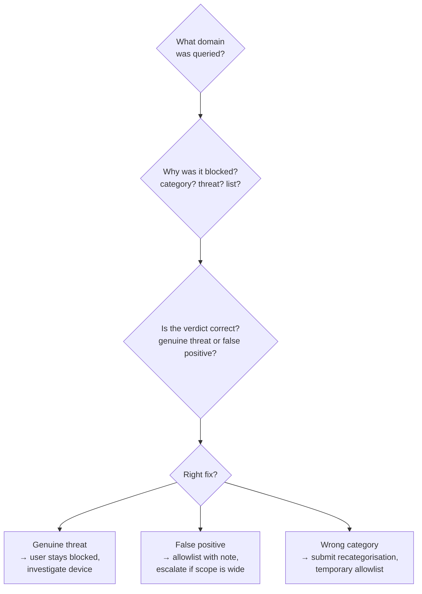

The DNS Query Log is for "quickly finding the who, what, when, and where of any DNS query to troubleshoot filtering policies." The default view shows the last 15 minutes; query data is retained up to the last 9 days, with the exact window depending on your DNSFilter plan. Anything older lives in the Data Export add-on (covered in the Advanced course's incident-investigation lesson), not in the Query Log itself.

## The four-question triage

Walk these in order. Don't skip, each question tells you whether you need the next one.

### 1. What was queried?

Start specific. Filter by the user's Site or Roaming Client and narrow to the time the user reported. The exact domain matters, `mail.example.com` and `cdn.example.com` may be on different lists.

### 2. Why was it blocked?

The log row shows the verdict. Common reasons:

- **Category**, the domain falls under a Content Category that the customer's policy blocks (e.g. Social Networking, P2P & Illegal).
- **Threat feed**: Malware, Phishing, Botnet, Cryptomining, or similar. DNSFilter's heuristic engine also flags newly registered or suspicious domains, often before traditional reputation feeds catch them.
- **Block list**, somebody (the customer, the MSP, or a Universal list) added the FQDN explicitly.

### 3. Is the verdict correct?

This is the judgement call. A few cues:

- Domain is brand-new (registered days ago) and the user can't articulate why they're going there → trust DNSFilter, keep blocked.
- Domain is a customer's known supplier or partner that's somehow been categorised wrongly → false positive, headed for an allowlist.
- Domain is plausibly legitimate but you can't tell → use DNSFilter's Domain Report Tool to read its own classification before you decide.

### 4. What fix does this ticket actually need?

- **Genuine threat**, leave blocked, escalate to whoever runs the customer's endpoint response. The ticket update is "DNSFilter caught a phishing attempt; no further action on DNS side."
- **False positive, narrow scope**, add an allowlist entry (next lesson covers how) with a note saying *who* asked for it and *why*.
- **Wrong category**, submit a recategorisation request via DNSFilter's Domain Report Tool so the fix is global, then add a per-policy allowlist as a temporary patch.
- **Out of frontline scope**, domain is sensitive, scope is unclear, customer has competing requirements, escalate with the query log row and your reasoning attached.

<Callout type="tip" title="Filter discipline">
Default to filter chips: time + Site/Roaming Client + status (Blocked). The fewer rows on screen, the less likely you are to misread one. Add filters until the data set matches the question you're trying to answer; DNSFilter's own guidance frames it as filtering until the result "meets your requirements."
</Callout>

## A worked ticket

Riverbend Legal, small law firm, conservative policy, opens a ticket: *"I can't open the link to a court filings portal."*

<StepThrough client:load>
  <Step
    title="Filter the log"
    image="https://help.dnsfilter.com/hc/article_attachments/32082118423315"
    imageAlt="DNS Query Log with the Filters control highlighted; rows show timestamps, queried FQDN, and a verdict column for each query."
  >
    Time = last 30 minutes; Site = Riverbend HQ; Status = Blocked. The query for `filings.courts.example.gov` is right at the top.
  </Step>
  <Step title="Read the verdict">
    Verdict says category: Government. The customer's policy blocks the Government category as a baseline.
  </Step>
  <Step
    title="Decide"
    image="/img/dnsfilter/domain-report-results.png"
    imageAlt="DNSFilter Domain Report Tool results page for a queried domain, showing the current classification and a REPORT MISCATEGORIZATION button."
  >
    Court filings during business hours, named user, plausible request. Cross-check the FQDN in the Domain Report Tool to confirm DNSFilter's own classification before deciding. Triage: temporary allowlist for this exact FQDN with a note linking to the ticket, and escalate to revisit the policy at the next change window. If the classification looks wrong globally, hit REPORT MISCATEGORIZATION from this page so the fix isn't customer-local.
  </Step>
</StepThrough>

<Checkpoint slug="dnsfilter-l1-checkpoint-querylog" client:load />

<Callout type="info" title="Sources">
[DNS Query Log dashboard navigation](https://help.dnsfilter.com/hc/en-us/articles/1500008111501-DNS-Query-Log-dashboard-navigation), [Domain Report Tool](https://help.dnsfilter.com/hc/en-us/articles/1500008108562-domain-lookup), [DNSFilter Dashboard Reporting guide](https://help.dnsfilter.com/hc/en-us/articles/1500008108602-DNSFilter-Dashboard-Reporting-guide), [Data Export configuration](https://help.dnsfilter.com/hc/en-us/articles/6266552356499-Data-Export-configuration).
</Callout>
