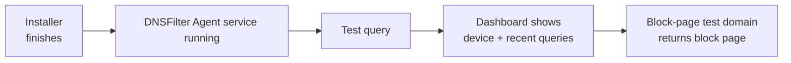

The Roaming Client is the agent that keeps DNSFilter enforcing when a device leaves the office network, coffee shop, hotel, home Wi-Fi, mobile hotspot. Without it, a laptop on the wrong network is filtered by whatever resolver the network hands out, which is usually nothing at all.

## What you need before installing

| Requirement | Notes |
|---|---|
| Windows 10 or higher, x64 or ARM64 | Windows 11 fully supported. Windows Server, shared desktop environments, and **Windows 365 Cloud PC** are explicitly **not supported**. |
| .NET runtimes | .NET Framework 4.8.1 or higher for all supported agent versions. .NET Desktop Runtime 8.0 also for agent v2.1.0+. .NET 8 Runtime for agent v3.0+ (unless NativeAoT is available). |
| The customer's site or agent key | Provisioned in the DNSFilter dashboard; ties the agent to the right Organization and applies the right policy. |

For a single device, the installer GUI walks the tech through it. For a fleet, DNSFilter supports silent install (suitable for repeated deployments), Active Directory / Entra ID, and any RMM or MDM tool that can push an MSI. Install by hand once, then copy the working command into your RMM script.

The Roaming Clients tab in the dashboard is where the per-device installer comes from. The INSTALL button generates the customer-scoped installer, that's the artefact you copy into your RMM script.

## Verifying the install

After the installer finishes:

1. Confirm the **DNSFilter Agent** service is running (Services or `Get-Service`).
2. Make any web request, then check the DNS Query Log filtered by the new device. You should see queries appearing within seconds.
3. Browse to `debug.dnsfilter.com`. The hosted block page should appear with a confirmation that the agent reached DNSFilter; that proves enforcement is wired up end-to-end. For category-by-category checks, DNSFilter publishes a `*.filterdns.net` family (e.g. `phishing.filterdns.net`) on its example test domains page.

<Callout type="success" title="Done means the dashboard agrees">
A green tick from the installer is *not* "done." The dashboard showing the device and a successful test-domain block is "done." Always do both checks. Re-check periodically too: customers who never reboot, run very old Windows builds, or have aggressive endpoint protection sometimes end up with a stopped agent and no enforcement.
</Callout>

## The three failure modes

### 1. The agent service is stopped

Symptoms: device works fine on Wi-Fi, no DNSFilter block page on the test domain, no recent queries from the device in the Query Log.

Fix: start the DNSFilter Agent service. If it won't stay running, check Event Viewer for the agent's error and confirm .NET prerequisites are present.

### 2. Captive portal won't load

Symptoms: airport / hotel / hotspot Wi-Fi shows "connected, no internet", the captive portal login page never appears.

Why: the Roaming Client's filtering can interfere with the network's captive-portal detection, especially on macOS prior to v2.3.8 (which introduced Travel Wi-Fi Mode for this case). Windows generally handles this by failing the network's connectivity probe first, but it can still happen.

Fix: usually restart the network connection while the agent re-detects the captive portal. If a customer reports this often, an upgrade to a more recent Roaming Client version is the longer-term fix.

### 3. Full-tunnel VPN bypassing the agent

Symptoms: device has the agent running but the Query Log shows no queries while VPN is connected; user reports websites that should be blocked are loading.

Why: a full-tunnel VPN routes all traffic, including DNS, through the VPN's network resolvers, so the Roaming Client never sees the queries.

Fix: change the VPN to split-tunnel where possible (this is DNSFilter's recommended setup). If full-tunnel is a hard requirement, and the agent is running in Classic DNS Filtering mode, point the VPN client's DNS at the loopback address `127.0.0.2` as the **primary** server, with the VPN's original tunnel DNS as **secondary** (failover only). For OpenVPN Connect specifically, you may also need to enable "Allow DNS resolution over loopback". DNSFilter's docs cover the per-client steps. The result: queries route through the Roaming Client first, with a clean fallback if the agent is somehow unavailable.

<Callout type="warn" title="Don't 'fix' a full-tunnel VPN by uninstalling DNSFilter">
This comes up on the frontline when a tech assumes the VPN team owns the box. Both can coexist with the right configuration, the right answer is the loopback trick or split-tunnel. Removing the agent is a security regression, not a fix.
</Callout>

## A worked ticket: Able Moose Accounting

Mark from Able Moose works from home on Tuesdays. He reports the test block page works at the office but not at home, risky sites just load.

<StepThrough client:load>
  <Step
    title="Confirm the agent is alive at home"
    image="https://help.dnsfilter.com/hc/article_attachments/32399096135443"
    imageAlt="DNSFilter Roaming Client status panel showing 'Status: Online', Version, Hostname, Last Sync, plus 'Diagnostic Tool' and 'Open Log Files' buttons."
  >
    Walk Mark through `services.msc`, find DNSFilter Agent, status = Running. Yes? OK.
  </Step>
  <Step title="Check the Query Log for Mark's device while he's at home">
    Filter by his Roaming Client. No queries showing while connected to the corporate VPN. Plenty showing when he disconnects.

    <StepCheck
      client:load
      question="That symptom pattern — zero queries from the device while VPN is connected, plenty as soon as he disconnects — most likely points to which cause?"
      choices={[
        "The Roaming Client service is stopped",
        "A full-tunnel VPN is sending all DNS through the VPN's own resolvers",
        "Mark's home Wi-Fi router is filtering DNSFilter traffic",
        "The customer's policy hasn't been published to the agent yet",
      ]}
      correct={1}
      hint="Re-read step 1: the agent service is already confirmed running."
      explanation="Full-tunnel routes every packet — including DNS — through the VPN, so the Roaming Client never sees the query."
    />
  </Step>
  <Step title="Diagnose, full-tunnel VPN">
    The VPN policy is full-tunnel; DNS goes through the VPN's resolver, not through the Roaming Client.
  </Step>
  <Step title="Apply fix and verify">
    Coordinate with the VPN administrator. Either move Mark's user to a split-tunnel profile, or set the VPN config's primary DNS to `127.0.0.2` (with the original tunnel DNS as secondary failover) so queries route through the agent. Re-test the block page from home.

    <StepCheck
      client:load
      question="If split-tunnel isn't an option, which loopback IP do you set as the VPN client's PRIMARY DNS so queries flow through the Roaming Client first?"
      choices={["127.0.0.1", "127.0.0.2", "10.0.0.1", "169.254.0.1"]}
      correct={1}
      hint="The Roaming Client listens on a non-standard loopback address so it doesn't collide with anything else bound to localhost."
      explanation="`127.0.0.2` is where the agent listens. The original VPN-tunnel DNS goes in slot 2 as failover only."
    />
  </Step>
</StepThrough>

<Checkpoint slug="dnsfilter-l1-checkpoint-roaming" client:load />

<Callout type="info" title="Sources">
[Install Windows Roaming Client](https://help.dnsfilter.com/hc/en-us/articles/1500008104822-Install-Windows-Roaming-Client), [Roaming Clients Overview / Supported OS](https://help.dnsfilter.com/hc/en-us/articles/1500008105722-Roaming-Clients-Overview), [Manage Roaming Client settings](https://help.dnsfilter.com/hc/en-us/articles/1500008108422-Manage-Roaming-Client-settings), [Prevent VPN-related Windows Roaming Client conflicts](https://help.dnsfilter.com/hc/en-us/articles/28704728815379-Prevent-VPN-related-Windows-Roaming-Client-conflicts), [Public Wi-Fi Captive Portal connection issues](https://help.dnsfilter.com/hc/en-us/articles/13124351011731-Public-Wi-Fi-Captive-Portal-connection-issues), [Captive Portal detection issue in macOS Roaming Client 2.2.0](https://help.dnsfilter.com/hc/en-us/articles/43626945949715-Captive-Portal-detection-issue-in-macOS-Roaming-Client-2-2-0).
</Callout>
