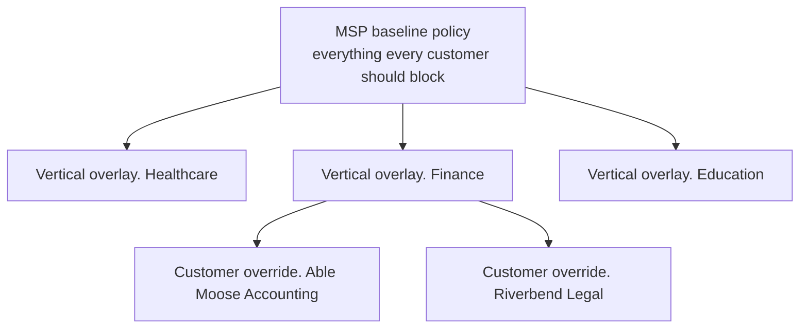

The Beginner course covered *what an Allow list does and how to add one entry safely*. Intermediate starts further back: *should this be a list change at all, or a policy change?* The answer almost always depends on whether you're designing the policy structure deliberately or letting it evolve ticket by ticket.

## The drift problem

Every MSP that runs DNSFilter long enough sees the same drift. A new customer onboards with a copy of the last customer's policy. Tickets accumulate. Each ticket adds another allowlist entry. Two years in, every customer's policy has 800-odd one-off allows nobody can justify, and a category change for one customer means manually walking thirty policies.

The fix is to design a deliberate hierarchy on day one and keep churn at the right layer.

## The three-layer pattern

Three distinct layers, each with a clear job:

- **MSP baseline.** What every customer should block regardless of vertical. Threat categories (Malware, Phishing, Botnets, Cryptomining), Anonymisers/TOR, plus the DNSFilter-recommended security set. This is the layer that almost never changes; when it does, it's a deliberate MSP-wide decision (e.g. add a new threat category in response to an emerging risk).
- **Vertical overlay.** What this *kind* of customer should block. Healthcare blocks gambling and adult; education blocks streaming and social during school hours; finance blocks personal email and file-share. Customer-specific tickets that are really vertical-wide should bubble up to this layer instead of staying as customer overrides.
- **Customer override.** What's unique to this customer, their specific suppliers' domains on Allow, an industry-specific carve-out, the one VP who needs YouTube for client demos. This is where Allow list churn happens.

DNSFilter doesn't enforce this hierarchy as per-policy inheritance, there's no "parent policy → child override" surface inside a Filtering Policy. For MSPs, **Global Policies** occupy the role of a baseline: defined at the MSP layer, pushed across every sub-org, edited centrally. They're not the same as a parent policy because there's no per-sub-org override layer above the policy itself; you still manage divergence through copy-from-template at the sub-org level. But for "the security baseline every customer in this MSP gets," Global Policies are the right surface.

## A naming convention you can read at a glance

| Pattern | Example | What it tells you |
|---|---|---|
| `MSP-Baseline-vN` | `MSP-Baseline-v3` | The shared starting point. Version bump signals an MSP-wide change. |
| `Vertical-<vert>-vN` | `Vertical-Finance-v2` | The vertical layer. |
| `<Customer>-Override-<env>` | `AbleMoose-Override-Prod` | The customer-specific layer that gets the per-ticket allowlist work. |

When a tech lands on a policy, the name tells them which layer they're in and therefore what kinds of changes are appropriate.

<Callout type="warn" title="Universal lists are a layer too">
Don't forget the [Universal Allow / Block](https://help.dnsfilter.com/hc/en-us/articles/9951319882387-Create-a-Universal-Allow-or-Block-List). Anything you put there overrides every policy in the org, it's a hidden global layer above everything else. Use Universal Block for the MSP-mandatory blocks (compromised domains the MSP knows about across all customers); use Universal Allow only for cross-customer tooling (e.g. the MSP's own RMM domain). Misusing Universal Allow turns a single ticket into an organisation-wide hole.
</Callout>

## When does churn move up a layer?

Watch for these patterns and promote when you see them:

<StepThrough client:load>
  <Step title="Three different customers in the same vertical ask for the same allowlist">
    That's a vertical signal. Move the entry to the vertical overlay; remove the per-customer copies.
  </Step>
  <Step title="Three different verticals ask for the same allowlist">
    That's an MSP-wide signal. Move the entry to the MSP baseline (or, if it's a never-block, to a Universal Allow with explicit MSP-wide approval).
  </Step>
  <Step title="One customer accumulates 50+ entries in their override">
    The vertical overlay is wrong for them. Either change the vertical assignment, or split the vertical into more specific sub-verticals.
  </Step>
</StepThrough>

## Worked design: Able Moose Accounting (mid-market)

Able Moose has grown to 120 staff across three offices (Auckland, Sydney, Brisbane), with a finance team and a separate HR team. Their old single policy mixed everything together and accumulated 200-odd allowlist entries.

The Intermediate-level redesign assigns them to:

- `MSP-Baseline-v3`, security baseline (no change for AMA).
- `Vertical-Finance-v2`, gambling, NSFW, P2P all blocked; the bookkeeping software vendors are pre-allowed at this layer because every Finance customer needs them.
- `AbleMoose-Override-Prod`, the things specific to AMA: their main bookkeeping vendor's analytics subdomain, two specific SaaS suppliers, the marketing team's social-media exemption during business hours.

The three offices are different Network Sites, all assigned to the same `AbleMoose-Override-Prod` policy. Walk the override layer every quarter and prune entries that are no longer needed; even a clean three-layer model accumulates cruft.

<Callout type="info" title="Sources">
[Get Started with Filtering Policies](https://help.dnsfilter.com/hc/en-us/articles/1500008111361-Get-Started-with-Filtering-Policies), [Create a Filtering Policy](https://help.dnsfilter.com/hc/en-us/articles/4412646659603-Create-a-Filtering-Policy), [Filtering Policy priorities hierarchy](https://help.dnsfilter.com/hc/en-us/articles/1500010706042-Filtering-Policy-priorities-hierarchy), [Create a Universal Allow or Block List](https://help.dnsfilter.com/hc/en-us/articles/9951319882387-Create-a-Universal-Allow-or-Block-List).
</Callout>
