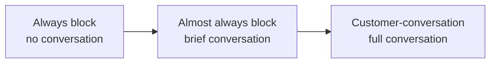

DNSFilter exposes a long list of Content Categories and a separate set of Threat categories (plus AppAware for app-blocking via domain control). For policy design, divide them into three buckets and run customer conversations against the buckets, not the long list.

## The three buckets

### 1. Always-block

These belong on the MSP baseline. There is no legitimate business reason for a customer to ask for any of them, if they do, it's a red flag, not an exception.

- **Malware**
- **Phishing**
- **Botnet / Command-and-Control**
- **Cryptomining**
- **TOR**
- **Anonymising proxies / unauthorised VPNs**

If a customer needs a sanctioned VPN, that's an Allow list entry for the *specific* sanctioned domain, not a category-wide unblock.

### 2. Almost-always-block

Block at the vertical layer by default; brief one-line conversation if a customer pushes back.

- **P2P & Illegal**, torrenting, pirated software, key generators.
- **Adult Content**, for any business customer.
- **Drugs**, controlled substances, paraphernalia.
- **Terrorism & Hate**.
- **New Domains** (registered in the last 30 days) and **Very New Domains** (registered in the last 24 hours). The most common false-positive source, but also the most common phishing-infrastructure pattern. Block by default; allowlist specific suppliers as their domains age in. The Labs area also exposes an `Uncategorized & Unknown Sites` toggle, useful for tightening posture but loud.

### 3. Customer-conversation

These genuinely depend on the customer. Don't decide for them.

- **Social Networking**, sales-driven companies need it; manufacturing floors usually don't.
- **Streaming Media**, bandwidth and productivity question.
- **File Sharing & Cloud Storage**, business-critical for some, exfiltration risk for others.
- **Gambling**, lawful in some jurisdictions and verticals, blocked across the board in others.
- **Personal Email**, depends on the customer's data-handling posture.
- **Online Games**, context-dependent.

<AnnotatedScreenshot
  src="/img/dnsfilter/threats-tab.png"
  alt="DNSFilter Filtering Policy Threats tab listing categories such as Malware, Phishing, Botnet, Cryptomining, with toggle controls per category and a Save action."
  caption="The Threats tab is where the always-block bucket lives. Toggle each category, save, and you've covered six of the eight always-blocks in one screen."
>
  <Hotspot client:load x={20} y={30} label="1" title="Malware" purpose="Always block. No customer conversation needed.">
    Verified-malicious domain reputation. The cost of an Allow-list mistake here is an incident, not a ticket.
  </Hotspot>
  <Hotspot client:load x={20} y={45} label="2" title="Phishing" purpose="Always block.">
    Credential-harvesting infrastructure. DNSFilter's heuristic engine flags newly registered phishing kits before traditional reputation feeds catch them.
  </Hotspot>
  <Hotspot client:load x={20} y={60} label="3" title="Botnet / C2" purpose="Always block.">
    Beaconing destinations for known command-and-control infrastructure. A query here is an alert in its own right.
  </Hotspot>
  <Hotspot client:load x={88} y={8} label="4" title="Save" purpose="Writes the toggles to the policy.">
    Toggling categories doesn't apply until Save commits the change. Watch for the Audit Log entry to confirm.
  </Hotspot>
</AnnotatedScreenshot>

<Callout type="info" title="Filtering Schedule is its own thing">
Filtering Schedule lets a category block during specific hours (Social Networking outside lunch, for example). It's a separate console area with its own time-window rules, not a property on the Filtering Policy. When this lesson's worked example mentions a "schedule" for Able Moose, that schedule lives under Filtering Schedule and is referenced from the policy.
</Callout>

## The customer conversation script

When you're onboarding a new customer or revising their vertical assignment, run the same conversation every time. It saves both sides hours.

<StepThrough client:load>
  <Step title="Set the frame">
    "We're going to default to blocking categories most businesses your size block. We'll go through each grey-area category and you can change it. Five minutes."
  </Step>
  <Step title="Walk the customer-conversation list">
    For each category in bucket 3, ask one question: "Block, allow, or block-with-exceptions?" Capture the answer in the policy notes. Block-with-exceptions becomes per-policy Allow list entries with the requesting stakeholder named.
  </Step>
  <Step title="Cite the always-block list">
    Tell them the always-block list (Malware, Phishing, etc.) is non-negotiable and explain why in one sentence per item. This is a five-minute conversation, not a debate.
  </Step>
  <Step title="Document the verdicts">
    Write the customer's choices in the policy notes (and in your PSA). When the customer's IT contact changes in two years, the next person can read the rationale instead of reverse-engineering it.
  </Step>
</StepThrough>

## Worked example: Able Moose Accounting (mid-market)

The conversation went like this:

| Category | Decision | Rationale (logged) |
|---|---|---|
| Social Networking | Allow during lunch hour, block otherwise via Filtering Schedule | Marketing manager Jane asked; sign-off from CFO. |
| Streaming Media | Block | Bandwidth across three offices is the constraint. |
| Cloud Storage | Allow for `dropbox.com`, `onedrive.live.com`, `box.com`; block category otherwise | Sanctioned providers only, auditor concern. |
| Personal Email | Block | Standard per their data-handling policy. |
| Gambling | Block | "Why would we even be asked." (Their words.) |

That conversation produces a defensible policy and the audit trail to back it up.

<Checkpoint slug="dnsfilter-policy-design-checkpoint-categories" client:load />

<Callout type="info" title="Sources">
[Filtering Policy content categories](https://help.dnsfilter.com/hc/en-us/articles/29593839153171-Filtering-Policy-content-categories), [Block cyber threats with Filtering Policies](https://help.dnsfilter.com/hc/en-us/articles/29593876264467-Block-cyber-threats-with-Filtering-Policies), [Get Started with Filtering Policies](https://help.dnsfilter.com/hc/en-us/articles/1500008111361-Get-Started-with-Filtering-Policies), [CIPA compliance for educational institutions](https://help.dnsfilter.com/hc/en-us/articles/1500008113941-cipa-compliance).
</Callout>
