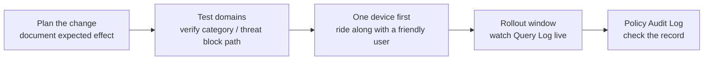

The classic pattern for rolling out new filtering rules, push the change, brace, watch the queue spike, is preventable. DNSFilter doesn't have a single feature called "audit mode," but it does give you the pieces of a phased rollout: example test domains, a documented single-device test, and a Policy Audit Log that tracks every change you make. (If a playbook references "DNSFilter audit mode," it's confusing the Policy Audit Log, which is a *record*, with audit-only enforcement, which is a *mode*. DNSFilter has the first, not the second.)

## What DNSFilter actually gives you

| Feature | What it is | When you use it |
|---|---|---|
| **Example test domains** | DNSFilter publishes specific domains intended for testing categories, threat feeds, and enforcement. | After every policy change, before declaring success. |
| **Single-device DNS forwarding test** | DNSFilter's documented practice: configure DNS forwarding on one computer first, validate, then roll out to the rest of the network. | Always, for both new Sites and policy changes. |
| **Policy Audit Log** | Record of every change to policies, retained for the previous year on Pro plans and above. | Reviewing what was changed, by whom, and when, especially after an incident. |

## The five-step pattern

<StepThrough client:load>
  <Step title="Plan the change in writing">
    Before clicking anything: write down what you're changing, the expected user-visible effect ("Marketing will see Social Networking blocked between 5pm and 9am"), and the rollback step. If you can't articulate the expected effect, you're not ready to ship.
  </Step>
  <Step title="Validate with DNSFilter's example test domains">
    DNSFilter publishes example domains for each major category and threat feed. Use them against a **test policy**, a separate Filtering Policy in the customer's sub-org used only for validation, with a single test device assigned to it, before applying the real change to a customer-facing policy. The point is to confirm the *mechanism* works, not the customer-specific allowlist behaviour.
  </Step>
  <Step title="Roll the change to one device first">
    Pick a friendly internal user, not the CFO. Apply the policy change. Have them go through their morning workflow. Capture which sites broke, then update the override layer's Allow list before exposing the change to the wider population.
  </Step>
  <Step title="Cut over the rest in a window">
    Push to the rest of the Site / Roaming Client population during a low-impact hour. Watch the live Query Log, filtered to the new policy, for the first 30 minutes. If blocked-query volume jumps to multiples of normal baseline, that's a spike to investigate before it turns into ticket pile-up.
  </Step>
  <Step
    title="Open the Policy Audit Log to confirm"
    image="/img/dnsfilter/policy-audit-log.png"
    imageAlt="DNSFilter Policy Audit Log page showing timestamped entries with user, action, and policy columns; a filter dropdown in the toolbar narrows by event type."
  >
    Open the Policy Audit Log and confirm the change was recorded, who, what, when. If you co-authored with another tech, this is also where you verify nobody else also touched the same policy at a similar time. Use the filter dropdown to narrow on a specific user or event type when chasing a recent change.
  </Step>
</StepThrough>

## When to skip phased rollout

There's exactly one category of change where you don't phase: emergency threat blocks. If a customer has reported a phishing campaign in flight or a domain shows up in a threat-intel feed, you don't ride along with one user first, you push the block immediately to all affected sites and worry about side-effects later. The cost equation is reversed: a missed legitimate site for two hours is a ticket; a clicked phishing link is an incident.

Everything else gets the five-step pattern.

<Callout type="warn" title="The fast-rollout temptation">
"It's just one allowlist entry, why do I need to test it." Because allowlist entries widen the attack surface, and a wrongly-scoped one (like a Universal Allow when you meant per-policy) can take hours to track down. The five steps take ten minutes; the ticket queue you save can take days.
</Callout>

## The Policy Audit Log as a forensic source

The Policy Audit Log isn't just compliance theatre. Two real uses:

1. **"Why did this break this morning?"**. Was a policy changed last night? Who? The audit log is the first thing you check before assuming it's something else.
2. **Before reverting "the obvious" change**. Sometimes a tech assumes the policy is wrong and changes it back; the audit log shows that the previous "wrong" state was actually the result of a deliberate decision two months ago. Revert with eyes open or not at all.

Pro plans and above retain the audit log for the previous year, useful for quarterly customer reviews where you can demonstrate exactly what changed in the customer's policy over time.

<Checkpoint slug="dnsfilter-l2-checkpoint-rollout" client:load />

<Callout type="info" title="Sources">
[Example domains to test Filtering Policies](https://help.dnsfilter.com/hc/en-us/articles/1500008110782-Example-domains-to-test-Filtering-Policies), [Test DNS Forwarding connection on a single device](https://help.dnsfilter.com/hc/en-us/articles/1500008110301-Test-DNS-Forwarding-connection-on-a-single-device), [Policy Audit Log](https://help.dnsfilter.com/hc/en-us/articles/1500008111441-Policy-Audit-Log), [Troubleshoot unexpected website blocks](https://help.dnsfilter.com/hc/en-us/articles/43881548089875-Troubleshoot-unexpected-website-blocks).
</Callout>
