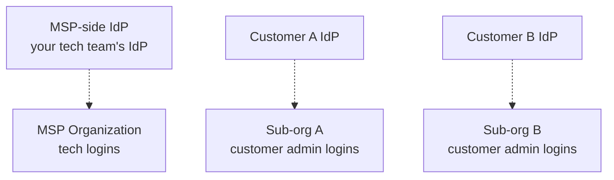

DNSFilter's SSO is an OIDC implementation, generic enough to work with most IdPs, specific enough to be configurable in a single setup pass. It's free across all plans. Done well, it removes a class of credential-management problems and unlocks per-user policy assignment via the Users feature.

## What DNSFilter actually supports

| Capability | Detail |
|---|---|
| Protocol | OpenID Connect (OIDC). Works with any IdP that supports the generic OIDC flow. |
| IdPs explicitly named in DNSFilter docs | Microsoft Entra ID (Azure AD), Okta, Google Workspace, Active Directory. Other OIDC-compatible IdPs work via the generic flow. |
| Cost | Included on all plans, no extra charge. |
| Authorized Login Domains | Up to 25 per organisation, configured under Organization → Settings. |
| Owner fallback | Account Owners always retain username/password login. DNSFilter recommends assigning at least one Super Admin role to a shared email so the team has a way back in if SSO keys expire or an account is locked out. |
| Once SSO is enabled | The "Add User" button is disabled, new users authenticate via the configured vanity URL with the IdP. |
| Configuration permission | Super Admin or higher. |

DNSFilter does not require SAML, the OIDC implementation is what's offered. If a customer's procurement insists on SAML, the answer is "DNSFilter is OIDC, here's why that's an industry-standard choice" rather than "let me find the SAML toggle."

## The two layers of identity

Two distinct IdP relationships matter:

1. **MSP staff** authenticate against the MSP's IdP into the MSP organisation. Each tech is a separate user; per-tech accounts make the Policy Audit Log meaningful.
2. **Customer admins** authenticate against the *customer's* IdP into their sub-org. Don't share an IdP between MSP and customer, that crosses the partner-access boundary in a way that's hard to audit.

Configuring SSO on the MSP organisation does not automatically configure it on every sub-org. Each sub-org with customer-side logins is its own SSO setup.

## Per-user policies via the Users feature

The Users feature (lesson 2) is what makes OIDC interesting from a policy point of view, not just a login point of view.

Users are the most specific attribute DNSFilter applies policies to, overruling Collections and Network Sites. A typical pattern:

| Attribute | Effect |
|---|---|
| Network Site policy | The default for everyone on the network. |
| User Collection policy | A group of users gets a tighter or looser policy. Collections are the Advanced-level grouping primitive, handy for IdP-group-mirrored policy sets. |
| User policy | Highest priority. The CFO gets a slightly different policy than the rest of finance. |

You can apply Filtering Policies, Filtering Schedules, and Block Pages on a per-user basis from the Users tab. Practically, in an IdP-integrated setup, you mirror IdP groups into User Collections, and policies attach to Collections rather than to individual users, easier to maintain.

## The IdP-failure escape hatch

This is the operational story that nobody documents and everyone needs.

When an IdP has an outage, every user authenticating via SSO is locked out of every system that depends on that IdP. DNSFilter is no different. The escape hatch is the username/password fallback that the Owner role always retains.

<StepThrough client:load>
  <Step title="Configure Owner with strong password + MFA">
    The Owner account is the disaster-recovery seat. It must have an MFA factor that survives the IdP outage. TOTP from an authenticator app, not push-MFA tied to the same IdP.
  </Step>
  <Step title="Decide which Super Admins also keep username/password fallback">
    Super Admins can be configured to also retain username/password. Do this for one or two senior MSP techs, not for everyone. The fallback is the escape hatch, not the everyday login.
  </Step>
  <Step title="Document the recovery path">
    Where the credentials live, who can use them, what triggers their use ("IdP outage of more than 30 minutes affecting customer X"). Test the path during planned IdP maintenance, not during the actual incident.
  </Step>
  <Step title="Rotate when personnel change">
    Owner credential rotation is a quarterly task at minimum and a same-day task on personnel departure.
  </Step>
</StepThrough>

<Checkpoint slug="dnsfilter-multi-tenant-ops-checkpoint-sso" client:load />

## Worked example: Able Moose Group (enterprise)

Able Moose Group, the Advanced-tier enterprise version of the persona, has 1,800 staff across 14 acquired sub-firms. Their identity setup:

| Layer | IdP | Notes |
|---|---|---|
| MSP side | MSP's Okta tenant | All MSP techs SSO into the MSP organisation in DNSFilter. |
| Top-level Able Moose Group | Group's Entra ID tenant | Customer's central IT lead (one user) has Super Admin on the parent sub-org. Owner is held by the MSP service account. |
| 14 acquired sub-firms | Each on whatever OIDC-compatible IdP they had at acquisition | Until consolidation completes, each sub-org's SSO is configured against the firm's existing IdP via the generic OIDC flow. Consolidation is a multi-quarter project, and DNSFilter doesn't block it. |

The fallback: MSP's NOC lead has username/password Super Admin on the parent sub-org as the IdP-failure escape hatch. Owner credentials live in the MSP's password vault with explicit access controls.

## What this is NOT

- **SSO removes the credential, not the entitlement.** When a user leaves, you still need to remove their DNSFilter account or scope-down their roles. Mirror IdP group changes into Collection membership and review quarterly.
- **SSO doesn't satisfy MFA requirements.** The IdP must enforce MFA on its side, and the Owner fallback needs its own MFA factor that doesn't depend on the same IdP path (otherwise an IdP outage takes the escape hatch with it).

<Callout type="info" title="Sources">
[Configure single sign-on (SSO) for DNSFilter](https://help.dnsfilter.com/hc/en-us/articles/4419682431891-Configure-single-sign-on-SSO-for-DNSFilter), [Configure DNSFilter SSO with Entra ID (Active Directory)](https://help.dnsfilter.com/hc/en-us/community/posts/34164448967571-Configure-DNSFilter-SSO-with-Active-Directory), [Setup DNSFilter with Single Sign-On (SSO) in Okta](https://help.dnsfilter.com/hc/en-us/community/posts/34164368272659-Setup-DNSFilter-with-Single-Sign-On-SSO-in-Okta), [Configure SSO with Google Workplace](https://help.dnsfilter.com/hc/en-us/community/posts/34163980154771-Configure-SSO-with-Google-Workplace), [Manage Users settings](https://help.dnsfilter.com/hc/en-us/articles/1500008111121-Manage-Users-settings), [Manage User Collections settings](https://help.dnsfilter.com/hc/en-us/articles/1500008111141-Manage-User-Collections-settings), [Multi-Factor Authentication](https://help.dnsfilter.com/hc/en-us/articles/4419435706003-Multi-Factor-Authentication).
</Callout>
