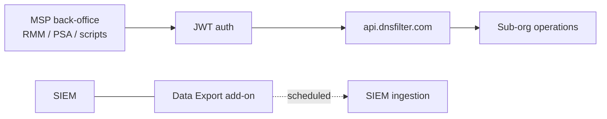

DNSFilter exposes a JSON Web Token-based REST API and ships native integration paths for several PSAs. Layered with the Data Export add-on, that's enough to wire DNSFilter into the rest of the MSP stack, but the harder skill is recognising the integrations not worth building.

## API authentication: JWT, not API keys

DNSFilter's "API keys" are JSON Web Tokens. Two operational facts the docs are explicit about:

1. The JWT is shown **once** when generated. The Save button on the dashboard doesn't activate until you've copied the value. Miss the copy, regenerate.
2. Revoke or delete tokens when no longer needed. Long-lived JWTs in the wrong place are a credential-leak class of incident on their own.

Generation is self-service for users with the right role. Best practice for an MSP:

| Token | Owner | Scope of use |
|---|---|---|
| Per-script tokens | Service account, not a person | Each automation script gets its own JWT. When a script is retired, the JWT is revoked. |
| Per-tech ad-hoc tokens | Individual techs, short-lived | For interactive exploration. Revoke at end of session or end of week. |
| The "Owner JWT" | Don't have one | Owner-level JWTs let scripts cancel the account. There's never a reason a script needs that. |

A JWT in source control or a CI environment variable is a credential leak in waiting. Use per-environment tokens, set a rotation policy, and audit usage so you'd notice if one stopped being used (or started being used from somewhere unexpected).

## PSA and automation integrations

DNSFilter publishes integration guides covering six named PSAs and one automation platform:

| Platform | Type | Notes |
|---|---|---|
| **HaloPSA** | PSA | "Authentication Method = Client ID and Secret (Services)"; record Client ID + Client Secret. |
| **Syncro** | PSA | More → Admin → Administration → API → API Tokens → New Token. |
| **ConnectWise PSA (Manage)** | PSA | Security Role with the documented Inquire/Add/Edit grants; API Member with that role; Public + Private API keys. |
| **Atera** | PSA | Covered by the PSA integration suite. |
| **Autotask** | PSA | Covered by the PSA integration suite. |
| **Pulseway PSA** | PSA | API Employee created against an internal Security Role with API access. |
| **Zapier** | Automation | For workflow chaining outside the PSA pattern. |

For each PSA, the workflow shape is the same: generate API credentials in the PSA, enter them into the API Authentication section in the DNSFilter integration setup, then **Save and Test**; the integration validates credentials before going live.

The result is a path for DNSFilter to push events into the PSA, the most common pattern is "DNSFilter detects something worth a ticket → ticket created in PSA against the right customer." Configure the trigger conservatively: a flood of low-severity tickets is worse than no integration.

For PSAs not on the named list, the [PSA Integration Quick Start guide](https://help.dnsfilter.com/hc/en-us/articles/34500194966675-PSA-Integration-Quick-Start-guide) is the generic pattern; the rest you build with the API.

## SIEM forwarding via Data Export

The Data Export add-on runs on a schedule (so you don't have to babysit cron jobs) and writes out to several named destinations:

- **Amazon S3**, for a central data lake or downstream pipeline.
- **Splunk**, direct forwarding into the SIEM.
- **Microsoft Sentinel**, direct forwarding into Sentinel workspaces.
- **PDF / CSV exports**, or a shareable link to the report, for ad-hoc consumption.

For a customer who insists on real-time SIEM ingest rather than scheduled batch exports, the conversation is different. DNS-layer telemetry at high volume needs explicit capacity planning on the SIEM side, and the per-query event volume is much higher than people expect.

## What NOT to integrate

Three cases where the answer is "don't build that":

### 1. "Real-time block notifications to the user's email"

The block page already tells the user what's happening, and DNSFilter exposes a notice email for unblock requests. Pushing a separate "you tried to access X and were blocked" email per block is a perfect way to ticket your own helpdesk into oblivion, the user reads the notification, decides to ask, files a ticket. Each of which would have been a single click on the block page's contact form.

### 2. "Auto-allowlist domains the user requests"

Self-service unblock is appealing in theory and a security regression in practice. A user clicking "I want this unblocked" can't tell a phishing domain from a legitimate one. Keep allowlist additions in human review. The block page's notice email plus a PSA ticket is the right shape; an automated allow-from-form is not.

### 3. "Mirror DNSFilter blocks into the firewall as IP blocks"

Tempting because it adds defence in depth. Wrong because of how DNS-categorised domain reputation works. Many domains classified at the DNS layer don't have a stable IP, content delivery networks, fast-flux malware, etc. Mirroring "block this domain" as "block this IP" produces over-blocking (legitimate traffic on shared CDN IPs) and under-blocking (the malicious IP changed an hour ago). DNS layer enforcement is the right enforcement layer; don't try to project it down a layer.

<Callout type="warn" title="Webhook patterns are best for ticketing, worst for control">
A webhook from DNSFilter into your PSA on certain trigger conditions is a great pattern. A webhook into something that *changes filtering policy* is dangerous, the integration becomes the new attack surface, and you've automated a privilege boundary you used to have a human in the middle of.
</Callout>

<Callout type="info" title="Sources">
[API Keys](https://help.dnsfilter.com/hc/en-us/articles/21169189058323-API-Keys), [DNSFilter API docs](https://api.dnsfilter.com/docs), [HaloPSA Integration guide](https://help.dnsfilter.com/hc/en-us/articles/34501250423315-HaloPSA-Integration-guide), [Syncro integration guide](https://help.dnsfilter.com/hc/en-us/articles/34501783032595-Syncro-integration-guide), [PSA Integration Quick Start guide](https://help.dnsfilter.com/hc/en-us/articles/34500194966675-PSA-Integration-Quick-Start-guide), [Data Export configuration](https://help.dnsfilter.com/hc/en-us/articles/6266552356499-Data-Export-configuration).
</Callout>
