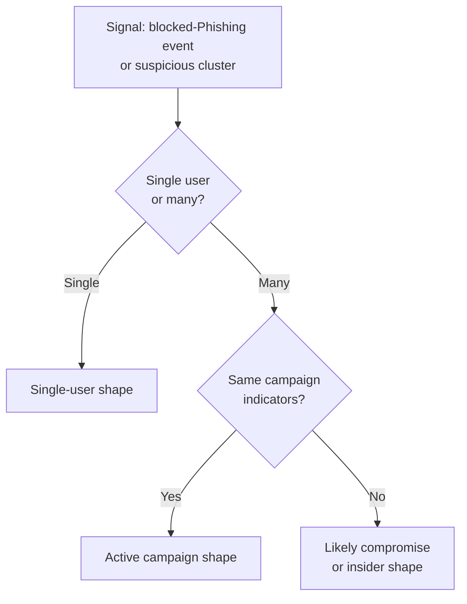

Frontline techs read the Query Log to triage tickets. At the Advanced level you read it to investigate incidents, campaigns, isolated user behaviour, or signals that a device may already be compromised. The product surface is the same; the questions you ask of it are different.

## Three incident shapes

| Shape | Signal | Investigation focus |
|---|---|---|
| **Active campaign** | Multiple users at the same customer (or across customers) hitting similar phishing/malware domains in the same window. | Are we already protecting? Is the customer's email gateway also catching it? Who's likely been clicking outside the DNS path? |
| **Single-user** | One user, one device, repeated suspicious queries. | Is this one phished user, an unusual but legitimate behaviour, or a compromised device? |
| **Likely compromise** | Beaconing patterns, periodic queries to a domain or domain family, often unusual hours, persisting after the initial block. | Forensic: hand off to an incident responder, but pre-stage the data they'll need. |

## The three pivots from a Query Log row

Once you have a candidate event in the Query Log, either flagged by the dashboard or surfaced by a notification, there are three pivots that get you from "this is interesting" to "this is the scope."

### Pivot 1: Other users on the same domain

Filter the Query Log on the domain (clear other filters; widen the time window). If many users at the customer hit it, you're in active-campaign territory; coordinate with the email security team. If only one user did, you're in single-user territory.

### Pivot 2: Full activity for the affected device

Filter by the user's Roaming Client or Site within the relevant time window. Look for two things:

- **Other suspicious domains in proximity**, a phishing kit's redirect chain, a malware sample's beacon-home, a cryptominer's pool. These rarely come alone.
- **The pattern of the queries**, periodic, mechanical-looking timing is much more suspicious than human-burst access patterns.

### Pivot 3: Domain reputation and history

Use DNSFilter's Domain Report Tool to check the domain's classification, age, and category. Cross-reference against external threat-intel sources you trust. A two-day-old domain with no reputation is a different signal from a long-established domain that's been recently compromised.

## A worked investigation

Able Moose Group's NOC alert: "Spike in Phishing-category blocks at sub-org `am-firm-04` over the past 2 hours."

<StepThrough client:load>
  <Step title="Open the Query Log filtered to the sub-org">
    Switch to the `am-firm-04` sub-org, open Reporting → DNS Query Log. Filter: status = Blocked, category = Phishing, time = last 4 hours. 47 events appear, against three distinct domains, three users.
  </Step>
  <Step title="Pivot 1, same-campaign check">
    All three domains have the same registrar, registration dates within 48 hours, and a similar URL structure. This is one phishing campaign, three lures. Active campaign shape confirmed.
  </Step>
  <Step title="Pivot 2, full activity for affected users">
    Filter by each user. Two of the three users only hit the phishing domain once, didn't return. DNSFilter blocked, they moved on. The third user has 14 hits across 30 minutes, worth a closer look. Pattern is consistent with someone clicking the email link, getting blocked, refreshing, retrying, not malicious behaviour, but noisy enough that a phishing-awareness conversation is warranted.
  </Step>
  <Step
    title="Pivot 3, domain reputation"
    image="/img/dnsfilter/domain-report-results.png"
    imageAlt="DNSFilter Domain Report Tool result page for a queried domain, showing the current classification (e.g. Phishing) and a REPORT MISCATEGORIZATION button."
  >
    Domain Report Tool returns Phishing classification on all three. Confirm via independent threat-intel source. Score: high-confidence phishing. If you find DNSFilter's verdict disagrees with credible external intel, REPORT MISCATEGORIZATION from this same page.
  </Step>
  <Step title="Coordinate with email security">
    The phishing emails came in via the customer's M365 tenant. Coordinate: confirm whether email security caught and quarantined them, identify who else received them, push an organisation-wide block for the campaign indicators in both the email gateway and DNSFilter Universal Block.
  </Step>
  <Step title="Decide the user-side response">
    Three users were targeted; the third may have entered credentials before DNSFilter caught the redirect. Coordinate password reset + session revocation with the customer's IdP team. Use the Policy Audit Log to capture exactly what was changed in DNSFilter during the response.
  </Step>
  <Step title="Write the incident report">
    Use the format below. File in the customer's PSA against a new Incident ticket; CC the customer's IT lead.
  </Step>
</StepThrough>

## A reusable write-up format

Six sections, one screen. No more.

| Section | Content |
|---|---|
| **Summary** | One paragraph: what was the threat, what was the scope, what was the outcome. |
| **Timeline** | First-detected, first-blocked, first-coordinated, first-mitigated. UTC. |
| **What DNSFilter saw** | Domains, categories, user count, query count. Citation: Query Log links if you can deep-link. |
| **What we did** | Each action with timestamp + who. Refers to Policy Audit Log entries. |
| **What the customer needs to do** | Password resets, awareness, follow-ups. Each item with an owner and a date. |
| **Open questions** | Where the data was inconclusive. "Did user-3 click the link before it resolved? Endpoint logs are needed." |

The "open questions" section is what differentiates a real write-up from a defensive one. It tells the customer where DNS-layer data ran out, and frames the natural next conversation about other observability layers.

<Callout type="warn" title="Don't pretend the Query Log saw what it didn't">
DNSFilter sees DNS queries. It doesn't see the email that delivered the phishing link, the click that the user made on the link, the credentials they may or may not have entered, or the session token the attacker may have captured before DNSFilter's block kicked in. A clean DNS investigation acknowledges what's outside the data and hands those questions off to the right tool, email security, EDR, IdP audit log.
</Callout>

## What this is NOT

- **Not the customer's whole incident response.** DNSFilter is one input. Password reset, email-gateway changes, endpoint isolation, customer comms, and regulator notification are the broader IR process; this lesson covers the DNS-layer slice.
- **Not a substitute for longer-horizon DNS retention.** Native Query Log retention tops out around 9 days. Anything older is the Data Export add-on (lesson 4), not the Query Log.

<Callout type="info" title="Sources">
[DNS Query Log dashboard navigation](https://help.dnsfilter.com/hc/en-us/articles/1500008111501-DNS-Query-Log-dashboard-navigation), [Domain Report Tool](https://help.dnsfilter.com/hc/en-us/articles/1500008108562-domain-lookup), [Policy Audit Log](https://help.dnsfilter.com/hc/en-us/articles/1500008111441-Policy-Audit-Log), [Identify and stop excessive DNS query traffic](https://help.dnsfilter.com/hc/en-us/articles/1500008113221-Identify-and-stop-excessive-DNS-query-traffic), [Data Export configuration](https://help.dnsfilter.com/hc/en-us/articles/6266552356499-Data-Export-configuration).
</Callout>
