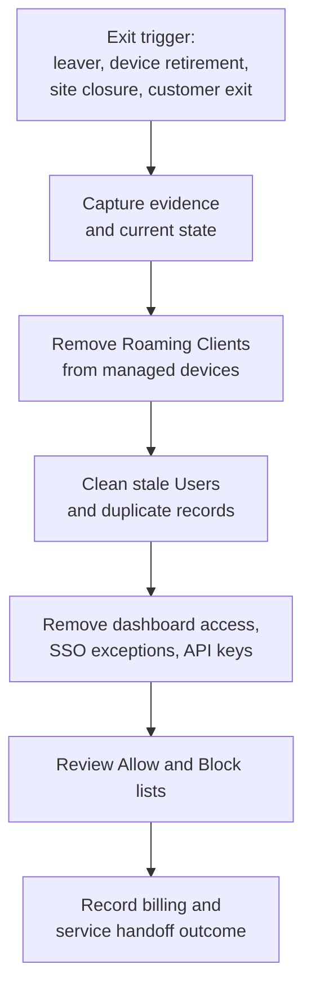

Onboarding adds protection. Offboarding proves the MSP can remove that protection without leaving stale access, surprise billing, or unmanaged agents behind. Treat DNSFilter offboarding as a controlled change, not a cleanup chore.

## The offboarding surface

The order matters. If you delete records before uninstalling agents, a live agent can check in again and recreate the object. If you remove access before asking a user to revoke their own API key, you may need support or a break-glass path to close the gap.

## Four exit shapes

| Exit shape | DNSFilter work | Evidence to retain |
|---|---|---|
| **MSP technician leaves** | Remove dashboard user, review SSO group membership, confirm whether they owned API keys. | User list before/after, API key owner notes, PSA offboarding ticket. |
| **Customer user leaves** | Remove IdP group membership, remove duplicate or stale DNSFilter Users if they appear under Deployments. | IdP leaver ticket, DNSFilter Users screen after sync. |
| **Device retires** | Uninstall the Roaming Client through the supported path, then delete or clean up the dashboard record. | Agent name, device asset ID, uninstall result, last seen. |
| **Customer exits** | Export required reports, uninstall agents, remove integrations and API keys, clean access, confirm billing handoff. | Exit checklist, exported reports, final billing note, customer acceptance. |

## The customer-exit runbook

<StepThrough client:load>
  <Step title="Freeze planned changes">
    Stop policy edits, list changes, and new agent deployments for the customer. Put the exit window in the PSA ticket. Any emergency block still goes through incident response, but ordinary tuning waits until the exit closes.
  </Step>
  <Step title="Export the evidence the customer keeps">
    Pull the reports the contract requires before you remove access: recent Query Log or Data Export destination status, Policy Audit Log, reporting snapshots, and the list of deployed Roaming Clients. Native retention is short, so do this first.
  </Step>
  <Step title="Uninstall Roaming Clients before deleting records">
    Windows Roaming Client 2.0.1+ supports dashboard Delete & Uninstall. macOS removal needs the uninstall script and, for MDM deployments, removal of the related configuration profiles. Deleting the dashboard row alone is not enough for a live agent.
  </Step>
  <Step title="Clean Users and stale deployment objects">
    Open Deployments, Users and Roaming Clients. Remove duplicate Users by keeping the record with the newer last-seen date. For old agents, confirm the endpoint is gone or the uninstall succeeded before deleting the row.
  </Step>
  <Step title="Close access paths">
    Remove customer and MSP users who no longer need access. Check SSO groups, fallback admin accounts, and any shared admin mailbox in the customer runbook. API keys are user-owned, so ask key owners to revoke or delete keys before you remove their dashboard seat.
  </Step>
  <Step title="Review lists and integrations">
    Export or document Universal Lists, customer-specific Allow entries, PSA integration settings, SIEM/Data Export settings, and custom block page domains. Retire anything tied to the departing customer.
  </Step>
  <Step title="Record billing handoff">
    Note the effective date, which org or sub-org was removed from service, who approved the exit, and which evidence was handed to the customer. Attach screenshots or exports to the PSA ticket.
  </Step>
</StepThrough>

## API keys are the awkward part

DNSFilter API keys belong to the user who created them. Owners and admins cannot revoke someone else's key from their own dashboard view. Build this into MSP staff offboarding:

1. Ask the departing technician to revoke or delete DNSFilter keys before their final access removal.
2. Replace any integration that used that key with a service-owned, least-privilege user.
3. Confirm the old key shows revoked or deleted.
4. Remove the technician's dashboard and IdP access.

Do not let an Owner account hold routine automation keys. Use least privilege, name the key after the integration, and record the rotation owner in the customer runbook.

## What this is NOT

- **Not an incident-response shortcut.** Don't uninstall a Roaming Client to make a block go away. Investigate the block and scope the policy change.
- **Not just deleting rows.** Dashboard deletion and device uninstall are different actions. The live agent wins if you skip uninstall, it'll check in and recreate the object you just removed.

<Checkpoint slug="dnsfilter-multi-tenant-ops-checkpoint-offboarding" client:load />

<Callout type="info" title="Sources">
[API Keys](https://help.dnsfilter.com/hc/en-us/articles/21169189058323-API-Keys), [Manage Roaming Client settings](https://help.dnsfilter.com/hc/en-us/articles/1500008108422-Manage-Roaming-Client-settings), [Uninstall Windows Roaming Client v2.0.1 or higher](https://help.dnsfilter.com/hc/en-us/articles/34957633714707-Uninstall-Windows-Roaming-Client-v2-0-1-or-higher), [Uninstall macOS Roaming Clients](https://help.dnsfilter.com/hc/en-us/articles/24995984792339-Uninstall-macOS-Roaming-Clients), [Remove duplicate Users](https://help.dnsfilter.com/hc/en-us/articles/30329791733779-Remove-duplicate-Users-from-DNSFilter-Deployments-dashboard).
</Callout>
