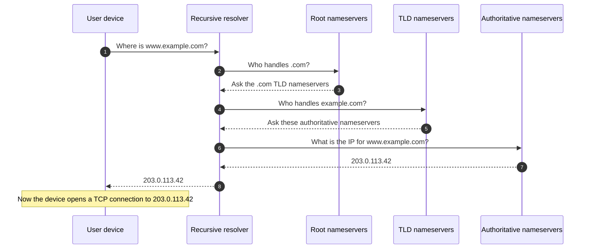

A domain name is a label humans use; the network underneath only routes to **IP addresses**. **DNS** is the system that translates one to the other every time a browser, mail client, or app needs to reach something.

## Why this matters for an MSP tech

You will almost never get a ticket that says "my DNS is broken". You will get tickets that say *"my email isn't sending"*, *"the website is down"*, *"this verification step won't go through"*, or *"my new app says the domain isn't connected"*. About half of them are DNS, and the other half look like DNS until you eliminate it. If you can read DNS, you stop guessing.

## The resolution chain, one diagram

When a user's machine wants to reach `www.example.com`, the work that happens is mostly invisible. There are five participants:

The user's device asks one server (the **recursive resolver**, usually run by the ISP or a public service like 1.1.1.1). That resolver does the legwork: it walks the **DNS hierarchy** from the **root**, to the **TLD** that owns `.com`, to the **authoritative nameservers** for `example.com`, and then asks them about `www.example.com` specifically.

The resolver hands the IP back to the device. Only then does the browser open a TCP connection to that IP. DNS itself does not move web pages or email. It just answers the question *"where is this name?"*.

## Two facts that change how you read tickets

**DNS is cached at every step.** Each answer carries a **TTL** (time to live, in seconds). The recursive resolver remembers the answer for that long and serves it to anyone else who asks. So when you change a record, your machine might still see the old answer until the cache expires. This is what people loosely call "propagation". Lesson 5 covers it in detail.

**DNS is not the connection.** If `www.example.com` resolves to `203.0.113.42` but the server at `203.0.113.42` is offline, DNS is fine and the website is still down. The two failure modes feel similar to a user, but they're answered by different tools. Confirm DNS first, then test the IP.

<Callout type="info" title="Where every record lives">
Every DNS record is stored at one place: the **authoritative nameservers** for the domain's zone. Everything else in the chain (root, TLD, recursive resolvers) caches and points; only the authoritative server answers definitively. When a customer says "I added the record", they mean "in the panel run by whoever hosts our DNS". Lesson 3 unpacks who that is.
</Callout>

## A worked ticket: Able Moose Accounting

Sarah at Able Moose Accounting opens a ticket: *"the website is down for me but my colleague can see it fine."*

<StepThrough client:load>
<Step title="Confirm what each user sees">
Both users go to `example.com`. Sarah gets a connection error. Her colleague Jamie loads the site cleanly. Same DNS answer? Maybe not.
</Step>
<Step title="Resolve the name on each machine">
On Windows: `nslookup example.com` from each machine. Jamie's resolves to the current host's IP. Sarah's resolves to a different IP that hasn't been used in months.
</Step>
<Step title="Compare to authoritative">
Query the authoritative nameservers directly: `nslookup example.com ns1.<dns-host>`. The authoritative answer matches Jamie's IP. Sarah's machine is holding a stale cached answer from her local resolver.
</Step>
<Step title="Decide the fix">
Flush the local DNS cache (`ipconfig /flushdns`), restart the browser, retry. The site loads. The cause was a TTL-aged cache, not a website outage. You log the cause as DNS cache, not infrastructure, and you do not page the web team.
</Step>
</StepThrough>

This is the smallest possible DNS ticket and it already requires reading the resolution chain. Every later lesson builds on it.

<Checkpoint slug="domains-and-dns-foundation-checkpoint-resolution" client:visible />
