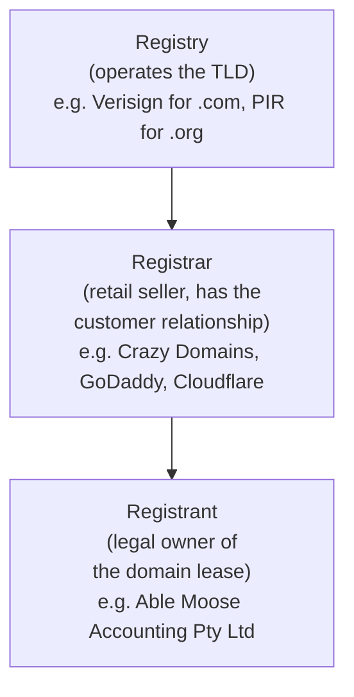

A domain name is leased, not bought. The lease is held by the **registrant** (the legal owner) through a **registrar** (the company that has the relationship with the registry running the TLD). Lose access to the registrar account, lose control of the domain. Lose control of the domain, lose every service hanging off it.

## The three parties

The **registry** runs the master database for an entire **TLD** (top-level domain) like `.com`, `.org`, or any country-code TLD. It does not sell to the public. Registries delegate retail to **registrars**, who run the customer-facing portal where domains are bought, renewed, and configured. The **registrant** is the customer named on the lease.

For an MSP, this distinction matters: when you log in to "manage the domain", you are logged in to the registrar's portal. Your access depends on the registrant having put you there. The registrar can change the registrant's record, but only at the registrant's instruction.

## The four contact roles

ICANN-style domains carry up to four contact roles. Country-code TLDs use the same shape with minor variation.

| Role | Who it is in practice | What it controls |
|---|---|---|
| **Registrant** | The legal entity that owns the domain | Name on the lease, ultimate authority over transfers and ownership changes |
| **Administrative contact** | Usually the same person as the registrant, or a named director / IT manager | Authorises significant changes (renewal terms, transfer initiation) |
| **Technical contact** | Usually the MSP, or the customer's senior IT staff | Receives technical notices (DNS issues, abuse reports), often the operational point of contact |
| **Billing contact** | Whoever pays the renewal | Receives renewal invoices and payment failures |

Why the distinction matters: a transfer-out request, an ownership change, or a critical-renewal email goes to the contact whose role matches the action. If the registrant contact is still pointed at a personal mailbox the previous web designer used, no one inside Able Moose ever sees the renewal warning, and the domain expires.

<Callout type="warn" title="Stale registrant contacts are how MSPs inherit disasters">
A new customer arrives. Their domain is still registered under the previous IT provider's email. The previous provider has the registrant role and therefore the ability to authorise a transfer or release. Until that contact is corrected, the customer does not actually control the domain. Update the registrant first, before anything else.
</Callout>

## WHOIS and RDAP: looking up who controls a domain

The contact details are public-by-default for many TLDs, queryable via **WHOIS** (the legacy text protocol) and **RDAP** (the modern JSON-over-HTTP replacement). Most registrars also offer **WHOIS privacy** that masks personal details behind a proxy email.

What an MSP tech does with this:

- **Confirm a customer actually owns the domain** before you start working on it. A WHOIS lookup against `example.com` should show the company as registrant. If it shows a previous IT provider, that's your first ticket.
- **Look up the registrar** when a customer says "I don't know who we registered with". The WHOIS record names the registrar.
- **Read the expiry date** when troubleshooting why a domain stopped resolving. An expired domain disappears from DNS.
- **See the nameservers** without logging in to anything. Useful for a sanity check that the customer's DNS is hosted where you think it is.

For country-code TLDs, the local registry's WHOIS or RDAP is authoritative (each ccTLD operator runs their own). For gTLDs (`.com`, `.org`, `.net`, `.io`, etc.), the registrar's RDAP service is the canonical source. Any general-purpose WHOIS web tool will work for spot-checking.

## A worked ticket: Able Moose Accounting

Able Moose's office manager opens a ticket: *"we got an email saying our domain is expiring in 7 days, can you renew it?"*

<StepThrough client:load>
<Step title="Verify the email is real">
Phishing pretending to be a registrar is common. The email should come from the actual registrar's domain, link to the registrar you recognise, and reference the customer's account. If it points to a domain you've never heard of, treat it as phishing and check the registrar by independent means.
</Step>
<Step title="Look up the WHOIS record">
Run a WHOIS lookup on `example.com`. It shows the registrant, the registrar, and the expiry date. Compare expiry to the email's claim.
</Step>
<Step title="Confirm who pays">
The billing contact may not be in the customer's company. If a previous accountant or web designer is on the billing role, the renewal might be on their card. Update the billing contact to the customer before the renewal lands.
</Step>
<Step title="Renew through the registrar account">
Log into the registrar with the customer's account, not a forwarded link. Renew directly. Document the new expiry and set a calendar reminder for next year minus 30 days.
</Step>
</StepThrough>

<Checkpoint slug="domains-and-dns-foundation-checkpoint-registration" client:visible />
