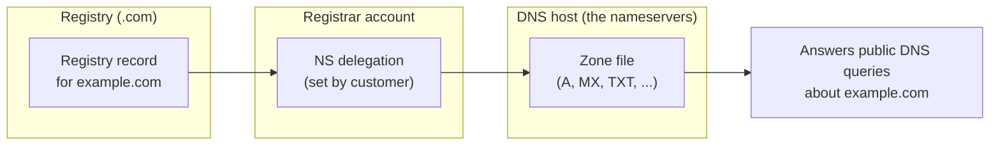

The registrar holds the lease. The **nameservers** hold the records. They are usually two different companies. Confusing the two is the single biggest source of "I changed it but nothing happened" tickets.

## The registrar points; the nameserver answers

When you registered the domain, the registrar wrote a small entry into the registry: *"example.com's nameservers are `ns1.dnshost.example` and `ns2.dnshost.example`"*. That is the **NS delegation**. It is the only DNS information the registry actually stores.

Every other record (A, MX, TXT, etc.) lives on those nameservers. Whoever runs them is the **DNS host**. Editing a TXT record is something you do in the DNS host's panel, not at the registrar, unless they happen to be the same company.

## The four common scenarios

| Scenario | Registrar | DNS host | Where to edit records |
|---|---|---|---|
| Default for new domain | Crazy Domains, GoDaddy, etc. | Same registrar's free DNS | Registrar's DNS panel |
| Customer using Microsoft 365 | Original registrar | Original registrar | Registrar's DNS panel |
| Customer moved to Cloudflare DNS | Original registrar | Cloudflare | Cloudflare's DNS panel; registrar only stores the NS delegation pointing at Cloudflare |
| Customer with web host running their DNS | Original registrar | Web host (e.g. WP Engine, SiteGround) | Web host's DNS panel |

In every row the registrar and the host can be different. The registrar's job after delegation is just to renew the lease and store the NS pointers. The host's job is to publish records.

<Callout type="warn" title="The number-one sanity check before editing DNS">
Before you make a change, look up the current NS records: `nslookup -type=ns example.com`. Compare to the panel you're about to edit. If the NS records point at one host and you're editing in another, you'll change a zone that nothing on the internet is reading.
</Callout>

## Primary, secondary, and the minimum of two

Every domain has at least two nameservers. The registry refuses a delegation pointing at fewer. This is for redundancy: if one nameserver is offline, the resolver tries the next.

In practice, when an MSP-managed customer is on a managed DNS host (Cloudflare, Microsoft 365 DNS, AWS Route 53), all the nameservers are run by the same provider and the redundancy is handled internally. You don't pick which one is "primary". You just enter the four-or-so nameserver names the host gives you into the registrar.

## NS records: in two places, both authoritative-ish

There is a subtle gotcha. NS records appear in two places:

- **At the parent zone**, in the registry (the `.com` registry stores "example.com's nameservers are X, Y"), the **delegation** record. This is what new resolvers actually follow.
- **At the child zone**, on the nameservers themselves (the `example.com` zone file has its own NS records too), the **in-zone** record.

For Beginner-course work, treat the parent (registry) delegation as the source of truth. If you change the child-zone NS records but forget the registrar delegation, the internet still routes to the old host. Lesson 4 covers what NS records look like as a record type.

## A worked ticket: Able Moose Accounting

Able Moose's marketing manager opens a ticket: *"I added the new email service's TXT record at our registrar this morning, can you check it's showing up? It's been 3 hours and the verification still fails."*

<StepThrough client:load>
<Step title="Check where the domain's nameservers point">
`nslookup -type=ns example.com` on your machine. Result: `ns1.cloudflare.com`, `ns2.cloudflare.com`. The customer's DNS host is Cloudflare, not the registrar.
</Step>
<Step title="Compare to where the manager added the record">
Ask which panel they edited. They say "the Crazy Domains DNS panel where I bought the domain". That panel still has a DNS records area, but it isn't being read because the NS delegation points at Cloudflare.
</Step>
<Step title="Add the record at the actual DNS host">
Log in to Cloudflare for that domain, add the TXT record there with the same name and value the email service provided. Wait for propagation (we'll cover that in lesson 5).
</Step>
<Step title="Decide whether to clean up the registrar entry">
The orphaned record in Crazy Domains is harmless because nothing reads that zone. Optional cleanup; not required. Document the actual DNS host in the customer's runbook so the next tech doesn't repeat the mistake.
</Step>
</StepThrough>
