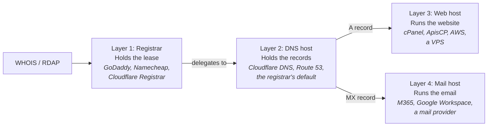

Almost every confusing ticket about domains and DNS traces back to a tech treating "the registrar," "the DNS host," "the web host," and "the mail host" as one fuzzy thing called "the domain." They are not. They are four separate services, often run by four separate companies, and the action the client needs depends entirely on which one you're acting against.

A client says *our website is broken, fix the DNS*. You log into "the DNS," see nothing wrong, and burn forty-five minutes before realising the problem is at the web host. This lesson is the cheapest mistake you can avoid in the whole track.

## The four layers, end to end

Four jobs are being done for any working domain. They can all live at one company, or split across two, three, or four. You will see every combination.

**Registrar.** Holds the *lease* on the domain. Pays the registry, renews annually, holds the contact records and the registrar lock. The auth code for an outbound transfer lives here.

**DNS host.** Holds the *records* that tell the world what the domain points at (A, AAAA, CNAME, MX, TXT). The DNS host's nameservers are listed at the registrar; those nameservers serve the actual records.

**Web host.** Runs the website. The A record at the DNS host points at this host's IP.

**Mail host.** Runs the email. The MX record at the DNS host points at this host. Mail often lives at a different host than the website (web on shared hosting, mail at M365 is the single most common split), which is the biggest source of "we changed something and the other one broke" tickets.

## Reading a ticket through the four layers

A client report rarely names the layer. *The website is broken*. *Email isn't working*. Your first job is to figure out which layer the action lives on:

1. **WHOIS or RDAP on the domain.** Tells you the registrar (Layer 1) and the nameservers the registrar is delegating to (which company runs Layer 2).
2. **`dig` against those nameservers.** `dig A example.com` tells you the IP the website is on (Layer 3). `dig MX example.com` tells you the mail host (Layer 4).
3. **Match symptom to layer.** Website down with a healthy A record and a reachable IP usually means Layer 3 (the web host is broken). Website down with a missing or stale A means Layer 2 (wrong records) or Layer 1 (wrong nameservers listed). Mail bouncing with a healthy MX usually means Layer 4 (the mail host is rejecting). "Domain doesn't work at all" usually means Layer 1 (expiry, lock, or delegation gone).

## What this is NOT

- "DNS host and registrar are the same thing." Often the same company, but the records can be moved to a different DNS host while the registrar stays put (and vice versa). Treat them as separate even when one panel surfaces both.
- "If the registrar's panel shows DNS records, the registrar is the authoritative DNS host." Not necessarily. Some registrars expose a UI for records you'd actually need to edit at a different host if the nameservers point there. Read the delegated nameservers in WHOIS to be sure.
- "Mail is part of hosting." Sometimes. Often not. A large fraction of MSP clients have web at one host and mail at M365 or Google. Treat MX and A as records you change independently unless you've checked.

## Decision walkthrough

WHOIS shows the domain `example.com` registered at GoDaddy with nameservers `ns1.cloudflare.com` and `ns2.cloudflare.com`. `dig A example.com` returns `198.51.100.42`. You ping the IP and get nothing. The client says the website is down.

<DecisionTree
  client:load
  startId="root"
  title="Which layer is the problem at?"
  nodes={[
    {
      type: "question",
      id: "root",
      prompt: "DNS resolves and returns 198.51.100.42, but the IP doesn't respond. Which layer owns this?",
      choices: [
        { label: "Layer 1, the registrar.", next: "out-l1" },
        { label: "Layer 2, the DNS host.", next: "out-l2" },
        { label: "Layer 3, the web host.", next: "out-l3" },
        { label: "Layer 4, the mail host.", next: "out-l4" },
      ],
    },
    {
      type: "outcome",
      id: "out-l1",
      label: "Registrar is doing its job",
      tone: "bad",
      body: "The registrar's only job in this picture is to delegate to the Cloudflare nameservers, which it's doing. The records resolved.",
    },
    {
      type: "outcome",
      id: "out-l2",
      label: "DNS resolved fine",
      tone: "bad",
      body: "DNS returned an IP, on time, from the right nameservers. The DNS host did its job. Look further down the chain.",
    },
    {
      type: "outcome",
      id: "out-l3",
      label: "Web host owns the IP",
      tone: "success",
      body: "Right. The IP DNS returned isn't responding. Whoever owns 198.51.100.42 is the web host. Open a ticket with them, or check the hosting panel if the host is one of your MSP's.",
    },
    {
      type: "outcome",
      id: "out-l4",
      label: "Mail isn't in the picture",
      tone: "bad",
      body: "The client reported a website problem; MX is not in the picture for this ticket. Mail records are independent.",
    },
  ]}
/>

## What to do next

When a domain-or-DNS ticket lands, the first move is always the same: identify the four hosts. WHOIS or RDAP for Layers 1 and 2. `dig A` and `dig MX` against those nameservers for the IPs at Layers 3 and 4. Write the four down in the ticket before you start fixing.

<Checkpoint slug="domains-and-dns-foundation-checkpoint-four-layer-model" client:visible />
