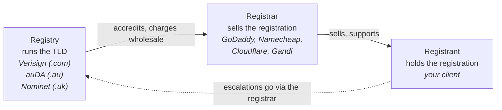

When a domain registration goes wrong, the company you contact depends on which of three parties is involved. A billing problem goes to the registrar. An auth-code request goes to the registrar. A trademark dispute goes to the registry (or the dispute provider) and is well above your line. A reseller-panel quirk goes to the reseller's support, not the underlying registrar.

Techs who think *domains come from ICANN* or *I'll just contact Verisign* lose hours to the wrong support queues. Five minutes of model now saves those hours later.

## The three roles

**Registry.** Runs the TLD itself. One per TLD. Verisign runs `.com` and `.net`. Public Interest Registry runs `.org`. auDA runs `.au`. Nominet runs `.uk`. The registry holds the canonical database of domains in its TLD and sets policy specific to that TLD. You almost never deal with the registry directly; most registries forbid retail customer interaction and require registrars to be the middleman.

**Registrar.** ICANN-accredited (for gTLDs) or registry-accredited (for ccTLDs) reseller of registrations. Hundreds exist. The registrar holds the contact data, runs the panel the registrant logs into, processes payments, handles transfers, manages renewals. When you act on a domain in MSP work, you almost always act through the registrar.

**Registrant.** The customer who holds the registration. In MSP work, the registrant is the client (or should be, see the next lesson on contacts). The registrant doesn't deal with the registry; they deal with the registrar.

## The reseller-registrar pattern

A lot of MSPs and hosting companies don't sell directly through an ICANN-accredited registrar of their own. They resell through a wholesale platform like **OpenSRS** (owned by Tucows) or **eNom**, white-labelling the experience. The MSP's panel looks like the MSP, but underneath the registrar of record is OpenSRS or eNom.

The mechanics are unchanged: you still get an auth code for transfers, you still pay annual renewals, the registrant is still your client. The differences are practical: the panel layout, the support path (you contact the MSP's reseller account team, not Tucows directly), and the available TLD list.

Recognise reseller setups early. When a client's domain is "registered with us" but you can see in WHOIS that the actual registrar is `Tucows Domains Inc.`, that's a reseller relationship. It's still your registration to manage; you go through your reseller account's support for anything the panel doesn't expose.

## What this is NOT

- "ICANN runs domains." ICANN runs *policy* and accredits *registrars*. Registries run TLDs. Registrars sell registrations. ICANN almost never talks to a registrant directly.
- "All registrars charge the same." The wholesale fee a registry charges is fixed (every registrar pays Verisign the same wholesale for `.com`), but retail markup varies. Premium-looking registrars can charge 2x the cheap ones.
- "If my registrar goes out of business, my domain is lost." ICANN policy requires registries to support transfer of registrations from a failed registrar to a replacement. The process is slow, but the registrant's registration is preserved.

## Decision walkthrough

A client emails: *we need to transfer our domain `example.com` to a new registrar. Please get the auth code.* Your documentation system says the domain is "registered with FastHostsCo, our usual supplier." WHOIS reports the registrar as `Tucows Domains Inc.`.

<DecisionTree
  client:load
  startId="root"
  title="Where do you go to request the auth code?"
  nodes={[
    {
      type: "question",
      id: "root",
      prompt: "WHOIS says Tucows; your docs say FastHostsCo. Who do you contact?",
      choices: [
        { label: "Email Tucows directly to request the auth code.", next: "tucows-direct" },
        { label: "Open a ticket with FastHostsCo through your reseller account.", next: "reseller" },
        { label: "Email ICANN to ask them to release the domain.", next: "icann" },
      ],
    },
    {
      type: "outcome",
      id: "tucows-direct",
      label: "Wrong support queue",
      tone: "bad",
      body: "Tucows is the registrar of record, but the panel you have access to and the support queue you have a relationship with is the FastHostsCo reseller account. Going around the reseller usually returns 'please contact your reseller' and burns a day.",
    },
    {
      type: "outcome",
      id: "reseller",
      label: "Through the reseller",
      tone: "success",
      body: "Right. The reseller's support has visibility into your account and can produce the auth code (or surface it in the panel). The underlying registration is at Tucows, but Tucows expects routine work to come through resellers.",
    },
    {
      type: "outcome",
      id: "icann",
      label: "Wrong layer entirely",
      tone: "bad",
      body: "ICANN doesn't handle individual transfers and has nothing to do with auth codes. ICANN is policy and accreditation. Don't waste their time or yours.",
    },
  ]}
/>

## What to do next

When you read WHOIS for an unfamiliar domain, the line that names the registrar is the one to write down first; it tells you which panel to log into for anything routine. If the registrar is a reseller platform and your documentation names a different "registrar" (the MSP or hosting company the client deals with), both are true: the platform is the registrar of record and the MSP is the reseller account. Routine work goes through the reseller; rare escalations to the registry go through the underlying registrar.
