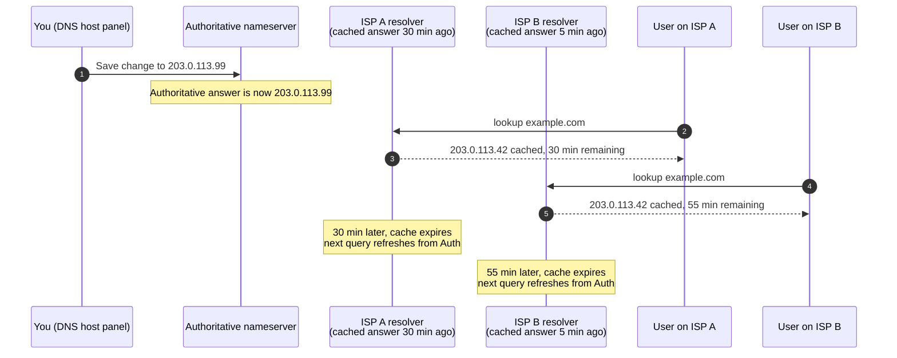

DNS does not "propagate". DNS records sit on the authoritative nameserver from the moment you save them. What takes time is **caches expiring**: every recursive resolver, every router, every operating system, every browser holds the old answer for the duration of the **TTL** you set on the record.

## What TTL really controls

Every DNS record carries a TTL in seconds. When a resolver gets the record, it stores the answer for that long, then throws it away.

| TTL value | Cache lifetime | Practical use |
|---|---|---|
| `60` | 1 minute | Records you might change at any moment (tested cutovers, dev) |
| `300` | 5 minutes | Records during a planned migration window |
| `3600` | 1 hour | Default for most records on most providers |
| `86400` | 24 hours | Records that almost never change (NS, MX) |
| `604800` | 1 week | Records that are essentially permanent |

The trade-off: **shorter TTL = faster changes, more queries**; **longer TTL = slower changes, less load**. For day-to-day operation, longer is cheaper and more reliable. For a planned change, shorter is what you want, set in advance (L3 lesson 2 covers the pre-stage TTL drop).

## What the time-feels-different reality looks like

Imagine you change the A record for `example.com` from `203.0.113.42` to `203.0.113.99`. The TTL is `3600` (1 hour).

Both users are seeing a stale answer, but they will refresh at different times. Telling a customer "DNS takes 24 hours to propagate" is a wishful overestimate; the truth is "wait at least the TTL the old record was set to before the change, then most resolvers will have the new answer".

The complication: the TTL of the record *being read* is the old TTL, not the new one. If a record was sitting at TTL `86400` and you save it at TTL `60`, the world's caches that already had the old record will hold it for up to a full day. The TTL you set today affects how fast *the next* change is.

## Why caches don't all line up

Every resolver caches independently. Some hold the answer for the full TTL. Some refresh early. Some browsers cache for their own browser-specific window on top. A user behind a corporate proxy may have a third layer of caching that ignores the TTL entirely.

Your machine's cache is the one you can clear immediately. The wider internet's caches you cannot. This is what people mean when they say *"propagation"*: not literal propagation, but cache-by-cache timeout.

<Callout type="tip" title="The five-minute fix for tickets blocked on cache">
1. `ipconfig /flushdns` (Windows) or `sudo killall -HUP mDNSResponder` (macOS) clears the local OS cache.
2. Close and reopen the browser to clear browser cache.
3. If still stale, query a public resolver directly: `nslookup name.example.com 1.1.1.1` or `8.8.8.8`. If that returns the new value but the user still sees the old, the cache is closer to the user (corporate proxy, browser, OS).
4. If the public resolver still has the old answer, wait the remainder of the old TTL.
</Callout>

## A worked ticket: Able Moose Accounting

The web designer for Able Moose moved the website to a new host this morning and changed the A record. The customer's bookkeeper Sarah opens a ticket at 11am: *"the website is broken, I see the old version. The web designer says they changed it at 9am and it should be live. Is something wrong?"*

<StepThrough client:load>
<Step title="Find out what TTL the old record had">
The question is not "what's the TTL now?", it's "what was it set to *before* the change?". If the previous TTL was `3600` (one hour), Sarah's ISP has at most 60 minutes left on the cache. If it was `86400` (one day), she might wait until tomorrow.
</Step>
<Step title="Check authoritative vs cached">
Query the authoritative nameserver: `nslookup example.com ns1.cloudflare.com`. The new IP comes back. Then query Sarah's resolver (or 1.1.1.1): if the old IP comes back, it's a cache; if the new IP comes back, the issue is local.
</Step>
<Step title="Flush local caches and retry">
On Sarah's machine: `ipconfig /flushdns`, restart browser. If she now sees the new site, the issue was browser/OS cache. Done.
</Step>
<Step title="If still stale, set expectations honestly">
Tell Sarah the actual cache remaining (you can see it in `dig +noall +answer example.com` as the TTL on the resolver's answer). "Your ISP has the old record for another 47 minutes; please use a different network or wait." Do not say "DNS takes 24 hours" if it's really 47 minutes.
</Step>
</StepThrough>

You've now finished the Beginner course. You can read DNS, you know who controls a domain, you understand where records live and why changes take time. The Intermediate course teaches the panels you'll spend most of your time in, plus the SPF / DKIM / DMARC stack that decides whether the customer's email arrives.
