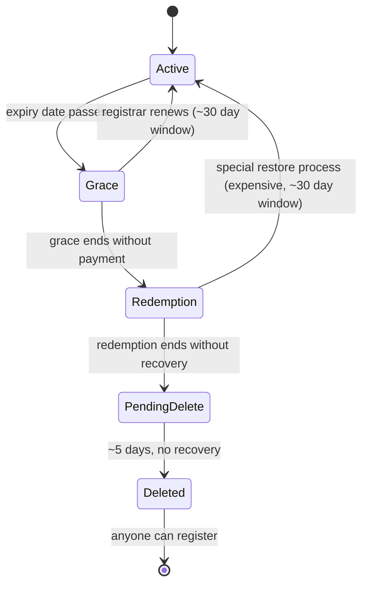

When a client phones in saying *our domain stopped working overnight*, the lifecycle stage tells you most of the answer in under a minute. Active and the issue is elsewhere. In grace and you renew. In redemption and you escalate (expensive, time-pressured). In pending delete and you stop, because the domain is days away from being released and the recovery path no longer exists at this layer.

Knowing which stage you're in changes which action is right; guessing wrong wastes hours or costs the client the domain.

## The standard gTLD lifecycle

**Active.** Registered and inside the paid term. WHOIS shows an expiry date in the future. Status flag: `ok` or `active`.

**Expired (auto-renew grace).** Paid term ended. Most registrars enter an auto-renew grace of about 30 days, during which the registrar can still renew at the standard price. Records may continue to resolve. Status flag: `autoRenewPeriod`.

**Redemption.** If grace ends without payment, the registry pulls the domain. It stops resolving. Recovery requires a special restore process at a significantly higher fee (often 10x a normal renewal). Status flag: `redemptionPeriod`. Lasts about 30 days.

**Pending delete.** Roughly 5 days. Recovery is no longer possible. Status flag: `pendingDelete`.

**Deleted.** The registry releases the domain back to the public market. Drop-catching services compete for attractive names the instant they drop.

Durations above are gTLD norms. ccTLDs run variants; check the specific registry for ccTLDs.

## Reading status flags

WHOIS / RDAP responses include status fields. The ones you'll see most:

- `ok` or `active`: normal.
- `clientTransferProhibited`, `clientUpdateProhibited`, `clientDeleteProhibited`: registrar-set locks (next lesson).
- `autoRenewPeriod`: in the auto-renew grace window.
- `redemptionPeriod`: in registry redemption.
- `pendingDelete`: queued for release.
- `pendingTransfer`: a transfer is in progress.

Multiple flags can be set at once. A single `redemptionPeriod` changes what action is right.

## What this is NOT

- "Auto-renew always renews." Auto-renew tries the card on file. When the card has expired, been declined, or been changed without updating the registrar, auto-renew fails silently and the domain enters grace. Renewal-reminder emails matter.
- "Redemption is just a slightly more expensive renewal." It is a different process at the registry, costs an order of magnitude more, and isn't always self-serve. Escalate it; don't treat it as a renewal-with-a-late-fee.
- "After expiry I have a year to recover." No. The full timeline from expiry to permanent loss is roughly 65 days (30 days grace + 30 days redemption + 5 days pending delete) for a typical gTLD.

## Decision walkthrough

<DecisionTree
  client:load
  startId="root"
  title="Domain in redemption: what now?"
  description="A client calls Friday afternoon, panicked: 'our website is down and emails are bouncing, everything stopped overnight. Please get it back up.' You pull WHOIS. The status shows `redemptionPeriod` and expiry was 38 days ago."
  nodes={[
    {
      type: "question",
      id: "root",
      prompt: "WHOIS shows redemptionPeriod, expiry 38 days ago. What do you do?",
      choices: [
        { label: "Click 'renew' in the registrar panel; the standard renewal will bring it back.", next: "renew" },
        { label: "Escalate to your senior immediately. Redemption recovery requires the registrar's special restore process at the registry.", next: "escalate" },
        { label: "Tell the client the domain is lost and they should pick a new one.", next: "lost" },
        { label: "Wait until pending delete; recovery is easier from there.", next: "wait" },
      ],
    },
    {
      type: "outcome",
      id: "renew",
      label: "Wrong process",
      tone: "bad",
      body: "Redemption is past the standard renewal grace. The renew button at most registrars will either return an error or quietly fail; the registry won't honour a standard renewal in redemptionPeriod. You waste time and signal false confidence to the client.",
    },
    {
      type: "outcome",
      id: "escalate",
      label: "Constructive escalation",
      tone: "success",
      body: "Right. Redemption is in the escalation column from lesson 03. The senior owns the cost / sign-off decision, gets client agreement on the higher restore fee, and works the registrar to file the restore. Time-pressured but recoverable.",
    },
    {
      type: "outcome",
      id: "lost",
      label: "Walking away too early",
      tone: "bad",
      body: "Redemption is recoverable; it's just expensive and time-pressured. Walking away leaves real money on the table for the client.",
    },
    {
      type: "outcome",
      id: "wait",
      label: "Loses the domain",
      tone: "bad",
      body: "Pending delete is past the recovery window. Waiting loses the domain entirely. Acting now (escalation route) is the only path.",
    },
  ]}
/>

## What to do next

On any domain-not-working ticket, the first read is always: pull WHOIS / RDAP and read the status flags and expiry date before anything else. The lifecycle stage tells you which response is right:

- **Active:** the issue is at another layer; go to the four-layer model and identify which one.
- **Grace:** renew through the registrar; confirm billing.
- **Redemption:** escalate. Don't self-serve.
- **Pending delete:** stop. The conversation is now about whether the name matters enough to catch on re-release (escalation territory).

<Checkpoint slug="domains-and-dns-foundation-checkpoint-domain-lifecycle" client:visible />
