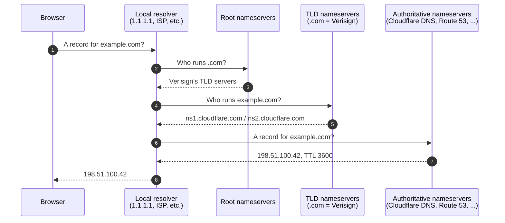

When a record looks wrong, the fix has to land at the right server. There's a chain of about four servers involved in resolving a typical query, and only one of them is the authoritative DNS host you can edit.

Most *DNS isn't propagating* tickets are actually *I edited record X at the right place but a cached answer at server Y is still in play*. The chain is how you reason about that.

## The chain in motion



**The local resolver.** The user's home router, their ISP, or an explicit choice like `1.1.1.1` (Cloudflare) or `8.8.8.8` (Google). The resolver is the client-side cache; it caches answers aggressively to be fast.

**The root nameservers.** 13 organisations under ICANN. They know which TLD nameservers serve which TLD.

**The TLD nameservers.** Run by the registry for each TLD (Verisign for `.com`, PIR for `.org`, auDA for `.au`). They know which authoritative nameservers a registered domain points at.

**The authoritative nameservers.** Run by the DNS host. They hold the actual records (A, AAAA, CNAME, MX, TXT) and are the only server in the chain you control.

After the first query, the resolver caches the answer for the TTL. Subsequent queries skip steps 2–7 and just return the cache. Only when the cache expires does the resolver re-do the chain.

## Who controls what

The MSP's tech controls exactly one server: the authoritative nameserver (via the DNS host). The registrar controls the NS delegation at the parent zone (what the TLD's nameservers tell resolvers to query). Nobody at the MSP controls the resolver path.

Different users hit different resolvers; the resolver caches answers for the TTL; you cannot force a resolver to flush from outside. The *wait for propagation* rule is a recognition that you can't make every resolver re-query at once; you can only wait until their TTL expires.

## What this is NOT

- "DNS is replicated; every server has every record." Resolvers cache, they don't replicate. The authoritative server is the single source of truth.
- "The registrar serves DNS." Only if you've chosen the registrar's nameservers as authoritative. The registrar's role is the NS delegation at the TLD, not serving records.
- "I can force propagation by querying many servers." Querying a resolver makes it fetch from authoritative, but it was going to do that on cache expiry anyway. You can't accelerate the resolvers you don't query.

## Verifying a DNS change

When verifying a change, query the **authoritative server directly first**:

```text
dig A example.com @ns1.cloudflare.com    # source of truth
dig A example.com @8.8.8.8                # what one public resolver currently caches
```

The two together tell you whether the change is right at source and how far cached old data still persists.

## Decision walkthrough

You change a client's A record from `203.0.113.10` to `198.51.100.42` at Cloudflare DNS. Thirty minutes later the client emails: *the website still shows the old server.* Where is the old IP coming from?

<DecisionTree
  client:load
  startId="root"
  title="Where in the chain is the stale answer?"
  nodes={[
    {
      type: "question",
      id: "root",
      prompt: "First check?",
      choices: [
        { label: "Open the Cloudflare panel and verify the save.", next: "panel" },
        { label: "Query the authoritative server directly: dig A example.com @ns1.cloudflare.com.", next: "authoritative" },
        { label: "Ask the client to clear their browser cache.", next: "browser" },
      ],
    },
    {
      type: "outcome",
      id: "panel",
      label: "Sanity check but not the primary",
      tone: "warn",
      body: "Worth doing eventually, but a terminal command is faster. Query the authoritative server first; if it returns the new IP, the panel save worked.",
    },
    {
      type: "outcome",
      id: "authoritative",
      label: "Source of truth first",
      tone: "success",
      body: "Right. If the authoritative returns the new IP, the change is correct; old answers are cached downstream. If the authoritative returns the old IP, the change didn't save and the panel is what to check next.",
    },
    {
      type: "outcome",
      id: "browser",
      label: "Wrong scope",
      tone: "bad",
      body: "Browser cache rarely holds DNS for more than seconds. The issue is likely a resolver further upstream, not the browser.",
    },
  ]}
/>

When `dig @ns1.cloudflare.com` returns the new IP and `dig @8.8.8.8` returns the old, Google's resolver still has the old A record cached. It will re-query after the TTL expires. The fix is wait, or check whether the original record had a long TTL that hasn't expired yet.
