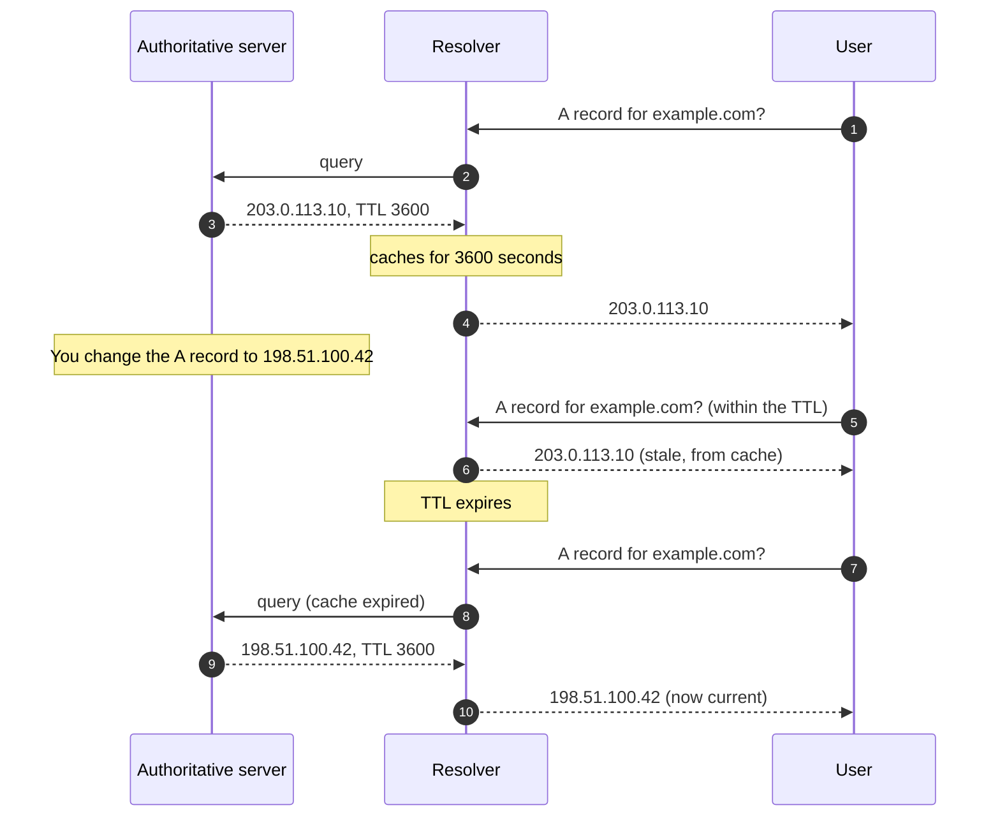

Every DNS record has a TTL, and every TTL-related *propagation isn't working* ticket comes back to the same misunderstanding. TTL is the cache lifetime, not a propagation timer.

A short TTL doesn't make the change happen faster at the authoritative server; it makes resolvers re-query *sooner after their current cache expires*. Lowering the TTL after a change has been made is too late to help that change. Setting TTL properly *before* a change is what shapes the propagation experience for users.

## What TTL is, in motion

The authoritative server serves the new value the moment you save. Resolvers that had the old value cached continue to serve the old value for up to the TTL of the *old* record. New resolvers querying for the first time see the new value immediately.

## What TTL controls

Two things, exactly:

1. **How long resolvers cache the record.** A resolver receiving TTL 3600 holds for an hour.
2. **How long after a change it takes for caches to expire.** If you change a record whose old TTL was 3600, downstream caches keep returning the old value for up to an hour after the change.

The key insight: **TTL controls how long the *old* value can persist**, not how fast the *new* value propagates.

## Common TTL values

| Value | Use case |
|---|---|
| 60 sec | Below most resolver floors; overkill, adds load |
| 300 sec (5 min) | Standard cutover TTL during active migrations |
| 3600 sec (1 hour) | Common operational default; reasonable middle ground |
| 86400 sec (24 hours) | Stable records (MX of a long-stable provider, SOA, NS) |
| 604800 sec (1 week) | Records that essentially never change |

## The pre-flight TTL drop

<Callout type="info" title="Pre-flight is what makes cutovers snappy">
For any planned DNS change where propagation speed matters:

1. **Lower the TTL** on the records that will change (300 is the standard pre-flight value).
2. **Wait at least one current-TTL duration** so resolvers re-pull and pick up the lower TTL.
3. **Make the change.** Resolvers will now cache the new value for only 5 minutes.
4. **Verify** with `dig` against the authoritative and a public resolver.
5. **Restore a sensible TTL** (3600 or higher) after the change settles.

If you skip steps 1 and 2, the change still propagates, but caches with the old TTL hold the old value for the old duration (potentially 24 hours). The drop step is the difference between *5-minute cutover* and *day-long inconsistency*.
</Callout>

## Practice: checking TTL before a cutover

You're preparing for a mail migration next Thursday. Current MX has a high TTL. Walk through the pre-flight check.

<Console
  client:load
  title="ttl-preflight-check"
  steps={[
    {
      narration: "Check the current TTL on the MX record to know how far in advance you need to drop it.",
      variants: {
        bash: {
          choices: [
            "dig MX example.com +noall +answer",
            {
              label: "whois example.com",
              rationale: "whois shows registrar metadata (registrant, expiry, nameservers). It doesn't show DNS record TTLs.",
            },
            {
              label: "dig MX example.com +short",
              rationale: "+short strips everything including the TTL. You need the TTL value to plan the pre-flight timing.",
            },
          ],
          correctIndex: 0,
          response: "example.com.    86400    IN    MX    10 mail.example.com.",
          comment: "TTL 86400 (24 hours). You need to drop this well before Thursday's cutover.",
        },
        powershell: {
          choices: [
            "Resolve-DnsName example.com -Type MX | Format-List",
            {
              label: "Resolve-DnsName example.com -Type MX",
              rationale: "Default table output can truncate columns. Format-List shows all fields including TTL.",
            },
            {
              label: "Get-DnsClientCache | Where-Object { $_.Entry -eq 'example.com' }",
              rationale: "Local stub-resolver cache. Shows remaining TTL from your machine, not the authoritative value.",
            },
          ],
          correctIndex: 0,
          response: "Name      : example.com\nQueryType : MX\nTTL       : 86400\nExchange  : mail.example.com\nPreference: 10",
          comment: "TTL 86400 seconds (24 hours). Drop to 300 now; the lower TTL needs at least one full cycle to propagate before Thursday.",
        },
        cmd: {
          choices: [
            "nslookup -type=MX -debug example.com",
            {
              label: "nslookup -type=MX example.com",
              rationale: "Default nslookup hides TTL. The -debug flag shows the full DNS response including TTL values.",
            },
            {
              label: "nslookup example.com",
              rationale: "Without -type=MX, nslookup returns A records. You need MX to check the mail record's TTL.",
            },
          ],
          correctIndex: 0,
          response: "Got answer:\n    ANSWERS:\n    ->  example.com\n        MX preference = 10, mail exchanger = mail.example.com\n        ttl = 86400 (1 day)",
          comment: "24-hour TTL. Drop to 300 now, wait 24 hours for downstream caches to pick up the lower value, then make the MX change Thursday.",
        },
      },
    },
    {
      narration: "Tuesday afternoon. You dropped the TTL to 300 yesterday. Verify the lower TTL has propagated to public resolvers.",
      variants: {
        bash: {
          choices: [
            "dig MX example.com @8.8.8.8 +noall +answer",
            {
              label: "dig MX example.com @ns1.example.com +noall +answer",
              rationale: "The authoritative always shows the current TTL. You need a public resolver to confirm downstream caches picked up the lower value.",
            },
            {
              label: "dig MX example.com +short",
              rationale: "+short strips the TTL. You need to see the TTL value to confirm the drop propagated.",
            },
          ],
          correctIndex: 0,
          response: "example.com.    300    IN    MX    10 mail.example.com.",
          comment: "TTL 300 at Google's resolver. The drop propagated. Thursday's cutover will propagate within 5 minutes for most users.",
        },
        powershell: {
          choices: [
            "Resolve-DnsName example.com -Type MX -Server 8.8.8.8 | Format-List",
            {
              label: "Resolve-DnsName example.com -Type MX -Server ns1.example.com | Format-List",
              rationale: "Authoritative always shows current TTL. Check a public resolver to confirm caches have the lower value.",
            },
            {
              label: "Clear-DnsClientCache",
              rationale: "Clears your local cache. Doesn't tell you whether public resolvers have picked up the lower TTL.",
            },
          ],
          correctIndex: 0,
          response: "Name      : example.com\nQueryType : MX\nTTL       : 300\nExchange  : mail.example.com\nPreference: 10",
          comment: "TTL 300 at Google's resolver. Pre-flight complete. Ready for Thursday's cutover.",
        },
        cmd: {
          choices: [
            "nslookup -type=MX -debug example.com 8.8.8.8",
            {
              label: "nslookup -type=MX example.com",
              rationale: "Queries the system resolver. You need to check a public resolver (8.8.8.8) to confirm the lower TTL reached downstream caches.",
            },
            {
              label: "ipconfig /flushdns",
              rationale: "Flushes your local cache. Doesn't confirm whether public resolvers have the lower TTL.",
            },
          ],
          correctIndex: 0,
          response: "Server:  dns.google\nAddress: 8.8.8.8\n\n    MX preference = 10, mail exchanger = mail.example.com\n    ttl = 300 (5 mins)",
          comment: "TTL shows 300 at Google's resolver. Pre-flight confirmed. Thursday's MX change will propagate in minutes.",
        },
      },
    },
  ]}
/>

## What this is NOT

- "TTL controls propagation." TTL controls cache lifetime. Propagation is the effect of caches expiring. The TTL that matters for a specific change is the *old* TTL on the *old* record.
- "Setting TTL to 1 second means changes are instant." Most resolvers floor at 30-60 seconds; sub-30s TTLs don't deliver what they imply, and they put load on the authoritative server.
- "After I set TTL low, the next change will propagate fast." Only if the low TTL has been in place long enough for downstream caches to have picked it up.

## Decision walkthrough

<DecisionTree
  client:load
  startId="root"
  title="What do you do today?"
  description="A client says: 'we're moving our website to a new web host on Thursday at 9pm. We want minimal downtime visible to users.' Today is Tuesday. The current A record has TTL 86400 (24 hours)."
  nodes={[
    {
      type: "question",
      id: "root",
      prompt: "Tuesday. Cutover scheduled Thursday 9pm. Current TTL 86400. Plan?",
      choices: [
        { label: "Wait until Thursday 9pm and make the change with TTL 86400 as-is.", next: "no-preflight" },
        { label: "Lower the TTL on the A and AAAA records to 300 today.", next: "preflight-now" },
        { label: "Lower the TTL on Thursday morning.", next: "too-late" },
      ],
    },
    {
      type: "outcome",
      id: "no-preflight",
      label: "Day-long inconsistency",
      tone: "bad",
      body: "Downstream caches will hold the old IP for up to 24 hours after the change. Users will hit the old server through Friday evening.",
    },
    {
      type: "outcome",
      id: "preflight-now",
      label: "Pre-flight done right",
      tone: "success",
      body: "Right. 48+ hours before Thursday is plenty for the lower TTL to spread through downstream caches. At cutover, the new value propagates within 5 minutes for most users.",
    },
    {
      type: "outcome",
      id: "too-late",
      label: "Drop too late",
      tone: "warn",
      body: "By Thursday morning, downstream caches with the current 86400 TTL won't have re-queried yet; they're still holding the high-TTL entry. The drop is too late to matter for the 9pm change.",
    },
  ]}
/>

After the cutover, restore TTL to 3600 (or higher) so the authoritative server isn't fielding queries every 5 minutes for a record that won't change for months.

<Checkpoint slug="domains-and-dns-foundation-checkpoint-ttl" client:visible />
