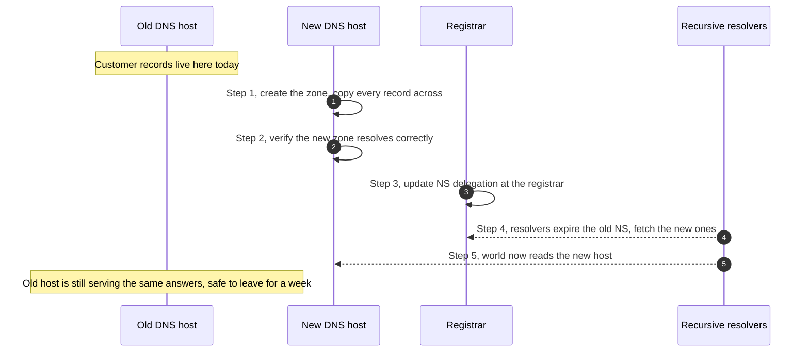

The foundation course covered why the registrar and the DNS host are different things. The day-to-day work starts with the operational consequence: the first thing you do on any DNS ticket is identify which is which, and the first thing you do on any onboarding is decide whether you're keeping DNS where it is or moving it.

## The 30-second identification

Three commands answer the question for any domain:

| Command | Tells you | Read it as |
|---|---|---|
| `whois example.com` (or RDAP / web tool) | Who the **registrar** is | "Renewal and ownership lives at this company" |
| `nslookup -type=ns example.com` | The current **NS delegation** | "The DNS host is whoever runs these nameservers" |
| `nslookup -type=soa example.com` | The **SOA** record's `MNAME` field | "The primary nameserver in the zone, double-check that the host matches the NS records" |

The registrar from WHOIS will not match the nameserver hostnames in 60% of MSP-managed domains. That's normal: a customer registers at one company and parks DNS at another (very often Cloudflare, Microsoft 365, or the web host).

## When to move DNS hosting

Customer onboarding usually surfaces the question. Three real triggers:

1. **The customer is on Microsoft 365 and wants their DNS records there for simplicity.** M365 has DNS hosting built into the tenant, so the records that M365 cares about (MX, autodiscover, SPF, DKIM, DMARC) sit in one place. Real consideration, but moving DNS for one platform's convenience is a long-term constraint.
2. **The customer wants Cloudflare in front of their website for caching, DDoS protection, or the proxy features.** Cloudflare's panel becomes the DNS host. This is the most common move you'll do as an MSP.
3. **The current registrar's DNS panel is unreliable, slow, or missing record types.** Older retail registrars don't all support modern record types or fast TTL changes. Moving to a managed DNS host fixes this without changing the registrar.

You almost never *have* to move the DNS host. Most platforms' setup wizards work fine with whatever DNS host the customer already has, as long as you can add the records they need.

## How a DNS host move actually works

Step 1 is where mistakes happen: a record exists in the old zone that nobody documented (a verification TXT, an old subdomain, a marketing redirect). If it isn't copied to the new zone, it disappears the moment the NS delegation changes.

<Callout type="warn" title="Always export before you migrate">
Before a DNS host move, export the current zone (zone file, BIND format, or a screenshot of every record) from the old host. Compare it against the new host's zone after import. **Don't trust the new host's import wizard alone**, especially with TXT records, where the wizard often truncates long values or drops escaped quote characters.
</Callout>

## Decision tree: should you move DNS hosting?

<DecisionTree client:load
  startId="root"
  nodes={[
    { type: "question", id: "root", prompt: "Why is moving DNS hosting being considered?", choices: [
      { label: "Customer wants Cloudflare proxy / caching for their website", next: "cf" },
      { label: "Customer wants M365 admin to be one panel for everything", next: "m365" },
      { label: "Current registrar's DNS panel is broken or missing record types", next: "broken" },
      { label: "We just like our chosen DNS host more", next: "preference" },
    ]},
    { type: "outcome", id: "cf", label: "Yes, move DNS to Cloudflare", tone: "success",
      body: "Cloudflare's value is the proxy, and the proxy needs Cloudflare to be the authoritative DNS host so it can return its proxy IPs. Plan a midweek change window, export the existing zone first, verify mail-flow records survive the move." },
    { type: "outcome", id: "m365", label: "Possibly, but rarely worth it", tone: "warn",
      body: "M365 hosting DNS is convenient for the M365 records but adds a dependency. If the customer ever leaves M365, you'll re-host DNS again. Often better to leave DNS at the existing host and just add the M365 records there." },
    { type: "outcome", id: "broken", label: "Yes, move DNS to a managed host", tone: "success",
      body: "Pick a stable managed host (Cloudflare, Microsoft 365, AWS Route 53, the registrar's premium DNS if available). The registrar stays the same; only the NS delegation changes." },
    { type: "outcome", id: "preference", label: "No, leave it where it is", tone: "info",
      body: "Operational preference is not a reason to migrate a customer's production DNS. The change has cost, risk, and customer-facing impact if something is missed. Document the existing setup instead." },
  ]}
/>

## A worked ticket: Able Moose Accounting

Able Moose's CFO asks the MSP to *"put Cloudflare in front of our website to make it faster"*. The customer's domain is registered at Crazy Domains, and DNS is hosted at Crazy Domains too.

<StepThrough client:load>
<Step title="Audit the current zone">
Log into Crazy Domains, take a screenshot of every record. Note: A and AAAA for the apex, CNAME for `www`, M365 MX, SPF TXT, DKIM CNAME pair, DMARC TXT, an old `tradeshow2024` subdomain pointing somewhere, and a verification TXT for an analytics service.
</Step>
<Step title="Set up the Cloudflare zone">
Create the zone in Cloudflare, run the import wizard, then compare against the audit. The wizard caught the records you expected. Manually re-add anything missing. Decide which records will be *proxied* (covered in lesson 3) and which stay DNS-only.
</Step>
<Step title="Pre-stage the TTL">
Drop the TTL on the apex A and AAAA records to 300 seconds 24 hours before the change window. (If the customer's TTLs were already short, skip this; this is a defence against worst-case rollback timing.)
</Step>
<Step title="Update the NS delegation at the registrar">
At Crazy Domains, replace the nameservers with Cloudflare's `ns1.cloudflare.com` / `ns2.cloudflare.com` pair. The change applies at the registry within minutes. Resolvers update over the next NS-record TTL (typically 24 hours).
</Step>
<Step title="Watch and verify">
For the next 48 hours, run periodic checks: `nslookup example.com`, `nslookup -type=mx example.com`, send a test email to and from the domain. Most resolvers refresh inside 6 hours; the long tail is rare but real.
</Step>
</StepThrough>

<Checkpoint slug="domains-and-dns-day-to-day-checkpoint-registrar-host" client:visible />
