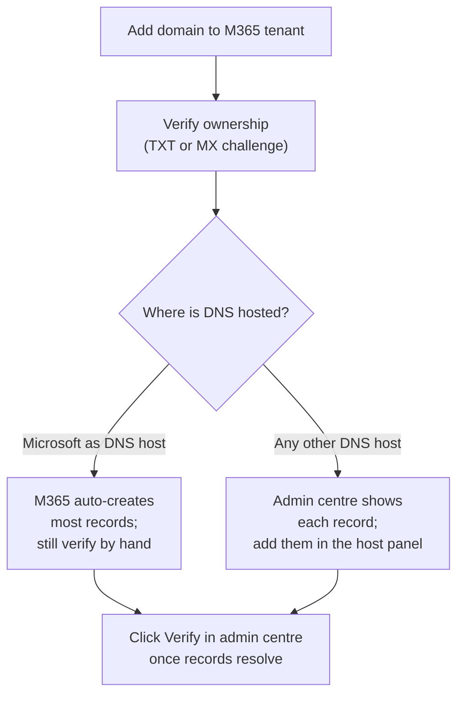

Microsoft 365 needs about a dozen DNS records on a customer's primary mail domain to work. The records are the same regardless of where DNS is hosted; the only thing that changes is the panel you type them into. The Microsoft 365 admin centre will show you a checklist of "missing records" and "your DNS is verified" against any DNS host, not just Microsoft-hosted DNS.

## Two paths to the same records



If the customer's NS delegation points at Microsoft's nameservers, the M365 admin centre can add records directly. Otherwise, the admin centre prints the records it expects and waits for you to add them at whichever host the NS delegation actually points to. **Either way, the verification step is the same**: M365 queries DNS and confirms each expected record is present.

## The records M365 wants on the primary mail domain

| Record | Type | Name | Value (typical) | What it controls |
|---|---|---|---|---|
| Verification | TXT | `@` (apex) | `MS=ms12345678` | Proves ownership during onboarding |
| Mail flow | MX | `@` | `0 example-com.mail.protection.outlook.com` | Inbound mail to Exchange Online |
| SPF | TXT | `@` | `v=spf1 include:spf.protection.outlook.com -all` | Permits Microsoft to send mail for the domain |
| Autodiscover | CNAME | `autodiscover` | `autodiscover.outlook.com` | Lets Outlook auto-configure |
| Autodiscover (legacy) | SRV | `_autodiscover._tcp` | priority 100 weight 1 port 443 target `autodiscover.outlook.com` | For older Outlook clients on AD-joined networks |
| MDM enrolment | CNAME | `enterpriseregistration` | `enterpriseregistration.windows.net` | Modern device join (if Intune in use) |
| MDM enrolment | CNAME | `enterprisedeviceenrollment` | `enterprisedeviceenrollment.windows.net` | Modern device join (if Intune in use) |
| Skype/Teams | SRV | `_sip._tls` | (only if Skype for Business / legacy Teams config) | Older calling features |

The exact record names and values come from the M365 admin centre under **Settings → Domains → [your-domain] → DNS records**. Don't hand-type them from memory; paste from the admin centre because Microsoft updates the targets on rare occasions.

<Callout type="info" title="The replace-vs-append trap">
The M365 admin centre tells you the SPF record value it wants. If a TXT record at the apex already exists for SPF (because another service was sending mail before, e.g. a CRM), **do not delete and replace**. SPF allows only one `v=spf1` record per domain, and the new record must `include:` everything the old one did, plus M365. Lesson 4 covers this in detail.
</Callout>

## DKIM: the CNAME pair that needs you to enable it

DKIM is the third leg of mail authentication. M365 sets up the *infrastructure* automatically but needs you to add **two CNAME records** to the customer's DNS, then enable signing in the M365 admin centre under **Email & collaboration → Policies & rules → Threat policies → DKIM**.

```
selector1._domainkey.example.com.   3600   IN   CNAME   selector1-example-com._domainkey.example.onmicrosoft.com.
selector2._domainkey.example.com.   3600   IN   CNAME   selector2-example-com._domainkey.example.onmicrosoft.com.
```

The exact target hostnames come from the DKIM page in the admin centre. They are unique per tenant. Add the CNAMEs first, then enable DKIM signing. If you enable signing before the records resolve, M365 refuses and the admin centre shows an error.

## A worked ticket: Able Moose Accounting

Able Moose has just completed a small acquisition, picking up a 6-person team that used `example.net` for their email. The CFO wants the team's mailboxes moved into the Able Moose M365 tenant so HR is consolidated.

<StepThrough client:load>
<Step title="Add the new domain in the M365 admin centre">
**Settings → Domains → Add domain → `example.net`**. Microsoft generates a TXT verification challenge.
</Step>
<Step title="Confirm where DNS is currently hosted">
The acquired firm's domain is registered at GoDaddy with DNS at GoDaddy too. NS delegation: `ns1.domaincontrol.com`. The records will be added there.
</Step>
<Step title="Add the verification TXT and click Verify">
At GoDaddy, add a TXT record at `@` with the value Microsoft provided (e.g. `MS=ms12345678`). After 1-2 minutes, click Verify in the M365 admin centre. M365 confirms ownership.
</Step>
<Step title="Add each of the recommended records">
M365 prints a checklist: MX, SPF, DKIM (CNAME pair), autodiscover CNAME, two MDM CNAMEs. Add each one at GoDaddy. Each record's "Name" in M365 corresponds to the hostname before `.example.net`; for `@` use the apex.
</Step>
<Step title="Enable DKIM signing">
Wait for the two DKIM CNAMEs to resolve (a few minutes), then enable DKIM in the admin centre. The page should show "Sign messages for this domain with DKIM signatures" toggled on.
</Step>
<Step title="Cut over MX last">
The MX is the last record you change. Until the MX is updated, mail goes to the acquired firm's old provider. Once you change the MX to `example-net.mail.protection.outlook.com` (or the value M365 provides), inbound mail starts arriving at the M365 tenant. Coordinate with the team so they're ready to use Outlook the moment mail flow cuts.
</Step>
</StepThrough>

<Checkpoint slug="domains-and-dns-day-to-day-checkpoint-m365" client:visible />
