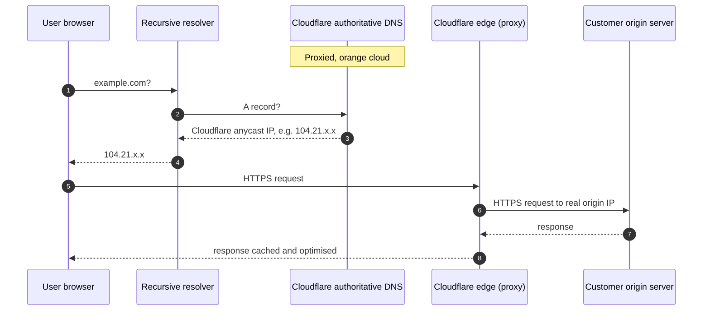

Cloudflare is a managed DNS host with one extra concept that no other host has: every A, AAAA, and CNAME record can be either **proxied** (orange cloud icon) or **DNS-only** (grey cloud icon). Understanding the toggle is the difference between Cloudflare doing what the customer wants and Cloudflare quietly breaking mail.

## What proxy mode actually does

When a record is **proxied**, Cloudflare does not return the customer's actual server IP. It returns one of Cloudflare's edge IPs, then proxies the HTTPS connection through to the origin. This is what gives Cloudflare its caching, DDoS scrubbing, WAF, and analytics.

When a record is **DNS-only**, Cloudflare answers with the actual origin IP and steps out of the path. Cloudflare is purely a DNS host for that record.

| Record | Proxy state | Why |
|---|---|---|
| `example.com` (A → web origin) | Proxied (orange) | The whole point: Cloudflare in front of the website |
| `www.example.com` (CNAME → apex) | Proxied (orange) | Same reason |
| `mail.example.com` (A → mail server) | DNS-only (grey) | SMTP and IMAP do not survive HTTPS proxying |
| `MX` records | Proxy doesn't apply | Cloudflare cannot proxy mail traffic; the panel won't even show the toggle |
| `autodiscover` CNAME | DNS-only (grey) | Outlook auto-configuration fetches XML over HTTPS but uses host-specific verification that breaks through a proxy |
| `_dmarc` TXT | Proxy doesn't apply | TXT records aren't proxied |

## The records that should never be orange

The "orange cloud breaks it" list is short but worth memorising:

- **Anything serving SMTP, IMAP, POP, or other non-HTTP/HTTPS protocols.** Proxy is HTTPS-only. A mail server fronted by orange cloud stops accepting mail.
- **Anything that needs the client's real IP at the origin.** Cloudflare's proxy replaces the source IP with its own. Origins that allowlist by IP, or that need exact client IP for something like geofencing, will not work behind proxy without the `CF-Connecting-IP` header support on the origin.
- **Anything where DNS verification is the requirement.** Some service-verification flows resolve the hostname and expect to see a specific IP they own. Behind orange cloud, the IP is Cloudflare's. The verification fails. Switch to grey cloud just for the verification step, then switch back if it's appropriate.
- **Anything pointing to a non-public origin.** Proxy mode only works with origins reachable from the public internet. If the origin is internal-only, the proxy can't reach it.

<Callout type="warn" title="The most common Cloudflare mistake an MSP makes">
A customer tells you "my email isn't sending after the Cloudflare migration". Look at the `mail.<customer>` A record in the Cloudflare panel. If it's orange, that's the bug. Switch to grey, wait for the TTL to expire on resolvers, mail flow returns. The MX record itself is unaffected (Cloudflare can't proxy it anyway), but the underlying A record the MX points to will silently break SMTP if proxied.
</Callout>

## Driving the panel: the record-add basics

The Cloudflare DNS panel sits at **dash.cloudflare.com → [your zone] → DNS → Records**. Each new record needs:

| Field | What to enter |
|---|---|
| Type | `A`, `AAAA`, `CNAME`, `TXT`, `MX`, `NS`, `SRV`, `CAA` (most useful types selectable from the dropdown) |
| Name | The hostname *before* the apex domain. `@` for the apex itself. `www` for `www.<domain>`. The panel auto-appends the apex, so don't include it. |
| IPv4 / Target / Content | The value; format depends on type. The panel validates as you type. |
| Proxy status | Orange/grey toggle (only on A, AAAA, CNAME). Defaults to orange for new A records on a zone the customer "wants Cloudflare in front of". |
| TTL | "Auto" works for everything proxied (Cloudflare ignores the TTL for proxied records and serves a default low value). For DNS-only, use the TTL you want. |

When you import an existing zone via Cloudflare's wizard, every record comes in as DNS-only (grey) by default. You then turn on proxy (orange) only for the records you want fronted. This is safer than the reverse.

## A worked ticket: Able Moose Accounting

A week after moving to Cloudflare, Able Moose's bookkeeper Sarah opens a ticket: *"clients are saying they can't email me, but my Outlook says it sent fine."*

<StepThrough client:load>
<Step title="Test inbound to and from outside">
Send a test email from a free webmail account to Sarah's address. Bounce back? Delivered to spam? Or never arrives? You get a bounce: "550 5.7.1 Service unavailable" referencing Cloudflare's edge.
</Step>
<Step title="Check the MX target's A record">
The MX points to `example-com.mail.protection.outlook.com`, which is Microsoft's, not Cloudflare-routed. The MX itself is fine. Check `mail.example.com` for any historical record.
</Step>
<Step title="Spot the orange cloud on a non-mail record">
You discover that during the Cloudflare migration, an old `mail.example.com` A record (pointing at a legacy mail server still receiving copies for archival) was imported as **proxied**. Cloudflare's edge is rejecting SMTP because it doesn't proxy port 25.
</Step>
<Step title="Toggle to DNS-only">
Click the orange cloud, switch to grey. Save. Within minutes, SMTP delivery to that endpoint resumes. Update the runbook so the next migration audit catches this.
</Step>
</StepThrough>
