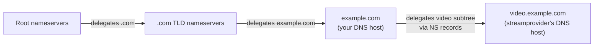

Most subdomain setups use a CNAME or a direct A record at the parent zone. A small set delegate to a different DNS host entirely via NS records: a third-party team manages a subdomain, a streaming service wants its own nameservers, a marketing platform requests delegation for tracking subdomains.

When delegation is wrong, the symptoms look like *DNS isn't working* but the cause is at a layer most techs don't reach for.

## Delegation, conceptually

When you register a domain, you publish NS records at the registrar pointing at the DNS host's nameservers. That's *parent-zone* NS delegation: the `.com` TLD's nameservers tell resolvers "for `example.com`, ask Cloudflare."

You can do the same thing one level deeper. Inside `example.com`'s zone, publish NS records for a subdomain pointing at *different* nameservers:

```text
video.example.com.   IN  NS  ns1.streamprovider.example.
video.example.com.   IN  NS  ns2.streamprovider.example.
```

This tells resolvers: *for anything under `video.example.com`, ask `streamprovider.example`'s nameservers, not me*. Your DNS host stops being authoritative for that subtree.



The contrast with a CNAME: a CNAME aliases *one name* to another. NS delegation hands off an *entire subtree*. CNAME is light and per-record; delegation is heavy and structural.

## When you might use delegation

The legitimate use cases are limited:

- **Third-party service** that wants its own subdomain with many records (streaming, video CDN, marketing landing platforms, identity providers).
- **Internal team boundary** in a large client where a dev-ops team owns `dev.example.com`, marketing owns `mkt.example.com`, etc.
- **Geographic / regional split.**

For most small-business MSP work, delegation doesn't come up. When it does, it's usually a vendor's specific request with a setup runbook.

## Glue records (when the nameserver is inside the delegated zone)

A complication: when the delegated nameserver's hostname is *inside* the delegated zone itself.

```text
video.example.com.   IN  NS  ns1.video.example.com.
video.example.com.   IN  NS  ns2.video.example.com.
```

To resolve `video.example.com`, a resolver needs to query `ns1.video.example.com`. But to query `ns1.video.example.com`, it first needs to resolve that name, which is inside the zone it's trying to resolve. Chicken and egg.

The fix is **glue records**: A and AAAA records for the nameservers, published in the *parent* zone alongside the NS records, so the resolver can find the nameserver's IP without first resolving its name through the delegated zone.

```text
video.example.com.        IN  NS    ns1.video.example.com.
video.example.com.        IN  NS    ns2.video.example.com.
ns1.video.example.com.    IN  A     198.51.100.10
ns2.video.example.com.    IN  A     198.51.100.11
```

If the delegated nameserver's hostname is *outside* the delegated zone (`ns1.streamprovider.example`), no glue is needed; the resolver resolves that name independently.

## What this is NOT

- "NS delegation is just a fancy CNAME." Different mechanisms, different use cases. CNAME aliases one name; NS hands off a subtree.
- "You always need glue records when you delegate." Only when the nameserver hostname is inside the delegated zone.
- "Glue records can be edited freely." Glue at the *TLD level* (for your registered domain's nameservers) is edited at the registrar's panel and changes are slow. Glue at the *parent zone level* (for a subdomain you delegate) is part of your zone and can be edited normally. Don't confuse the two layers.

## Decision walkthrough

A client's marketing manager emails: *the marketing automation vendor wants us to delegate `mkt.example.com` to their nameservers `mkt-ns1.marketingplatform.example` and `mkt-ns2.marketingplatform.example`. Please set this up.*

<DecisionTree
  client:load
  startId="root"
  title="What's your first move?"
  nodes={[
    {
      type: "question",
      id: "root",
      prompt: "Vendor-requested delegation. Start where?",
      choices: [
        { label: "Add the NS records at the parent zone and call it done.", next: "blind" },
        { label: "Check the vendor's setup runbook; confirm with senior that the vendor and the delegation pattern are approved; then add the NS records.", next: "checked" },
        { label: "Refuse and tell the client to manage their own DNS.", next: "refuse" },
      ],
    },
    {
      type: "outcome",
      id: "blind",
      label: "Skipped the escalation step",
      tone: "warn",
      body: "Defensible if you've been authorised to handle delegations and you're following a documented runbook. Without those, delegation is bigger than it looks; escalate.",
    },
    {
      type: "outcome",
      id: "checked",
      label: "Runbook + sign-off",
      tone: "success",
      body: "Right. Delegation is escalation territory unless you have a runbook. Confirming the vendor and the pattern with senior takes minutes and is exactly the level of friction the lesson 03 ceiling table calls for.",
    },
    {
      type: "outcome",
      id: "refuse",
      label: "Wrong default",
      tone: "bad",
      body: "Delegation is a legitimate MSP-managed task; refusing on principle helps nobody. Escalate the decision, don't refuse the work.",
    },
  ]}
/>

If the delegation later doesn't seem to work, the diagnostic axis is: `dig NS mkt.example.com` against your authoritative DNS host (is the delegation set up correctly at the parent?) versus `dig A landing.mkt.example.com @mkt-ns1.marketingplatform.example` (have the delegated nameservers got the records?). The split between *parent delegation correct* and *delegated zone has records* tells you which side to contact.
