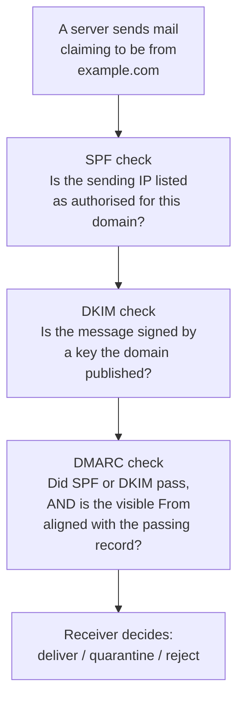
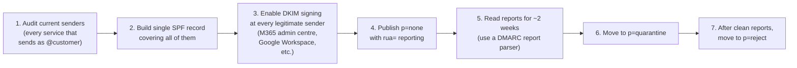

SPF, DKIM, and DMARC are three records that solve three different problems. Together they tell receiving mail servers *"messages claiming to come from this domain should look like this; reject the rest"*. Before you understand them as a system, treat them one layer at a time.

## The three layers



- **SPF** answers "is this sending IP allowed for this domain?". A TXT record at the apex lists IPs and `include:` references for every service authorised to send on the domain's behalf.
- **DKIM** answers "is this message cryptographically signed by a key the domain published?". The sender signs each outgoing message with a private key; the public key is published in DNS at a *selector* under `_domainkey`. Receivers fetch the key and verify the signature.
- **DMARC** answers "do the From-header domain and the SPF/DKIM result line up, and what should I do if not?". A TXT record at `_dmarc.<domain>` says "if SPF or DKIM passes *and* the visible From domain aligns, that's good; if not, treat the message as suspicious or reject it; here's where to send the report".

DMARC is what makes SPF and DKIM enforceable. SPF and DKIM alone are advisory.

## SPF, line by line

```
example.com.   3600   IN   TXT   "v=spf1 include:spf.protection.outlook.com include:_spf.google.com ip4:198.51.100.10 -all"
```

Reading from left to right:

| Token | Meaning |
|---|---|
| `v=spf1` | This is an SPF record; required prefix |
| `include:spf.protection.outlook.com` | Authorise everything Microsoft 365's SPF lists |
| `include:_spf.google.com` | Authorise everything Google Workspace's SPF lists |
| `ip4:198.51.100.10` | Authorise this specific IPv4 address (e.g. an on-prem mail relay) |
| `-all` | Anything else fails SPF (`-` means hard fail) |

The qualifier matters: `-all` (hard fail), `~all` (soft fail), `?all` (neutral), `+all` (allow anyone, never use). Most customers running M365 or Google should be on `-all`. `~all` is a transitional choice during onboarding; new domains often start there before moving to `-all`.

**Only one `v=spf1` TXT record per domain.** A common helpdesk failure: the customer's domain sends mail through M365 *and* through a CRM (HubSpot, Salesforce). Both vendors give a setup wizard saying "add this SPF record". If you add both, you have two `v=spf1` records and SPF fails for everything. Merge them into one record with both `include:` references.

<Callout type="warn" title="The 10-DNS-lookup limit">
SPF allows at most 10 DNS lookups during evaluation, including everything inside the `include:` references' own SPF records. A customer with M365 + Salesforce + Mailchimp + a tracking pixel service can hit this limit fast. When SPF starts failing for senders that should pass, this is often the cause. SPF "flattening" services exist for this; use sparingly because they need to be re-flattened when the included vendors update their IPs.
</Callout>

## DKIM: keys and selectors

DKIM publishes a public key under a *selector* hostname. The selector lets a domain rotate keys without breaking old signed mail.

```
selector1._domainkey.example.com.   3600   IN   CNAME   selector1-example-com._domainkey.example.onmicrosoft.com.
selector2._domainkey.example.com.   3600   IN   CNAME   selector2-example-com._domainkey.example.onmicrosoft.com.
```

Microsoft 365 uses two selectors (so it can rotate one while the other stays live). Each is a CNAME pointing to a hostname Microsoft owns, and Microsoft serves the actual public-key TXT record there. You add the CNAMEs once; key rotation is invisible.

Other providers publish DKIM as a direct TXT record at the selector instead of a CNAME:

```
google._domainkey.example.com.   3600   IN   TXT   "v=DKIM1; k=rsa; p=MIGfMA0GCSqGSIb3DQEBAQUAA4G..."
```

You'll see both styles. In the M365 admin centre, DKIM signing must be **enabled per domain** after the CNAMEs resolve, otherwise outbound mail isn't signed and DMARC alignment fails.

## DMARC: the policy the receiver reads

```
_dmarc.example.com.   3600   IN   TXT   "v=DMARC1; p=quarantine; rua=mailto:dmarc@example.com; pct=100; adkim=s; aspf=s"
```

| Tag | Meaning |
|---|---|
| `v=DMARC1` | DMARC version |
| `p=` | Policy: `none` (just report), `quarantine` (deliver to spam), `reject` (refuse) |
| `rua=mailto:` | Where to send aggregate reports (daily summaries) |
| `ruf=mailto:` | Where to send forensic reports (per-failure detail; rare) |
| `pct=` | Apply policy to this percentage of failing mail (rollout dial; default `100`) |
| `adkim=` / `aspf=` | Alignment strictness for DKIM/SPF: `s` strict, `r` relaxed (default) |
| `sp=` | Subdomain policy override |

Almost every domain should *start* at `p=none` to collect reports without affecting delivery, then move to `p=quarantine` once the reports show only legitimate senders are passing, then `p=reject` once `quarantine` has been clean for a few weeks.

## The deployment order



Don't jump straight to `p=reject`. The DMARC report tells you which senders are missing from SPF, which mail flows aren't DKIM-signed, and which third-party services need their own SPF/DKIM setup before enforcement won't break legitimate mail.

## A worked ticket: Able Moose Accounting

Able Moose's CFO forwards a phishing email: *"this looks like it's from me, but I never sent it. Can you stop people from impersonating us?"* The phishing message has `From: Sarah Williams <sarah@example.com>` and looks convincing.

<StepThrough client:load>
<Step title="Check current mail-auth records">
- `nslookup -type=txt example.com` — there's a single SPF record with `~all` (soft fail).
- `nslookup -type=txt selector1._domainkey.example.com` — DKIM CNAME exists, returns a key.
- `nslookup -type=txt _dmarc.example.com` — no DMARC record at all.
</Step>
<Step title="Diagnose">
SPF is in soft-fail mode (so receivers may still deliver SPF-failing mail). DKIM is technically published but, with no DMARC, receivers have no policy directive about what to do when alignment fails. Spoofed mail can still slip through. The fix is to deploy DMARC.
</Step>
<Step title="Publish DMARC at p=none with reporting">
Add `_dmarc.example.com` TXT: `v=DMARC1; p=none; rua=mailto:dmarc@example.com`. This starts collecting reports without changing delivery for any sender.
</Step>
<Step title="Read reports for two weeks">
Daily reports arrive at `dmarc@`. Set up a parser (a free service like Postmark's DMARC Digests works, or any DMARC reporting tool). Confirm M365 sends are passing; identify any legitimate third-party sender (CRM, accounting tool) that's failing alignment.
</Step>
<Step title="Move to p=quarantine, then p=reject">
After 2 weeks of clean reports, change to `p=quarantine`. After another 2 weeks of clean reports at quarantine, move to `p=reject`. From this point, mail claiming to be from `example.com` that doesn't pass SPF or DKIM and isn't aligned with the From domain is rejected at the receiver. The phishing problem is now structurally hard.
</Step>
</StepThrough>

<Checkpoint slug="domains-and-dns-l2-checkpoint-mail-auth" client:visible />
