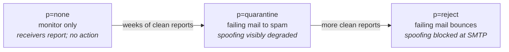

DMARC is the policy layer on top of SPF and DKIM. The record itself is short. The *decision* about what policy to publish, and especially when to step up from `p=none` to enforcement, is consequential and design-shaped.

Helpdesk work: adding an initial `p=none` to start monitoring. The ramp up to `quarantine` or `reject` is escalation. Knowing this boundary keeps you from accidentally rejecting legitimate mail.

## What DMARC is and where it lives

A single TXT at `_dmarc.<domain>`:

```text
_dmarc.example.com.   IN  TXT  "v=DMARC1; p=none; rua=mailto:dmarc-reports@example.com"
```

The fields that matter for helpdesk work:

| Field | What it does |
|---|---|
| `v=DMARC1` | Version. Always this. |
| `p=<policy>` | What receivers should do when SPF and DKIM both fail and the From: domain is `example.com`. `none` / `quarantine` / `reject`. |
| `rua=mailto:<addr>` | Where to send aggregate reports (XML summaries from each receiver, daily, of pass/fail counts). |
| `sp=<policy>` | Optional subdomain policy. If unset, subdomains inherit `p=`. |
| `adkim=` / `aspf=` | Alignment mode (relaxed / strict). Default relaxed. |

## The three policies



- **`p=none`**: receivers report failures but don't act. No legitimate mail is blocked; no spoofing is blocked either. The value is the reports. **Safe starting point.**
- **`p=quarantine`**: failing mail goes to spam folders. Spoofing visibly degraded; legitimate mail that fails for unexpected reasons also lands in spam, potentially missed.
- **`p=reject`**: failing mail bounces. Spoofing blocked at the SMTP layer; legitimate mail that fails for any reason is gone, with bounces visible to the sender.

## Why ramping is design, not helpdesk

<Callout type="warn" title="The escalation line">
- Adding `_dmarc TXT "v=DMARC1; p=none; rua=mailto:..."` from a vendor's recommendation is **helpdesk work**.
- Moving from `p=none` to `p=quarantine` or from `p=quarantine` to `p=reject` is **design and escalates**.

Why? Moving the policy requires reading the aggregate reports, identifying senders that legitimately send as the domain but aren't yet authorised in SPF or DKIM (CRMs, newsletter services, third-party tools), and authorising them before any policy change. Misreading reports or moving too soon blocks real mail. The decision is design; senior or email-security lead owns it.

Tools like EasyDMARC, dmarcian, and Postmark's DMARC monitor process the XML reports into human-readable dashboards. They make the ramp tractable; the work itself is still design.
</Callout>

## What this is NOT

- "DMARC blocks all spoofed mail." DMARC blocks mail that *fails alignment* with the From: domain. Sophisticated phishing using look-alike domains (`exampl3.com`, `example.co`) isn't blocked. DMARC stops *exact-domain* spoofing.
- "Setting `p=reject` is the safe choice." It's the *strict* choice. Safe depends on whether you've identified every legitimate sender. Going to `p=reject` without the ramp blocks legitimate mail you didn't know about.
- "DMARC requires SPF and DKIM both to pass." DMARC requires *at least one* to pass and align with the From: domain. Pass = SPF passes and aligns, OR DKIM passes and aligns. (Not both.)

## Decision walkthrough

A client just onboarded to M365. SPF and DKIM are set up. The owner emails: *set up DMARC, and set it to reject so we're fully protected.*

<DecisionTree
  client:load
  startId="root"
  title="Set up DMARC at p=reject as requested?"
  nodes={[
    {
      type: "question",
      id: "root",
      prompt: "Owner wants p=reject straight away. What do you do?",
      choices: [
        { label: "Publish p=reject as the owner requested.", next: "reject" },
        { label: "Publish p=none with rua= reporting. Explain that DMARC ramps from none → quarantine → reject over weeks while you monitor reports.", next: "none" },
        { label: "Publish p=quarantine as a middle ground.", next: "quarantine" },
      ],
    },
    {
      type: "outcome",
      id: "reject",
      label: "Risks blocking legitimate mail",
      tone: "bad",
      body: "Going straight to p=reject without monitoring history risks blocking legitimate mail from senders the client didn't realise were sending (CRM, newsletter platform, HR system, transactional mail service). The right starting point is p=none with reports flowing.",
    },
    {
      type: "outcome",
      id: "none",
      label: "Helpdesk-scope + appropriate framing",
      tone: "success",
      body: "Right. Publish p=none with reporting and frame the ramp as a follow-on conversation: 'this starts monitoring. Reports for a couple of weeks will show what's claiming to send as your domain. Once every legitimate sender is properly authorised, we can step up.' The ramp itself is escalation when the time comes.",
    },
    {
      type: "outcome",
      id: "quarantine",
      label: "Skips the monitoring phase",
      tone: "warn",
      body: "Quarantine still actively affects delivery without the monitoring history to know whether the affected mail is spoofing or legitimate. Skipping p=none undermines the ramp's purpose.",
    },
  ]}
/>

Three weeks later, the owner asks *can we move to `p=reject` now?* The answer is: *let me loop in your senior or email-security lead. The decision to ramp DMARC requires reading the aggregate reports and confirming every legitimate sender is properly authorised. We want to make sure no real mail is being blocked when we move to enforcement.*
