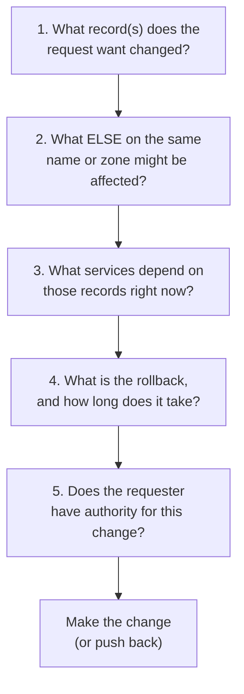

The mistakes that hurt customers happen in the gap between "what was asked" and "what was actually needed". A web developer asks for an A-record change because their part of the world says that's what they need; the customer's mail flow uses the same record set and breaks because nobody asked the broader question. The diagnose-first difference is that you ask the broader question first, every time.

## The five-question pattern

Run this on every change request before any change is made:

Five questions, two minutes per ticket. The discipline is the only thing standing between an MSP and a four-hour mail outage caused by a one-record change.

## Three real bad-change-request patterns

### Pattern 1: "Just point the apex at our hosting"

A web designer onboards the customer to a new website host. They send the MSP a ticket: *"please point example.com at host.webagency.example via CNAME."*

Why this is wrong:
- A CNAME at the apex of a zone is **not legal in standard DNS** (lesson 4 covers the workarounds).
- Even if the host supports ALIAS / ANAME flattening, **CNAMEs cannot coexist with other records on the same name**. If the apex has MX, TXT (for SPF/DMARC), or any verification record, a CNAME at apex breaks them all.
- The web designer wants the user to reach the website. They do not know or care that mail goes to the same domain.

The correct response: ask for the host's actual A and AAAA addresses (most hosts publish them). Point the apex A and AAAA there. Leave the apex MX/TXT alone. If the host insists on CNAME-only, use ALIAS/ANAME at the DNS host.

### Pattern 2: "Delete the existing records and put these in"

A SaaS vendor's setup checklist: *"replace your existing TXT records with the following."*

Why this is wrong:
- The customer's existing TXT records include SPF for mail, DMARC, M365 verification, and possibly verification for three other services.
- The vendor's checklist assumes a fresh domain with nothing else on it.
- "Replace" deletes records the vendor has no idea exist.

The correct response: **add** the new records, don't replace. The new TXT records sit alongside the old ones; DNS allows multiple TXT records at the same name.

### Pattern 3: "Change the A record now please"

A web developer messages on Friday afternoon: *"can you change the A record for the website to 198.51.100.55 right now? We're done with the new server."*

Why this needs a pause:
- No TTL pre-stage means the cutover takes as long as the existing TTL.
- "Right now" on Friday afternoon means the team is offline if anything goes wrong over the weekend.
- The new server might not have the SSL certificate provisioned yet; once DNS points there, browsers see cert errors.
- The MX might point at the same A indirectly (if the customer's mail uses the website server for outgoing mail).

The correct response: confirm the new server is fully ready (TLS, application, mail-side checks), schedule a Tuesday morning cutover window with TTL pre-staged at 300 seconds 24 hours ahead, and document rollback steps before doing anything.

## The change-impact checklist for DNS

For any non-trivial change, fill in:

| Question | Answer |
|---|---|
| Records being changed | (list) |
| Records on the same name not being changed | (list) |
| Services that depend on those records | (list, e.g. M365, customer website, CRM, monitoring) |
| Current TTL on each record | (list, in seconds) |
| Has the new endpoint been verified working? | yes / no |
| What's the rollback record value? | (the current value, captured before change) |
| What's the rollback time? | (the TTL the world's caches will hold) |
| Who authorised the change? | (named contact, written approval) |
| Change window? | (date, time, duration) |

Most changes don't need a formal change record. The discipline of asking the questions is what matters: when you can answer them in 30 seconds, you've also confirmed the change is safe.

## A worked ticket: Able Moose Group

Able Moose Group's web designer for the marketing site (an external agency) opens a ticket: *"please change the A record for example.com to 192.0.2.50, that's our new staging server. We're going to test there before we go live."*

<StepThrough client:load>
<Step title="Q1: What record(s) does the request want changed?">
The apex A record. Currently `203.0.113.42` (the production marketing site).
</Step>
<Step title="Q2: What ELSE on the same name might be affected?">
The apex of `example.com` also carries the MX (Microsoft 365), SPF TXT, DMARC TXT (technically at `_dmarc.`, so different name; not affected here), and Microsoft tenant verification TXT. Changing the A doesn't touch those, but if the MX *implicitly* depended on a server at the same IP, that would be the trap.
</Step>
<Step title="Q3: What services depend on those records right now?">
The customer's marketing site is at `example.com`. The website serves customer-facing forms used daily. Mail flow is M365 via a separate MX target, so independent of A. Marketing automation pixels load from the marketing site. A change here means broken forms and broken pixels until propagation completes.
</Step>
<Step title="Q4: What's the rollback?">
Capture current value: `203.0.113.42`. TTL on the existing record: `3600`. Rollback time worst-case: 1 hour after revert. If TTL is dropped to `300` first, rollback is 5 minutes after revert.
</Step>
<Step title="Q5: Does the requester have authority?">
The web designer is external. The change request came via email; the customer's authorising contact (CFO) is not on the thread. Reply to the web designer and CC the CFO: *"can you confirm you authorise this change?"*. Wait for explicit yes.
</Step>
<Step title="Push back on the actual request">
The web designer wants production traffic on a *staging* server. That's not what staging means. Suggest instead: point a different name (`staging.example.com`) at the new server, leave the apex A on production, test from staging, then plan a real cutover when staging is signed off.
</Step>
</StepThrough>

The web designer initially planned a one-line ticket. The five-question pattern caught a request that would have replaced production with an unfinished server. Pushing back well is part of the job.

<Checkpoint slug="domains-and-dns-migrations-and-security-checkpoint-cutover" client:visible />
