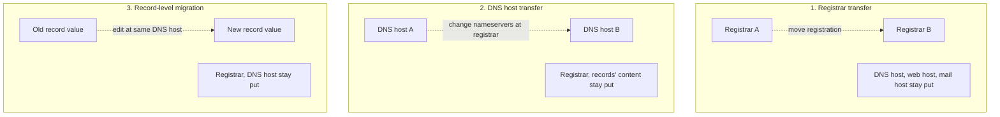

*Transfer the domain* is the single most ambiguous request in MSP DNS work. Three different operations sound identical from the client's perspective and require different work. Doing the wrong one wastes a day; doing two of them when only one was needed risks taking the client offline.

Spending the first few minutes on a transfer ticket clarifying *which* transfer, against which layer, is the cheapest win in this entire track.

## The three transfers (and a fourth pattern)

Take the four layers from the Foundation course (registrar, DNS host, web host, mail host). *Transferring the domain* can mean an action against any of them.

**Registrar transfer.** Move the *domain registration* from Registrar A to Registrar B. Who holds the lease changes; the records, the DNS host, the hosting all stay where they are.

**DNS host transfer.** Keep the registrar; change which company runs the *DNS host* (Layer 2). At the registrar, change the nameservers. Records have to be built at the new DNS host before the change.

**Record-level migration.** Keep the registrar and the DNS host; change the *value of records* (the A record points the website at a new web host, the MX records move to a new mail host).

The fourth pattern, **mail-vs-web migration independence**, isn't a fourth kind of transfer but a recognition that web (A/CNAME) and mail (MX) records migrate at different times via different changes. Lesson 07 covers it.

## How clients confuse them

- *Transfer the domain to Cloudflare.* Could mean: register with Cloudflare Registrar (registrar transfer), use Cloudflare DNS (DNS host transfer), or both. The first sentence rarely specifies.
- *Move our hosting from Host A to Host B.* Sounds like a web-host change (record-level migration). But the client may also want the registrar and DNS moved if Host A was providing all three.
- *Transfer everything to the new provider.* Could mean three sequential operations, or one of them. Always confirm.

## The clarification pattern

When a transfer-shaped ticket arrives:

1. **Look up the four current layers** for the domain (WHOIS, `dig NS`, `dig A`, `dig MX`).
2. **Identify the proposed end state.** What four-layer setup does the client's request imply?
3. **Compare.** Which of the three transfers (or which combination) gets from current to proposed?
4. **Confirm with the client.** *It sounds like you want to keep the registrar at Namecheap, move DNS to Cloudflare, and migrate the website to the new web host. Mail stays at M365 throughout. Is that right?* The confirmation forces explicit agreement.

When multiple operations are needed, the standard sequence:

1. **DNS host transfer first** (build the new zone with all current records before pointing nameservers).
2. **Record-level migrations** for the web or mail destination changes, after the DNS host transfer has settled.
3. **Registrar transfer last** (or unrelated; the registrar transfer doesn't affect records or hosting unless you also point the new registrar's default DNS at the records).

## What this is NOT

- "Transfer means all four layers at once." Each layer is independent. Most transfers are one layer; some are two; rarely all four.
- "The registrar transfer also transfers DNS." Only if the registrar's nameservers were the current authoritative DNS host *and* you accept the new registrar's default DNS.
- "The fastest path is to do everything at once." Tempting; usually a mistake. Sequencing with verification between catches errors early.

## Decision walkthrough

<DecisionTree
  client:load
  startId="root"
  title="First move on an ambiguous transfer ticket"
  description="A new client emails: 'we want to move our domain example.com to a new provider. The current setup is messy. Please help.'"
  nodes={[
    {
      type: "question",
      id: "root",
      prompt: "Where do you start?",
      choices: [
        { label: "Quote them for a full registrar + DNS + web migration.", next: "quote-blind" },
        { label: "Run a four-layer lookup, document the current state, then reply asking which layers they want moved and what end state they want.", next: "clarify" },
        { label: "Tell the client transfers are complex and refer them to a senior.", next: "refer" },
      ],
    },
    {
      type: "outcome",
      id: "quote-blind",
      label: "Quoting in the dark",
      tone: "bad",
      body: "Quoting blind risks billing for work that wasn't needed or missing work that was. You don't yet know what's currently in place or what they want to keep.",
    },
    {
      type: "outcome",
      id: "clarify",
      label: "Five minutes of lookup + clarification",
      tone: "success",
      body: "Right. WHOIS for registrar and nameservers, dig A for web host, dig MX for mail host. Document the four layers, then ask the client which they want moved and what the end state should be. The clarification is the work.",
    },
    {
      type: "outcome",
      id: "refer",
      label: "Premature escalation",
      tone: "bad",
      body: "The clarification work is in scope. Don't kick to escalation prematurely; once layers are clarified, the actual transfers are routine.",
    },
  ]}
/>

<Checkpoint slug="domains-and-dns-transfers-and-judgement-checkpoint-three-transfers" client:visible />
