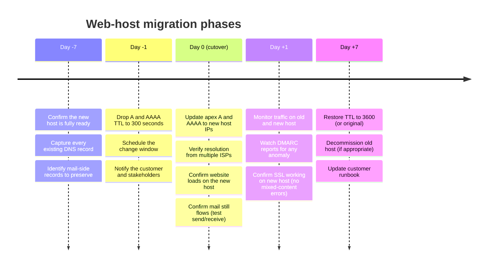
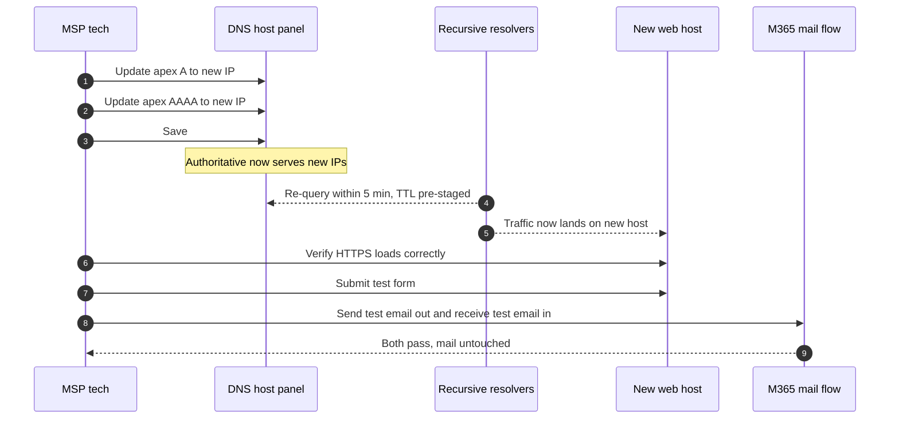

A web-host migration is the most common DNS-impacting change an MSP makes. The web team usually does the application work; the DNS work belongs to whoever runs DNS, which is often the MSP. Done well, the customer notices nothing. Done badly, mail breaks for days.

## The five-phase playbook

Five days of pre-staging and seven days of monitoring around a one-hour change window. The non-cutover days are why migrations don't fail.

## What "fully ready" means at Day -7

Before any DNS work, confirm the new host has:

- The website application deployed and accessible by IP or by a temporary `*.staging.example` URL
- Valid TLS certificate covering the customer's domain (using DNS-01 validation, the cert can be issued before the A-record change; using HTTP-01, it can't, so the host needs to be ready to issue the moment DNS flips)
- Database connectivity, file storage, and any backend integrations
- A baseline of the old site's content, exports, etc., so nothing's missing
- Incoming-form testing if the site has forms; failed forms during the cut are the most common silent failure

If any of those is "we'll do it during the change window", it's not Day -7 yet. Push back on the schedule.

## The records to identify before you touch anything

| Category | Records | Action during cutover |
|---|---|---|
| Web records | apex `A`, apex `AAAA`, `www` `CNAME` (or A/AAAA) | **Change** to new host IPs |
| Mail records | apex `MX`, `SPF` TXT, DKIM CNAMEs, DMARC TXT | **Preserve** as-is; do not touch |
| Verification records | M365 `MS=` TXT, Google verification, others | **Preserve** as-is |
| Subdomain CNAMEs | `careers`, `book`, `shop`, etc. | **Preserve** unless the new host is also taking those over |
| Anything else | unknown | **Investigate before touching**; document in runbook |

Common mail-side mistake: deleting all TXT records "to clean up" because the migration is for the website. The SPF and DKIM records are TXT-shaped and will be lost. Mail bounces start the next time anyone sends, often the next morning.

## The TTL pre-stage, in detail

Day -1: drop TTL on apex A and AAAA records to `300` seconds (5 minutes). Save. The world's caches now have at most `current TTL` seconds remaining on the old answer. By the time of the change window 24 hours later, every cache has refreshed and is holding the old A/AAAA at the new short TTL.

When you make the actual change at the change window, caches expire within 5 minutes. If something goes wrong and you revert, the rollback also takes 5 minutes.

Without the pre-stage, the cutover takes whatever the original TTL was (often 1 hour, sometimes longer). The rollback also takes that long. Five minutes vs an hour is the difference between "we caught it in time" and "the customer noticed it for the rest of the morning".

<Callout type="warn" title="Don't forget to restore TTL after the cutover">
A `300`-second TTL means resolvers re-query every 5 minutes. That's much higher load on the authoritative nameservers. After the cutover is verified stable (Day +7), restore TTL to `3600` or the original value. Forgetting this is harmless for low-traffic domains but real for high-traffic ones.
</Callout>

## The cutover itself

The verification matters. *"DNS saved"* is not the same as *"the website works"*. Click around the site, submit a form, send a test email both ways. If anything is broken, you have 5 minutes to revert before half the resolvers cache the new value.

## What can break during cutover, and how to spot it

| Symptom | Likely cause | Fast check |
|---|---|---|
| Site loads on some networks, not others | Some resolvers cached old; some have new | `dig +short example.com @1.1.1.1` vs `@8.8.8.8` |
| Site shows TLS / cert error | New host has no cert for the domain yet | Check cert in browser; wait or revert |
| Site loads but forms 500-error | App not fully deployed on new host | Web team |
| Email starts bouncing | MX or SPF was accidentally changed during the same edit | `dig +short MX example.com` should be unchanged |
| Subdomain breaks (`shop.`, `app.`) | Subdomain CNAME was at the old host's specific hostname | Confirm the CNAME target is reachable |

## A worked ticket: Riverbend Legal

Riverbend Legal (small, compliance-strict, can't afford a 30-minute mail outage) is moving from a small WordPress hosting company to a managed regional host. The MSP runs the cutover.

<StepThrough client:load>
<Step title="Day -7: confirm readiness">
The new host has the WordPress export imported, TLS cert via DNS-01 ready to issue, and a contact form tested. The old host's nightly backup is captured. Audit the existing zone: apex A `203.0.113.42`, apex MX (M365), SPF, DKIM CNAMEs, DMARC TXT, M365 verification TXT, `www` CNAME → apex.
</Step>
<Step title="Day -1: TTL pre-stage">
At 9am the day before cutover, drop the apex A TTL from 3600 to 300. Confirm save. By 9am the next day, every cache will hold the old answer for at most 5 minutes.
</Step>
<Step title="Day 0: cutover at 9am Tuesday">
9:00am: change apex A from `203.0.113.42` to `198.51.100.77`. Save. 
9:02am: `dig +short example.com @1.1.1.1` returns `198.51.100.77`. 
9:05am: load the site in a clean browser; loads on the new host. 
9:06am: send test email out and in; both arrive. 
9:08am: declare cutover done; notify the customer.
</Step>
<Step title="Day +1: monitor">
Old host's analytics show essentially zero traffic by end of day. New host's traffic graph matches the previous day's pattern from the old host. DMARC daily report (received that evening) shows no SPF/DKIM regressions. Send another round of test emails to confirm.
</Step>
<Step title="Day +7: restore TTL and decommission">
Restore TTL to 3600. Confirm the old host can be decommissioned (web team has migrated everything). Update the runbook: "Web cutover completed 2026-05-10; new host is [vendor]; rollback IP for emergency: 203.0.113.42 (do not use after old host is decommissioned)".
</Step>
</StepThrough>
