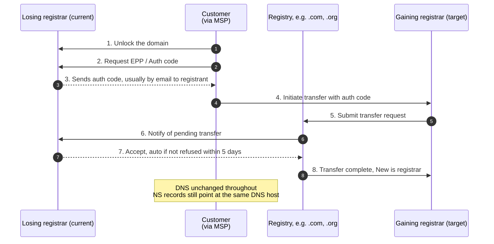

A domain transfer changes which registrar the lease lives at. The DNS records and nameservers are not touched. What changes is the company that bills the customer, holds the registrant record, and can authorise the next transfer. Get the timing wrong and you'll be locked out for weeks.

## The transfer flow, end to end

## EPP / auth code: the consent token

Every transfer needs an **EPP code** (also called auth code, transfer code, or domain password) generated by the losing registrar. It's a one-time secret proving the customer authorised the transfer. The gaining registrar can't initiate the transfer without it.

How to get it:

1. Log into the losing registrar's panel as the registrant or admin contact
2. Find the "transfer" or "domain settings" area
3. Click "request EPP / auth code"
4. The code is usually emailed to the registrant contact (the email address on file)

If the registrant contact email is wrong (an old employee, a previous IT provider), the code goes to the wrong inbox and you can't transfer until the contact is updated. **Update the contact first; transferring takes second priority.**

## The five-day acceptance window

Once the gaining registrar submits the transfer to the registry, the losing registrar has up to **5 days** to either explicitly accept, explicitly refuse, or do nothing (which counts as acceptance).

Most retail registrars accept on a click in their panel, which speeds the transfer to a few hours. Some require the customer to confirm via an email link from the losing registrar. Some sit on the request for the full 5 days hoping the customer changes their mind. Plan for 5 business days from initiation.

## The 60-day rules that catch out unprepared MSPs

Two ICANN-style rules apply to almost every TLD:

| Rule | Meaning | Operational impact |
|---|---|---|
| **60-day post-registration lock** | A newly-registered domain cannot transfer to a different registrar for 60 days | If a customer registered a domain last week and wants to move it, wait |
| **60-day post-transfer lock** | A domain just transferred cannot transfer again for 60 days | If you just brought it in, you can't move it out for 60 days |
| **60-day post-contact-change lock** | Some registrars / TLDs lock for 60 days after the registrant contact changes | Some MSPs deliberately wait to update registrant *until after* a transfer to avoid this |

Country-code TLDs (e.g. `.au`, `.uk`, `.de`) sometimes vary the windows; treat 60-day windows as the universal default and check the local registry's policy if you're working with a ccTLD.

<Callout type="warn" title="The registrant-change trap">
ICANN has a "Change of Registrant" policy: when the registrant contact's name, organisation, or email changes substantively, the domain enters a 60-day lock unless both old and new contacts opt out. If you both update the registrant *and* try to transfer in the same week, you'll find the domain frozen. Do one or the other; wait between them.
</Callout>

## Keeping DNS stable during the transfer

The customer's website and email keep working through a transfer because **nothing about DNS changes**. The NS delegation doesn't move; the records on those nameservers don't move; the customer's browsing and email is unaffected.

But — there is one trap. Some registrars **bundle DNS hosting with registrar service**. When you transfer the registrar away, the DNS service at the old registrar can be shut off. If the NS delegation pointed at the losing registrar's nameservers, **the moment you transfer, DNS goes dark**.

Before transferring, check the NS delegation:

- If the NS points at the losing registrar's own free DNS, **set up DNS hosting elsewhere first** (Cloudflare, the gaining registrar, anywhere stable), update the NS to point there, wait 48 hours for the change to settle, *then* transfer.
- If the NS points at a separate DNS host (Cloudflare, M365, AWS Route 53), the transfer is safe; DNS keeps working unchanged.

## A worked ticket: Able Moose Group

Able Moose Group acquires a smaller firm whose domain is registered with a low-end retail registrar that's been unreliable. The MSP wants to consolidate to a single registrar (Cloudflare Registrar, used for several other Group entities). The transfer must not interrupt the firm's email.

<StepThrough client:load>
<Step title="Pre-flight checks">
- WHOIS lookup: registrar is `Cheap Domains Co`, registrant contact is the firm's old IT person's email. **First fix needed**: update registrant before doing anything else, or the EPP code goes to the wrong inbox.
- NS lookup: nameservers are `ns1.theregistrar.example` / `ns2.theregistrar.example`. **Second fix needed**: DNS is hosted at the losing registrar.
</Step>
<Step title="Move DNS off the losing registrar first">
Set up the zone in Cloudflare's DNS (the customer's chosen host). Copy every record from the losing registrar's panel into Cloudflare. Verify each record's name, type, and value matches. Update NS at the losing registrar to point at Cloudflare. Wait 48 hours; confirm DNS is stable on Cloudflare's nameservers and not on the old ones.
</Step>
<Step title="Update registrant contact">
With the firm's authorisation in writing, update the registrant contact at the losing registrar to the firm's current operations manager. Some TLDs trigger a 60-day post-change lock here; if so, wait 60 days before initiating the transfer.
</Step>
<Step title="Request the EPP code">
Once eligible to transfer (60 days after any contact change, 60 days after registration if recent), request the EPP code at the losing registrar. Code arrives at the new registrant email.
</Step>
<Step title="Initiate transfer at gaining registrar">
At Cloudflare Registrar, start a transfer-in for the domain, paste the EPP code, complete the prompts. The losing registrar emails the firm's contact for confirmation; click confirm. Within 24 hours the transfer is usually complete.
</Step>
<Step title="Post-transfer audit">
Confirm WHOIS now shows Cloudflare as the registrar. Confirm NS still points at Cloudflare's DNS (no change expected). Send test email to the firm's domain to confirm mail is unaffected. Update the runbook with the new registrar, expiry date, and EPP-code regeneration instructions for future transfers.
</Step>
</StepThrough>

<Checkpoint slug="domains-and-dns-l3-checkpoint-transfer" client:visible />
