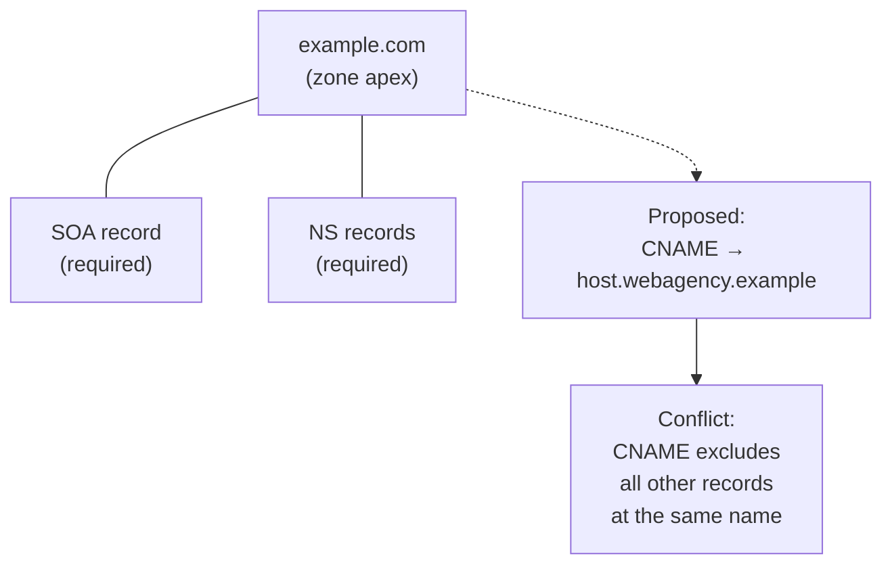

The DNS standards say: a CNAME cannot share a name with any other record type. The apex of a zone (the bare domain like `example.com` with nothing in front) **always** has at least SOA and NS records. So a CNAME at the apex breaks the rules. Most managed DNS hosts work around it. Some panels let you do it anyway, with consequences.

## Why CNAME-at-apex is the issue

A CNAME means *"this name is purely an alias; ask the target instead"*. The DNS spec (RFC 1912) says when a name has a CNAME, no other records can exist at that name. But the apex *must* have SOA and NS records to be a valid zone. The two requirements collide.

This is not a technicality. Resolvers respond to the conflict by either ignoring the CNAME, ignoring the other records, or returning errors, depending on the resolver. The behaviour is undefined enough that production systems break.

## What modern DNS hosts do instead

Three workarounds, depending on the host:

| Approach | How it works | Typical hosts |
|---|---|---|
| **ALIAS / ANAME records** | A custom record type the host resolves on the customer's behalf, returning A / AAAA at query time | DNSimple, easyDNS, OVH |
| **CNAME flattening** | The host accepts a CNAME at apex in their panel, resolves the target, and serves the resolved A / AAAA values to clients | Cloudflare, NS1 |
| **Plain A / AAAA** | The host requires the customer to enter the actual IP addresses, ignoring the request for an alias | Most basic registrars |

From a *protocol* perspective, the customer's domain is always serving valid A and AAAA records at the apex. The host is doing the alias lookup behind the scenes.

## When a web dev asks for "CNAME at the apex"

The pattern: the new web host requires "point your domain at `customers.host.example`". They write the docs assuming customers can use a CNAME. They don't realise (or don't care) that a CNAME at apex is non-standard.

How to respond, from least to most effort:

1. **Use the host's actual A / AAAA addresses.** Most managed hosts publish a static set of edge IPs the customer can point A and AAAA at (Vercel, Netlify, Shopify, Squarespace all have these, even though their docs lead with the CNAME path).
2. **Use the DNS host's ALIAS / ANAME / flattening feature** if the customer is on Cloudflare, DNSimple, or another host that supports it. The panel accepts what looks like a CNAME at apex; the host resolves and serves A / AAAA.
3. **Use a bare-to-www redirect.** Park the apex on a redirect-only A record (often `www.` is the canonical name; apex 301-redirects to it). Subdomains with CNAME work fine; only the apex is constrained. Some customers accept this; many don't.
4. **Move DNS host.** If the customer's current DNS host doesn't support ALIAS / flattening and the web host insists on CNAME-at-apex, the only structural fix is to move DNS to a host that does. Treat as a last resort because it's a load-bearing change.

<Callout type="warn" title="The cost of CNAME-flattening">
Cloudflare's flattening means Cloudflare resolves the target's A / AAAA every few minutes and caches them. If the target host changes their IPs, Cloudflare re-resolves, but only at TTL expiry. For short-TTL targets this is fine; for long-TTL or frequently-changing targets, customers see brief outages every time the target's IPs rotate.
</Callout>

## The cohabitation rule, restated for L3

| At the apex | Allowed? |
|---|---|
| `A` + `AAAA` + `MX` + `TXT` + `NS` + `SOA` | Yes (the normal case) |
| `CNAME` only | No (breaks SOA / NS requirement) |
| `CNAME` + `MX` | No (CNAME excludes all other types) |
| `ALIAS` / `ANAME` (host-resolved) + `MX` + `TXT` | Yes (the host serves A / AAAA at query time, not a CNAME) |

At a non-apex name, the same rule applies in a less catastrophic form: a CNAME at `shop.example.com` cannot coexist with an MX or TXT for `shop.example.com`. If the customer needs to use `shop.` for both a third-party shop platform (CNAME) and email-receiving (MX), they need a different name.

## A worked ticket: Able Moose Group

Able Moose Group's marketing manager onboards the Group to a new web platform. The platform's docs say *"create a CNAME for your apex domain pointing to apex.host.example"*. The Group's primary domain is `example.com` and DNS is on Cloudflare.

<StepThrough client:load>
<Step title="Decode what the platform actually wants">
The platform serves the customer's website. It wants traffic for `example.com` and `www.example.com` to land on its edge. It says "CNAME" because that's the easiest instruction for hosts that support it; it doesn't actually require a CNAME on the protocol level.
</Step>
<Step title="Choose the apex strategy on Cloudflare">
Cloudflare supports CNAME flattening at the apex. The panel accepts `CNAME example.com → apex.host.example`; behind the scenes Cloudflare resolves it to A and AAAA at query time and serves valid records.
</Step>
<Step title="Add records, with proxy off until tested">
- `example.com` CNAME → `apex.host.example`, proxied OFF (grey cloud) for the first test
- `www.example.com` CNAME → `apex.host.example`, proxied OFF
Verify the resolution: `dig +short example.com` returns the platform's edge IPs.
</Step>
<Step title="Confirm mail and other apex records survive">
Apex MX, SPF TXT, DMARC TXT, and Microsoft tenant verification TXT must all still resolve. Run `dig +short MX example.com` and `dig +short TXT example.com`. All present. Cloudflare's flattening doesn't remove them; it adds A/AAAA without conflicting.
</Step>
<Step title="Turn on proxy if appropriate">
Once the website is verified loading correctly, enable Cloudflare proxy on the apex CNAME if the customer wants caching/protection. Re-test. Web team signs off.
</Step>
</StepThrough>
