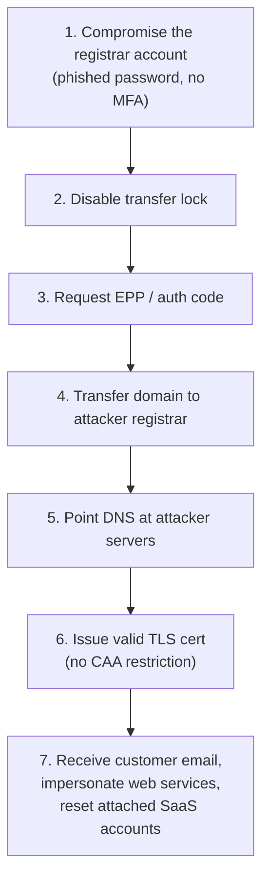
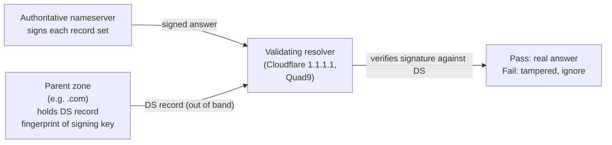

A domain hijack happens when an attacker gains control of the registrar account, the DNS records, or the certificate-issuance pipeline, and points the customer's services somewhere malicious. The financial and reputational damage is total: every system trusting the domain becomes attacker-controlled until the chain is broken. The defences are well-documented, layered, and in most MSPs only half-deployed.

## The hijack chain



Each step is preventable. Each missing prevention is a layer the attacker doesn't need to defeat.

## Layer 1: registrar account hardening

The registrar account is the front door. A weak password and no MFA on the account is one phishing email away from a hijack. Every customer's registrar account must have:

| Control | What it does |
|---|---|
| **MFA** (TOTP or hardware key, not SMS) | Prevents single-factor phishing |
| **Strong unique password** in a password manager | Prevents credential reuse from other breaches |
| **Account email at the customer's primary domain** | Inbox compromise of the registrar email is its own crisis; it must be a real, monitored mailbox |
| **Offline-recoverable contact email** as fallback | If the primary email is unreachable during a hijack, the alternate is how the customer regains control |

For an MSP managing many registrar accounts, document the access pattern in the runbook: who has access, how, with what MFA. Service-account-style logins with rotated MFA on a shared password manager beat individuals' personal MFA in the long run.

## Layer 2: transfer lock (registrar lock)

Every registrar offers a **transfer lock** (sometimes called "registrar lock" or "client transfer prohibited"). When set, the registrar refuses any transfer-out request, no matter who asks. Disable the lock only when actively transferring.

Check on a domain: the WHOIS record shows transfer status. `clientTransferProhibited` is the locked state. `ok` (or unset) means transferable.

For most MSP-managed customer domains, transfer lock should be **on** by default. Turn it off only during a planned transfer; turn it back on the moment the transfer completes.

## Layer 3: DNSSEC

**DNSSEC** signs DNS answers cryptographically. A resolver that validates DNSSEC can detect when a DNS answer has been tampered with in transit, including by an upstream resolver that's been compromised.



DNSSEC has two halves the customer needs to set up:

- **At the DNS host**: turn on DNSSEC signing for the zone. The host generates keys and signs every record set.
- **At the registrar**: publish the **DS** (Delegation Signer) record into the parent zone, fingerprinting the signing key. This is what links the chain.

Both halves are needed. Signing without the DS record means resolvers can't verify; DS without signing means resolvers expect signatures and reject all answers as bogus.

DNSSEC has a hard reputation. A bad rotation can break a zone for hours. Modern managed DNS hosts (Cloudflare, Microsoft 365 DNS, Route 53) handle the key management and rotation automatically. Most MSPs can enable DNSSEC safely on managed hosts; deploy it on self-managed BIND only if you have the operational maturity.

## Layer 4: CAA records

A **CAA** (Certification Authority Authorization) record at the apex tells certificate authorities which CAs are allowed to issue certs for the domain. CAs check the CAA before issuing.

```
example.com.   3600   IN   CAA   0 issue "letsencrypt.org"
example.com.   3600   IN   CAA   0 issue "digicert.com"
example.com.   3600   IN   CAA   0 iodef "mailto:security@example.com"
```

| Tag | Meaning |
|---|---|
| `issue` | This CA may issue certs for the domain |
| `issuewild` | This CA may issue *wildcard* certs |
| `iodef` | Where to send violation reports |

If an attacker gets DNS control they can edit the CAA, but in concert with DNSSEC the modification is detectable. The combination is what raises the bar against silent cert issuance from a CA the customer doesn't use.

## Layer 5: visibility and alerting

The defences above prevent the hijack. The visibility layer detects an in-progress hijack:

| Signal | What to monitor | Tool |
|---|---|---|
| Registrar account login from new IP / country | Login alerts | Most registrars send these by email; ensure the email goes to a monitored mailbox |
| Transfer initiated | The losing-registrar notice email | Same |
| DNS record change | Authoritative zone changes | Some DNS hosts log these (Cloudflare audit log, Route 53 CloudTrail) |
| New TLS cert issued for the domain | Certificate transparency logs | crt.sh (manual), Cert Spotter, Facebook CT Monitor (alerting) |
| DMARC report anomalies | Daily aggregate report | DMARC report parser |

The cert transparency monitor is the under-rated one: every public TLS cert ever issued for the domain shows up in CT logs within minutes. A new cert from a CA the customer doesn't use is the signal that something is wrong upstream.

## A worked ticket: Riverbend Legal

Riverbend Legal's principal forwards a phishing email: *"this looks like it's from us, including our company logo and signature, but we never sent it"*. The MSP is asked to "make our domain hijack-proof".

<StepThrough client:load>
<Step title="Audit current state">
Run a checklist:
- WHOIS: registrar lock present? **No** — `ok` status, transferable.
- Registrar account: MFA enabled? **Unknown**; need to log in and check.
- DNS host: DNSSEC enabled? `dig +dnssec example.org` shows no `RRSIG` records. **Not signed.**
- DS record at parent: `dig +short DS example.org @<parent-zone-NS>` returns nothing. **Not in parent.**
- CAA records: `dig +short CAA example.org` empty. **No CAA published.**
- DMARC: published at `p=none`, reports going to a generic mailbox. **Reports not parsed.**
- Cert transparency monitoring: not in place.

Six gaps; three of them critical.
</Step>
<Step title="Close the registrar layer first">
Log into the registrar with the customer's credentials. Enable MFA (TOTP via the firm's password manager). Enable transfer lock. Confirm the registrant contact email is the principal's monitored mailbox, not a generic web address.
</Step>
<Step title="Enable DNSSEC at the DNS host">
The DNS host is Cloudflare, which signs zones automatically. Toggle DNSSEC on in the Cloudflare panel. Cloudflare generates the DS record and shows it for copy.
</Step>
<Step title="Publish the DS record at the registrar">
Paste the DS values into the registrar's DNSSEC area. Save. Within an hour the parent zone serves the DS; within a few hours validating resolvers begin verifying answers. Confirm with `dig +dnssec +noall +answer example.org` showing `RRSIG` records.
</Step>
<Step title="Add CAA records">
At Cloudflare, add `0 issue "letsencrypt.org"` (the CA the customer's host actually uses) and `0 iodef "mailto:security@example.org"`. Now no other CA is authorised.
</Step>
<Step title="Set up cert transparency monitoring">
Sign the customer's domain up at a free CT monitor (e.g. Cert Spotter). Alerts on any new cert issued for `example.org` go to the principal's monitored mailbox.
</Step>
<Step title="Move DMARC to enforcement">
After two weeks of clean reports at `p=none`, move to `p=quarantine`; after another two weeks of clean reports, `p=reject`. The phishing impersonation Riverbend received becomes structurally hard.
</Step>
</StepThrough>

<Checkpoint slug="domains-and-dns-migrations-and-security-checkpoint-security" client:visible />

You've finished the migrations and security course. You can run a change-impact analysis on any DNS request, plan a web-host migration, run a registrar transfer without breaking DNS, recognise apex-record traps, and lock down a customer's domain against hijack. From here, the most useful next step is reading every DMARC report you receive for two weeks, then reviewing every customer's CAA and DNSSEC posture once a quarter.
