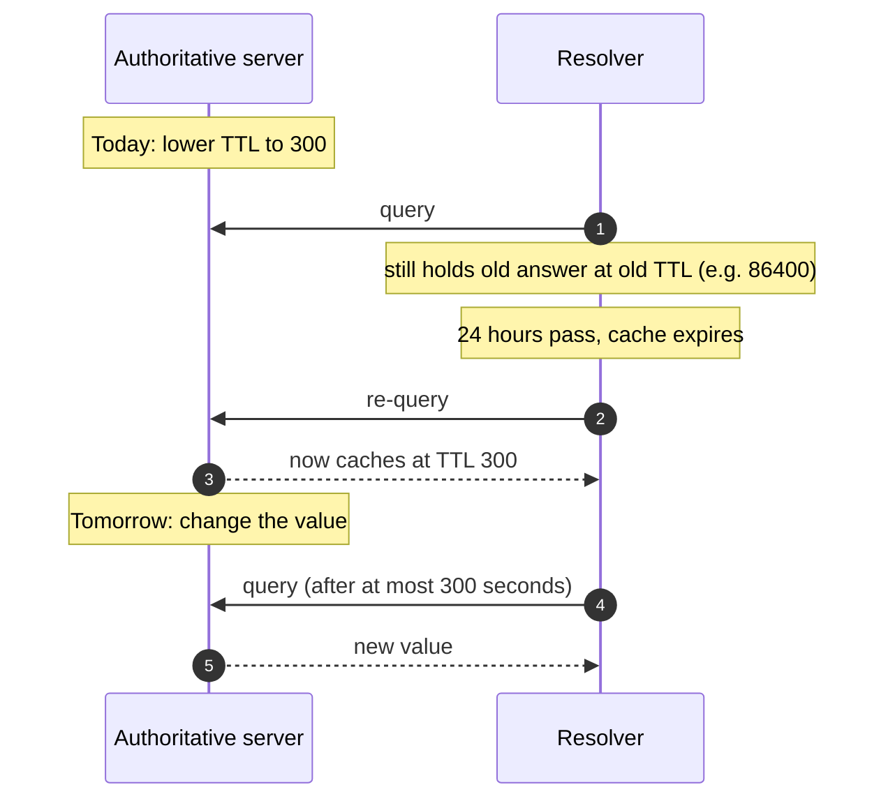

Every planned DNS change benefits from the TTL drop. The drop is cheap (one edit), the benefit is concrete (the change goes from *user-visible for up to 24 hours* to *user-visible within 5 minutes*), and the discipline is one most techs eventually internalise.

The rule:

> Lower TTL → wait at least one current TTL → make the change → verify → restore TTL.

## Why the wait matters

Downstream resolvers continue serving the *old* TTL until their existing cache expires. The wait between *lower TTL* and *change value* lets resolvers re-query and pick up the new (lower) TTL. Skip the wait and the drop didn't actually propagate; the value change still takes the old TTL's worth of time to settle.

## Picking the right reduced TTL

| Value | When |
|---|---|
| **60 sec** | Below most resolver floors; overkill, adds authoritative-server load. |
| **300 sec (5 min)** | **Standard cutover TTL.** Works for almost all migrations. |
| **600 sec (10 min)** | Slightly more cushion, slightly less load. |

Don't go below 60. Resolvers may not honour TTLs that low; you add load without proportional benefit.

## Picking the right restored TTL

After the change has settled (an hour with no issues), restore based on how often the record actually changes:

| Value | When |
|---|---|
| **3600 (1 hour)** | Common operational default; most records that change occasionally. |
| **86400 (24 hours)** | Stable records (MX of a long-stable provider, SOA, NS). |
| **300-600** | Records that may change frequently (DNS-based load balancing, geo-routing). |

Leaving everything at 300 indefinitely isn't *wrong*, but it's noisier than necessary and slightly slower for client lookups (lower cache hit rates downstream).

## What this is NOT

- "Lower TTL on the same edit as the value change." Doesn't help. The downstream caches' current TTLs control the wait, not the new TTL.
- "Lower TTL 30 minutes before a cutover when the previous TTL is 86400." Barely better than not lowering. The previous TTL is the wait you need.
- "Leave everything at 300 indefinitely." Works but slowly degrades the resolver cache hit rate worldwide. Cosmetic but worth tidying.

## When to escalate

- The previous TTL is exceptionally high (apex SOA / NS sometimes 604800 or more) and the cutover timeline doesn't allow the full wait. Senior decides whether to proceed without full TTL discipline.
- The TTL drop is on records the client considers ultra-critical (financial-services mail, real-time trading, payment processing). Senior owns the cutover plan.
- You're unsure which records will change in an upcoming cutover. Senior knows the bigger picture.

## Decision walkthrough

A client emails Tuesday: *we're moving our website to a new host next Friday at 8pm. Please make sure the DNS change goes smoothly.* You check the current A record TTL: 86400.

<DecisionTree
  client:load
  startId="root"
  title="When to lower TTL"
  nodes={[
    {
      type: "question",
      id: "root",
      prompt: "It's Tuesday. Cutover is Friday 8pm. Current TTL 86400. What do you do today?",
      choices: [
        { label: "Wait until Friday 8pm; make the change.", next: "no-drop" },
        { label: "Lower the A record TTL to 300 today (Tuesday). 72 hours before Friday is plenty for the lowered TTL to spread.", next: "drop-now" },
        { label: "Lower the TTL Friday morning.", next: "too-late" },
      ],
    },
    {
      type: "outcome",
      id: "no-drop",
      label: "Long propagation tail",
      tone: "bad",
      body: "Downstream caches hold the old IP for up to 24 hours after the change. User-visible disruption extends through Saturday evening for some users.",
    },
    {
      type: "outcome",
      id: "drop-now",
      label: "Comfortable pre-flight",
      tone: "success",
      body: "Right. Every downstream cache will have re-queried within 72 hours (their previous-86400 TTLs expire well within that window) and picked up the lower TTL. Friday's value change propagates within 5 minutes.",
    },
    {
      type: "outcome",
      id: "too-late",
      label: "Drop didn't propagate",
      tone: "bad",
      body: "Friday morning's 8-12 hour window won't suffice if downstream caches had recently queried; their cached 86400 TTL hasn't expired. The drop didn't propagate.",
    },
  ]}
/>
