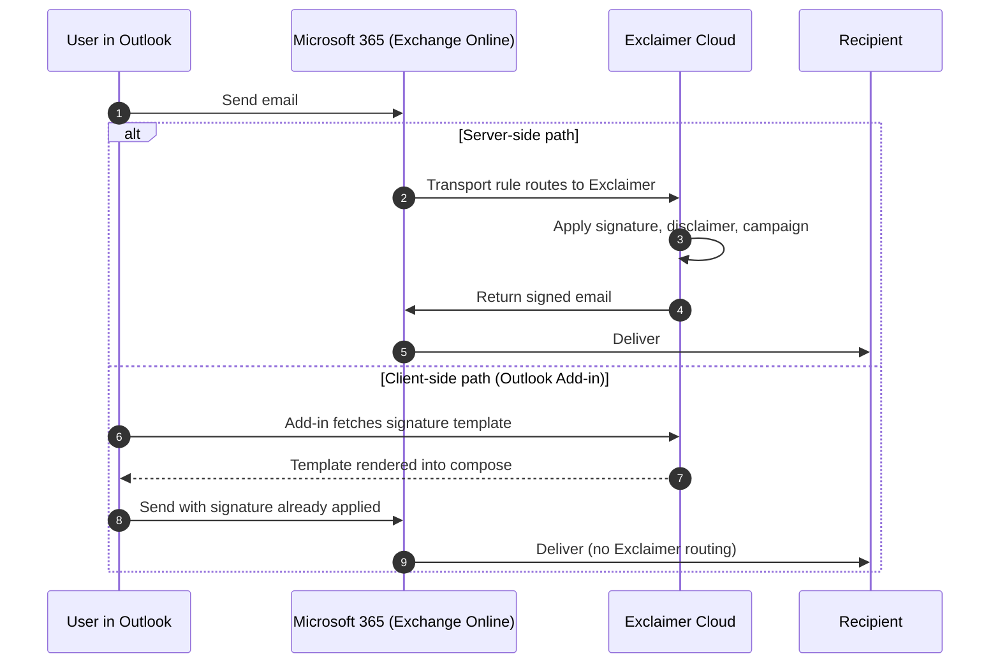

Exclaimer is centralised email signature management for Microsoft 365 and Google Workspace. The customer's signatures live in Exclaimer, not in each user's mailbox profile, and Exclaimer applies them either server-side through the mail flow path or client-side through the Outlook Add-in.

## The problem this product solves

Email signatures live in user mailbox profiles by default. That means every starter, leaver, role change, brand refresh, or compliance update is a per-user task spread across hundreds of mailboxes. Three things go wrong:

- **Drift.** One office uses last year's logo, another office has personal quotes appended, and the new hire's signature is just their first name in Calibri.
- **No central enforcement.** A regulated customer needs a specific legal disclaimer on every outbound email. Trusting users to paste it in works until it doesn't, and the lawyer letter doesn't care which user forgot.
- **Signatures don't follow the device.** A user who composes from Outlook Web, Outlook for Windows, and the iOS app has three places to keep in sync. They never are.

Exclaimer pulls signatures off mailboxes and into one place. The MSP designs templates, sets rules, and either routes outbound mail through Exclaimer's cloud (server-side) so signatures are stamped after send, or pushes templates into the user's Outlook (client-side) so they appear during compose.

## Where Exclaimer sits in the mail path

Two distinct delivery paths. The customer's choice between them, or both at once, drives a lot of what comes later in this course:

- **Server-side** runs every outbound message through an Exchange Online connector and a transport rule named "Identify messages to send to Exclaimer Cloud". Signatures are applied after the user clicks send, so they reach every device including phones and Macs without any per-user setup.
- **Client-side** uses the Exclaimer Outlook Add-in (recommended) or the Signature Update Agent on Windows. The user sees the signature in compose, before send. Mobile clients are unsupported on this path.

Customers run one path or both. When both are configured for the same signature, the client-side rendering takes priority for mail clients that can do it; server-side fills in the gaps (mobile, web, devices without the Add-in).

<Callout type="info" title="Why a frontline tech cares">
The first question on any signature ticket is "which path is this on?" Server-side issues show up on every device but only after send. Client-side issues only happen in Outlook desktop or web. The Diagnostic Logs split by path, and so does your triage.
</Callout>

## What Exclaimer adds beyond the signature

Three other objects ride the same mail path:

- **Disclaimers.** Plain-text legal text appended after the signature. Available on Standard and Pro plans. On Gmail, Disclaimers only deploy server-side.
- **Campaigns.** A banner image with a hyperlink, scheduled with start and end dates, appended after the signature. Available on Standard and Pro plans. Server-side only on Gmail.
- **Brand Kits.** A reusable bundle of fonts, colours, logos, icons, banners, meeting backgrounds, and disclaimer text. Signatures pull assets from a Brand Kit, so a logo refresh in one place updates every signature using it.

Each of these is covered in its own lesson later.

## What this is NOT

- **Not a mail server.** Exclaimer does not store or read message bodies. On inbound from Microsoft 365 the cloud service strips DKIM; Exclaimer does not reapply it. Microsoft 365 reapplies DKIM after Exclaimer hands the message back, so the signed message that leaves the tenant is the one your recipient verifies against.
- **Not an Outlook signature feature.** The native Outlook signature picker is per-user and per-machine. Exclaimer replaces that workflow with a central template applied by Exchange or by the Add-in.

<Callout type="info" title="Sources">
This lesson is grounded in Exclaimer's public knowledge base. Key articles: [Welcome to the Exclaimer Online Guide](https://support.exclaimer.com/hc/en-gb/articles/360050643051-Welcome-to-the-Exclaimer-Online-Guide), [Difference in features between Client-Side and Server-Side signatures](https://support.exclaimer.com/hc/en-gb/articles/9132428396445-Difference-in-features-between-Client-Side-and-Server-Side-signatures), [Information on using client-side and server-side signatures together](https://support.exclaimer.com/hc/en-gb/articles/11904697489181-Information-on-using-client-side-and-server-side-signatures-together-in-one-subscription), [Security and Compliance FAQ](https://support.exclaimer.com/hc/en-gb/articles/9189001376669-Security-and-Compliance-FAQ).
</Callout>
