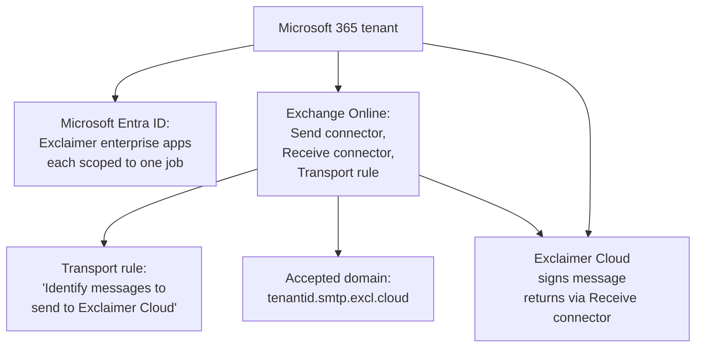

The Microsoft 365 connector is the wizard that wires Exclaimer into the customer's mail flow. Run it once at onboarding, then rarely again unless something gets re-broken. What the wizard creates is what every server-side signature ticket later traces back to.

## What the wizard creates

Three objects in Exchange Online plus a set of Microsoft Entra app registrations, each scoped to the minimum permissions for its job. The transport rule "Identify messages to send to Exclaimer Cloud" is the one frontline staff most often look at, it's what routes messages out for signing.

## The setup process

Run by an Exclaimer admin who can also authenticate as a **Microsoft 365 Global Administrator**. Exclaimer doesn't cache the GA credentials; they're used once for the wizard and prompted for again if any step is rerun.

<StepThrough client:load>
  <Step title="Open the wizard" image="/img/exclaimer/connect-to-365.png" imageAlt="The Connect to Microsoft 365 panel with the 'Send all email to Exclaimer' checkbox, an empty Test Group Name field, and a one-time code to paste during Microsoft authentication">
    Cogwheel icon on the header, Settings, Mail Flow, Connect to Microsoft 365. Decide whether the customer wants server-side for everyone (leave **Send all email to Exclaimer** ticked) or only a test group during phased rollout (untick it and name a mail-enabled security group in **Test Group Name**). The code shown is one-time; you'll paste it when Microsoft prompts.
  </Step>
  <Step title="Authenticate as Global Administrator">
    Sign in with the customer's Microsoft 365 GA. Accept the permissions request for Exclaimer to read Entra ID data and create the mail flow objects.
  </Step>
  <Step title="Pick the sync scope">
    Choose Full to sync every mailbox in the tenant or Limited to sync only a mail-enabled security group. Full is the default for most customers; Limited is for pilots and customers with strict scoping requirements. Switching from Full to Limited later removes user data outside the chosen group.
    {/* TODO: capture screenshot of the sync-scope radio (Full vs Limited) */}
  </Step>
  <Step title="Wait for hydration if it's a new tenant">
    Brand-new Microsoft 365 tenants need to be 'hydrated' before custom transport rules can be created. The wizard kicks this off automatically, but it can take up to an hour to replicate inside Microsoft 365. The wizard surfaces a "hydration in progress" message; don't restart the wizard, wait it out.
  </Step>
  <Step title="Confirm Configuration Successful">
    Once the wizard reports success, signatures applied to "Everyone in my organisation" start being added to outbound mail. Verify with the Signatures Tester before declaring the rollout done.
    {/* TODO: capture screenshot of the wizard's 'Confirm Configuration Successful' panel */}
  </Step>
</StepThrough>

<Callout type="info" title="Hostname-suffix gotcha">
The accepted domain the wizard creates uses `.smtp.excl.cloud`. Older Exclaimer documentation and a few KB articles still reference `.smtp.exclaimer.cloud`. Both refer to the same routing path, but Exchange Online's accepted-domain list will only show one. Don't recreate it because the suffix doesn't match a stale article; trust what the wizard last produced.
</Callout>

<Callout type="warn" title="Reuse the wizard for re-runs">
If someone has manually changed the transport rule or deleted a connector, the documented fix is not to recreate it by hand. Re-run the Connect to Microsoft 365 wizard. Pick a low-traffic window because re-running typically takes under ten minutes and the transport rule is briefly absent during the rerun.
</Callout>

## What permissions Exclaimer asks for

Exclaimer registers a set of enterprise applications in Microsoft Entra during setup. Each app is scoped to one job. The names that show up in the Microsoft Entra Admin Center under Enterprise applications when you search for "Exclaimer":

- **Exclaimer Cloud `{region}` Setup, Please remove after setup**, runs the wizard. Documented post-setup cleanup removes this one specifically; leaving it in place is a hygiene failure, removing the wrong Exclaimer app breaks the subscription. The region suffix (UK, EU, US, etc.) reflects where the customer's data is hosted.
- **Exclaimer, Signatures for Microsoft 365**, the main subscription app. Reads directory data so signature fields like `{DisplayName}`, `{JobTitle}`, `{Mobile}` are populated correctly. This is the one to check Entra ID consent for if a sync ticket lands.
- **Exclaimer Cloud Signatures for Office 365 Sent Items `{region}`**, updates the Sent Items folder copy of a message after the signature is applied, so what the user sees in Sent Items matches what the recipient got.
- **Exclaimer Cloud, User Details Editor**, signs users in to the User Details Editor portal where they edit their own contact fields (Standard and Pro plans).
- **Exclaimer Cloud, Single Sign-on**, optional. Required only if the customer signs in to the Exclaimer portal via SSO.
- **Exclaimer Cloud, Signatures for Outlook Feature**, optional. Required only for client-side signatures (Outlook Add-in or the legacy Signature Update Agent).

For Google Workspace the equivalent is a connected Marketplace app with Super Admin authorisation. The shape is the same: directory read, mail-flow capability, no message-body access.

## A worked ticket: Able Moose Accounting

The customer's IT lead calls: *"We bought Exclaimer last week. Setup ran but nobody is getting a signature on outbound mail."*

<StepThrough client:load>
  <Step title="Confirm the wizard reported success">
    Settings, Mail Flow. The Connect to Microsoft 365 panel shows the last successful configuration date if the wizard completed.
  </Step>
  <Step title="Confirm the transport rule is enabled in Exchange Online">
    Exchange admin centre, Mail Flow, Rules. The "Identify messages to send to Exclaimer Cloud" rule should be present and enabled. If it's disabled, that's the explanation, possibly someone followed an unrelated troubleshooting article that flips it off.
    {/* TODO: capture screenshot of the Exchange Admin Center transport rule view of 'Identify messages to send to Exclaimer Cloud' */}
  </Step>
  <Step title="Send a test from a real mailbox">
    Open the Signatures Tester (sidebar, Signatures Tester) and run the server-side test from one of Able Moose's real users to an external address. The Tester tells you whether rules pass; if they pass and the live email still has no signature, the issue is downstream, hydration delay, mail flow rule scope, or the signature itself being disabled.
  </Step>
</StepThrough>

## What this is NOT

- **Not credential storage.** Exclaimer prompts the GA each time a wizard step runs because it doesn't cache the credentials. If a tech tells you "Exclaimer broke when we changed the GA password", that doesn't make sense for Exclaimer's own integration; check whether they confused it with another connector.
- **Not message inspection.** The Exclaimer apps don't read message body content. The transport rule routes whole messages out and back; Exclaimer adds the signature without parsing what the user wrote. This matters for compliance conversations.

<Callout type="info" title="Sources">
[Connect to Microsoft 365](https://support.exclaimer.com/hc/en-gb/articles/17192747888669-Connect-to-Microsoft-365), [How to re-run the Connect to Microsoft 365 wizard](https://support.exclaimer.com/hc/en-gb/articles/11126607468829-How-to-re-run-the-Connect-to-Microsoft-365-wizard), [System Requirements for Exclaimer](https://support.exclaimer.com/hc/en-gb/articles/4406058988945-System-Requirements-for-Exclaimer), [Security and Compliance FAQ](https://support.exclaimer.com/hc/en-gb/articles/9189001376669-Security-and-Compliance-FAQ).
</Callout>
